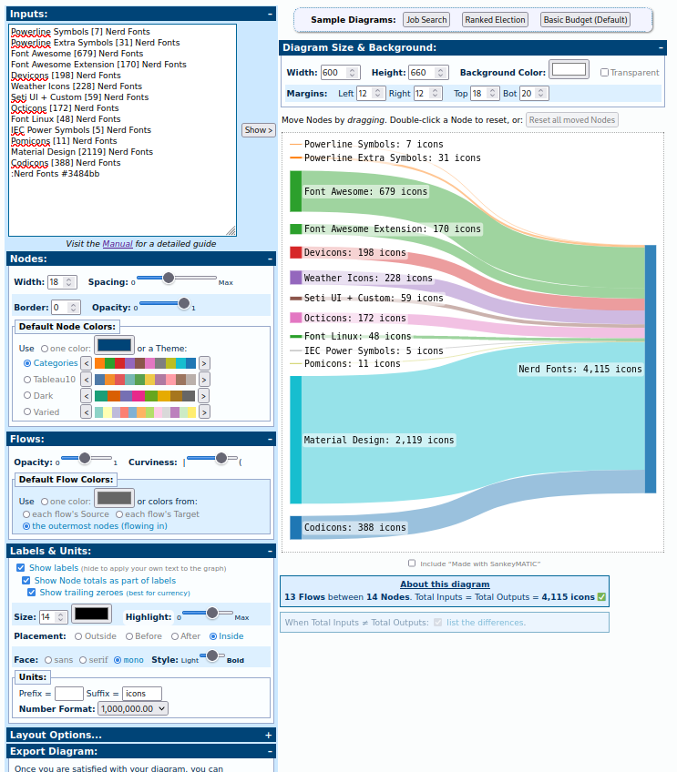

## How to update the sankey diagram




### Generate diagram

Goto https://sankeymatic.com/

Enter data:

        Powerline Symbols [7] Nerd Fonts
        Powerline Extra Symbols [31] Nerd Fonts
        Font Awesome [679] Nerd Fonts
        Font Awesome Extension [170] Nerd Fonts
        Devicons [198] Nerd Fonts
        Weather Icons [228] Nerd Fonts
        Seti UI + Custom [59] Nerd Fonts
        Octicons [172] Nerd Fonts
        Font Logos [48] Nerd Fonts
        IEC Power Symbols [5] Nerd Fonts
        Pomicons [11] Nerd Fonts
        Material Design [2119] Nerd Fonts
        Codicons [388] Nerd Fonts
        :Nerd Fonts #3484bb

### Steps
```
Nodes Width 18
Nodes Color Categories
Flow Curviness 0.7
Label Size 14
Label Face mono
Label Unit Suffix " icons"
Diagram Size Width 600
Diagram Size Width 660 (adapt if we add more)
Deselect 'Include "Made with ..."'

Export as SVG (exports into a text window)
Copy and paste into file

Open in inkscape

Ctrl-click on 'Nerd Fonts: x,xxx icons'
Change text size (top bar) to 16
Ctrl-click on underlying box
Rescale to fit

Rip out old icon sets from old diagram
And insert in new
Adapt colors if need be:
Select icon group
Use eyedropper tool and click on colored bar of new diagram

Save as compressed inkscape svgz
Store as bin/scripts/data/sankey/sankey-glyphs-x.x.x.svgz

Save as optimized svg, select:
  Remove XML decl
  Remove metadata
  Remove comments
  Embed raster img
  Untick Format with line-breaks
Store as images/sankey-glyphs-combined-diagram.svg
Store as assets/img/sankey-glyphs-combined-diagram.svg (in gh-pages)

Use Export as PNG... with Z_DEFAULT_COMPTESSION
Store as assets/img/sankey-glyphs-combined-diagram.png (in gh-pages)
```
