<h1 align="center">
  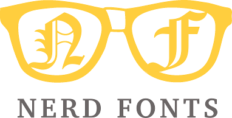
</h1>

[![GitHub release][img-version-badge-with-logo]][repo]&nbsp;[![Gitter][img-gitter-badge]][gitter]&nbsp;[![CodeClimate][img-code-climate-badge]][code-climate]&nbsp;[![Code of Conduct][coc-badge]][coc]&nbsp;[![PRs Welcome][prs-badge]][prs]&nbsp;&nbsp;&nbsp;[![Windows Logo][w-top]](#patched-fonts)&nbsp;&nbsp;&nbsp;[![macOS (OSX) Logo][m-top]](#patched-fonts)&nbsp;&nbsp;&nbsp;[![Linux Logo][l-top]](#patched-fonts)


**Nerd Fonts** 是一个使用大量字体图标来解决程序员在开发过程中缺少合适字体的问题的项目。它可以从流行的字体图标库中将大量外部字体引入待开发的项目中，它支持的字体图标库包括 [Font Awesome ➶][font-awesome], [Devicons ➶][vorillaz-devicons], [Octicons ➶][octicons], and [others](#glyph-sets).

下面的桑基图展示了Nerd Fonts中现有的字形组合：

<p align="center">
  
</p>
<sub><i>创建图表的工具为： <a href="http://sankeymatic.com/" title="SankeyMATIC (BETA): A Sankey diagram builder for everyone">@SankeyMATIC</a></i></sub>


## 快速导航

| **[Latest Release ➶][release]** | **[Fonts](#patched-fonts)** | **[Patcher](#font-patcher)** | **[VimDevIcons ➶][vim-devicons]** | **[Font Package <br/>Downloads ➶][release]** |
|:-------------------------------:|:---------------------------:|:----------------------------:|:---------------------------------:|:--------------------------------------------:|
| [![fonts-logo-small][ql-1]][release] | [![fonts-logo-small][ql-2]](#patched-fonts) | [![patcher-logo-small][ql-3]](#font-patcher) | [![vim-devicons-logo-small][ql-4]][vim-devicons] | [![fonts-logo-small][ql-5]][release] |


## 重要提示
* `master` 分支的文件路径 **不稳定！** [验证你的 repository URI references](#unstable-file-paths)
* 除非你想成为[开发贡献者](#contributing)，不然最好**不要**克隆这个 repository。 


## 目录

[**TL;DR**](#tldr)

[**安装选项**](#font-installation)
  * [**1 - 手动**](#option-1-download-and-install-manually)
  * [**2 - 下载发布存档**](#option-2-release-archive-download)
  * [**3 - 安装脚本**](#option-3-install-script)
  * [**4 - Homebrew Fonts (macOS (OS X))**](#option-4-homebrew-fonts)
  * [**5 - 克隆 Repo**](#option-5-clone-the-repo)
  * [**6 - Ad Hoc Curl 下载**](#option-6-ad-hoc-curl-download)
  * [**7 - Arch User Repository (AUR) (Arch Linux)**](#option-7-unofficial-arch-user-repository-aur)
  * [**8 - 你自己的字体补丁**](#option-8-patch-your-own-font)

[**特征**](#features)
  * [**Glyph/Icon sets**](#glyph-sets)
  * [**Patched Fonts**](#patched-fonts)
  * [**Combinations**](#combinations)
  * [**Font Patcher**](#font-patcher)

[**开发者 / 贡献者**](#font-patcher)
  * [**Font Patcher**](#font-patcher)
  * [**Gotta Patch 'em All Font Patcher!**](#gotta-patch-em-all)
  * [**Other Good Fonts to Patch**](#other-good-fonts-to-patch)
  * [**Contributing**](#contributing)

[**项目的目的**](#project-motivation)

**附加信息**
  * [**master中不稳定的文件路径**](#unstable-file-paths)
  * [**更新日志**](#changelog)
  * [**证书**](#license)


## TL;DR
  Nerd Fonts 中包含流行的程序字体和字形。
  如果你想要的字体没有在现有的字体库中，你可以使用 [font patcher](#font-patcher)来自定义字体。
  更多信息请见 [wiki][wiki]。如果你正在寻找Vim插件，请见 [VimDevIcons ➶][vim-devicons]。

### 多种字体下载选项

_如果你..._

  * `选项 1.` 需要**快速**从[`patched-fonts/` directory](#patched-fonts)下载一个 **独立字体** 
  * `选项 2.` 需要去下载包含粗体、斜体等等一系列字体的 **字体家族**，请见 [下载档案](#option-2-release-archive-download)
  * `选项 3.` 需要**自动安装**或使用**脚本**，请见 [安装脚本](#option-3-install-script)
  * `选项 4.` 是**macOS**的使用者，并且想要使用**Homebrew**，请见 [Homebrew Fonts](#option-4-homebrew-fonts)
  * `选项 5.` 想要 **完全控制**，请见 [克隆这个 repo](#option-5-clone-the-repo)
  * `选项 6.` 想要使用 **`curl` command** 或者使用 **scripts**，请见 [Ad Hoc Curl 下载](#option-6-ad-hoc-curl-download)
  * `选项 7.` 是**Arch Linux**的使用者，并且想要使用**AUR packages**，请见 [Unofficial Arch User Repositories](#option-7-unofficial-arch-user-repository-aur)
  * `选项 8.` 想要打包你自定义的字体，请见 [字体补丁](#option-8-patch-your-own-font)

## 特征
* [FontForge Python script](#font-patcher) 可以打包任何字体
  * 包括建立**Monospaced (fixed-pitch, fixed-width)** _或者_ **double-width (non-monospaced)** 字形
  * 更多详情请见 [**Font Patcher**](#font-patcher) 段落
* **`34`** 已经 [打包了字体家族](#patched-fonts)
* Over **`77,000`** 独立的 组合/变型 字体 [(更多详情)](#combinations)
* Over **`1,300`** 字形/图标 组合 [(更多详情)](#combinations)
  * 当前的字形集包括： [Powerline with Extra Symbols][ryanoasis-powerline-extra-symbols], [Font Awesome][font-awesome],  [Devicons][vorillaz-devicons], [Octicons][octicons], [Font Linux][font-linux], [Pomicons][gabrielelana-pomicons]
* 每种字体的**Monospaced (fixed-pitch, fixed-width)** _和_ **double-width (non-monospaced)** 版本
  * 这指的是Nerd Font字形本身，并不一定需要将字体作为一个整体考虑
* 一个 开发者/贡献者提供了 [bash script](#gotta-patch-em-all) 来为所有字体再打包


## 字形集

:mag: :mag: 你现在可以通过[NerdFonts.com][Cheat Sheet]中的[Cheat Sheet][]对字形进行搜索 

### Seti-UI + 自定义
> 基于 [Seti-UI] Icomoon 的额外自定义字形。

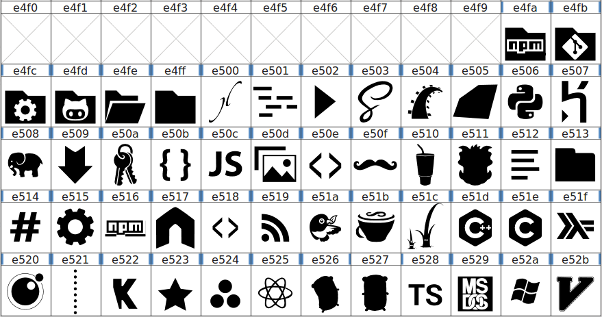

### [Devicons][vorillaz-devicons]
> 一个为开发者，code jedis，ninjas，HTTPsters，evangelists 和 nerds(sic)制作的图标字体。 / ([repo][vorillaz-devicons]) / ([website](https://vorillaz.github.io/devicons/))

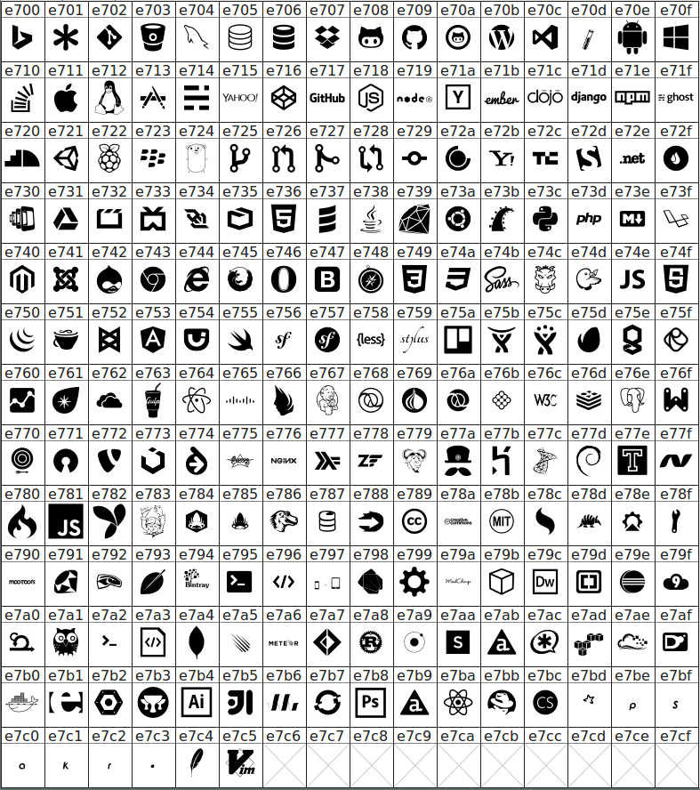

### [Font Awesome][font-awesome]
> 字体图标和 CSS 工具包。 / ([repo][font-awesome]) / ([website](http://fontawesome.io/))

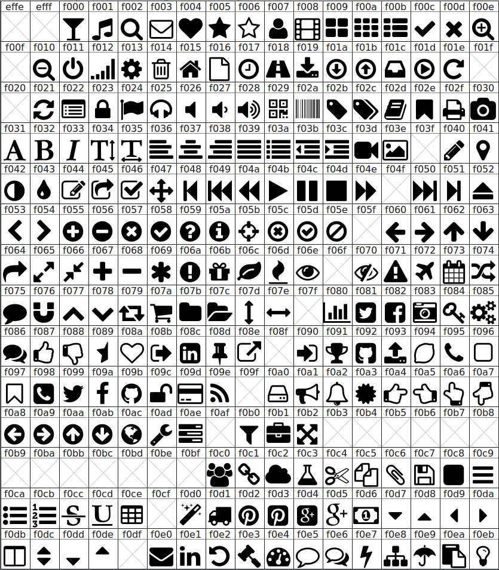
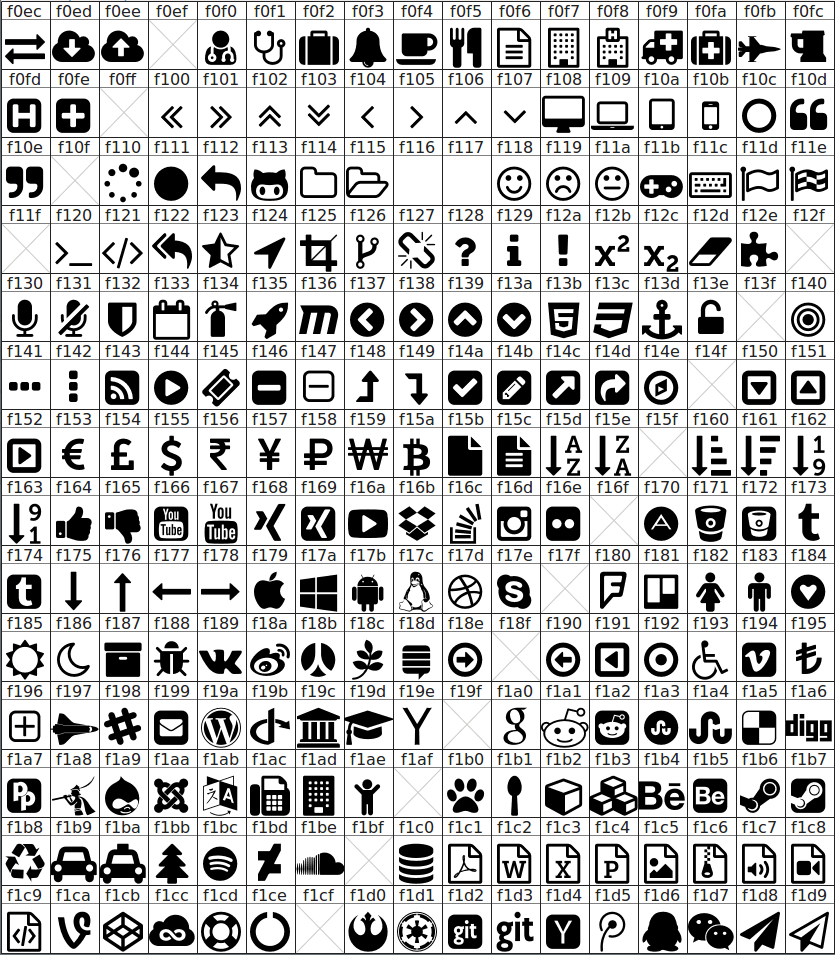
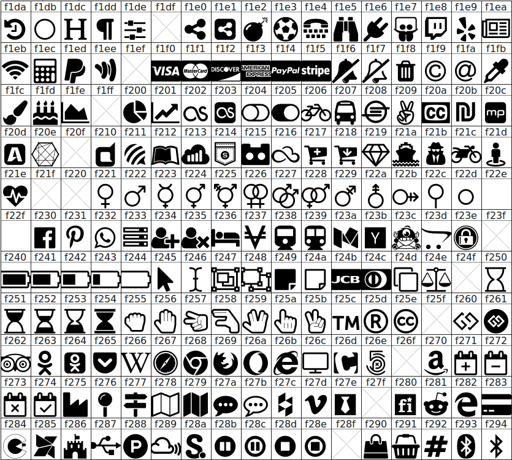
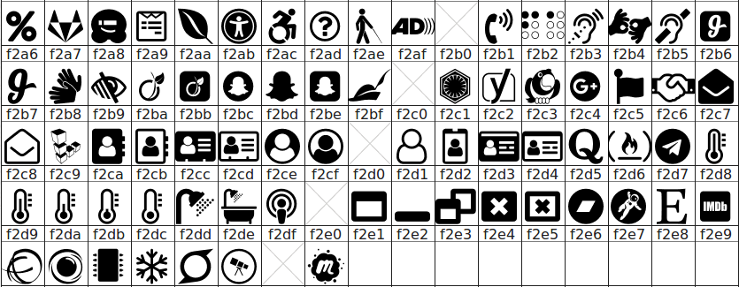

### [Font Awesome Extension][font-awesome-extension]
> 简单的 Font Awesome 补充包。 / ([repo][font-awesome-extension]) / ([website](https://andrelzgava.github.io/font-awesome-extension/))

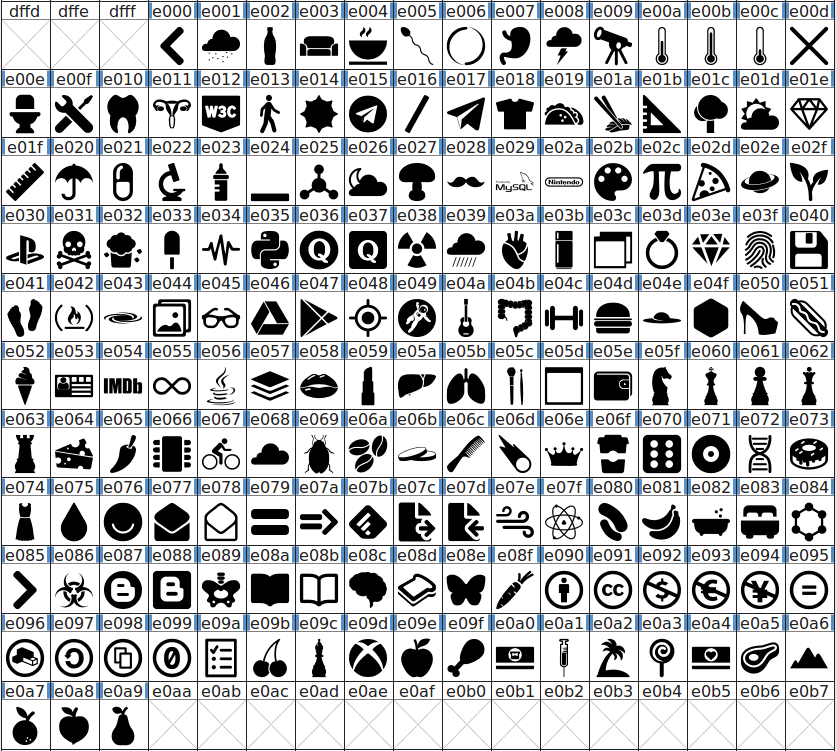

### [Octicons][octicons]
> GitHub's 图标. / ([repo][octicons]) / ([website](https://octicons.github.com))

#### Nerd Font Complete Codepoints:*


<sub>* To avoid conflicts between icon sets, these were modified in the 'Complete' fonts. To view the original codepoints see the [Wiki](https://github.com/ryanoasis/nerd-fonts/wiki/Codepoint-Conflicts).</sub>

### [Powerline Extra Symbols][ryanoasis-powerline-extra-symbols]
> 提供额外的 Powerline separator 字体 和 a column number glyph (CN). / ([repo][ryanoasis-powerline-extra-symbols])


### [IEC Power Symbols][website-iecpower]
> 向Unicode中加入新字符  / ([website][website-iecpower])

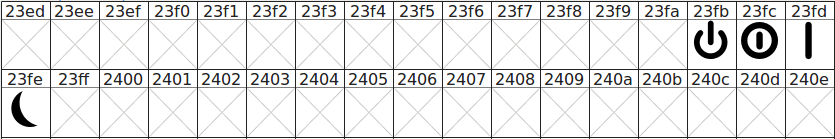
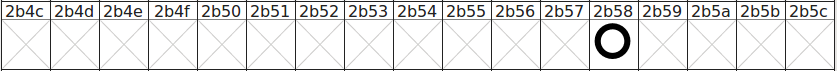

### [Font Linux][font-linux]
> Font-linux 是一个包含LOGO和linux流行布局的图标字体。 / ([repo][font-linux])

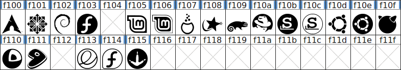

### [Pomicons][gabrielelana-pomicons]
> 8 个符号 ["Pomodoro Technique"®](https://cirillocompany.de/pages/pomodoro-technique). / ([repo][gabrielelana-pomicons])

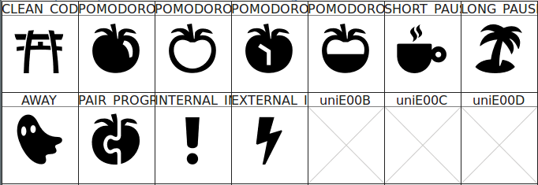

### Shell中的Icon 名称 

从[bin/scripts/lib/](bin/scripts/lib/)路径中下载 `.sh` 文件, 推荐的文件位置为 `~/.local/share/fonts/` 或者 `~/bin/`.

- `i_all.sh` - 帮助你加载你下载的所有文件
- `i_dev.sh` - Devicons (198 icons, 8 does not have an established name)
- `i_fa.sh` - Font Awesome (675 icons, 111 aliases)
- `i_fae.sh` - Font Awesome Extension (170 icons)
- `i_iec.sh` - IEC Power Symbols (5 icons)
- `i_linux.sh` - Font Linux (20 icons)
- `i_oct.sh` - Octicons (172 icons)
- `i_ple.sh` - Powerline Extra Symbols (37 icons, 2 aliases, 16 does not have an established name)
- `i_pom.sh` - Pomicons (11 icons)
- `i_seti.sh` - Seti-UI + Custom (50 icons, 2 aliases, 5 does not have an established name)

然后 `source` 所需的文件并且输出 `$i_*` variables 去寻找字体：

```sh
source ~/.local/share/fonts/i_oct.sh
echo $i_oct_heart
# Output:
# ♥
```

**NOTE:** You have to use one of the Nerd Fonts to see correct icons for some icon sets (Devicons, Font Awesome Extension, Font Linux), but other sets should work with their standard fonts too.


## 字体补丁

| Font Name                                         | Font Name and Repository    |\*RFN | EM Size | Status            |
|:--------------------------------------------------|:----------------------------|:-----|:--------|:------------------|
| [3270 Nerd Font][p-3270]                          | [3270][f-3270]              | NO   | 1000    | ![w2] ![m2] ![l2] |
| [Anonymice Nerd Font][p-anonymous-pro]            | [Anonymous Pro][f-a-pro]    | NO   | 2048    | ![w] ![m2] ![l]   |
| [Aurulent Sans Mono Nerd Font][p-aurulent]        |                             | NO   | 1000    | ![w] ![m2] ![l]   |
| [Bitstream Vera Sans Mono Nerd Font][p-bitstream] |                             | NO   | 2048    | ![w] ![m2] ![l]   |
| [Code New Roman Nerd Font][p-code-nr]             |                             | NO   | 2048    | ![w] ![m2] ![l]   |
| [DejaVu Sans Mono Nerd Font][p-dejavu]            |                             | NO   | 2048    | ![w] ![m2] ![l]   |
| [Droid Sans Mono Nerd Font][p-droid]              |                             | NO   | 2048    | ![w] ![m2] ![l]   |
| [Fantasque Sans Nerd Font][p-fantasque]           | [Fantasque Sans][f-fant]    | NO   | 2048    | ![w] ![m2] ![l]   |
| [Fura Code Nerd Font][p-fira-code]                | [Fira][f-fira-code]         | YES  | 1000    | ![w] ![m2] ![l]   |
| [Fura Mono Nerd Font][p-fira-mono]                | [Fira][f-fira-mono]         | YES  | 1000    | ![w] ![m2] ![l]   |
| [Gohu Nerd Font][p-gohu]                          | [Gohu][f-gohu]              | NO   | 1000    | ![w2] ![m2] ![l2] |
| [Hasklug Nerd Font][p-hasklig]                    | [Hasklig][f-hasklig]        | YES  | 1000    | ![w] ![m2] ![l]   |
| [Heavy Data Mono Nerd Font][p-heavy-data]         |                             | NO   | 2048    | ![w] ![m2] ![l]   |
| [Hermut Nerd Font][p-hermit]                      |                             | NO   | 1000    | ![w] ![m2] ![l]   |
| [Inconsolata Nerd Font][p-inconsolata]            |                             | NO   | 1000    | ![w] ![m2] ![l]   |
| [Inconsolata Go Nerd Font][p-inconsolata-go]      |                             | NO   | 1000    | ![w] ![m2] ![l]   |
| [Iosevka Nerd Font][p-iosevka]                    | [Iosevka][f-iosevka]        | YES  | 1000    | [#83][s-iosevka]  |
| [Knack Nerd Font][p-hack]                         | [Hack][f-hack]              | YES  | 2048    | ![w] ![m2] ![l]   |
| [Lekton Nerd Font][p-lekton]                      |                             | NO   | 1000    | ![w] ![m2] ![l]   |
| [Literation Mono Nerd Font][p-liberation]         | [Liberation][f-liberation]  | YES  | 2048    | ![w] ![m2] ![l]   |
| [Meslo Nerd Font][p-meslo]                        |                             | NO   | 2048    | ![w] ![m2] ![l]   |
| [Monofur Nerd Font][p-monofur]                    |                             | NO   | 2400    | ![w] ![m2] ![l]   |
| [Monoid Nerd Font][p-monoid]                      |                             | NO   | 1536    | ![w] ![m2] ![l]   |
| [Mononoki Nerd Font][p-mononoki]                  | [Mononoki][f-mononoki]      | NO   | 1024    | ![w] ![m2] ![l]   |
| [M+ (MPlus) Nerd Font][p-mplus]                   |                             | NO   | 1000    | ![w] ![m2] ![l]   |
| [ProFont (Windows tweaked) Nerd Font][p-profont]  |                             | NO   | 1200    | ![w] ![m2] ![l]   |
| [ProFont (x11) Nerd Font][p-profont]              |                             | NO   | 1000    | [FAILING]         |
| [ProggyClean Nerd Font][p-proggy-clean]           |                             | NO   | 2048    | [FAILING]         |
| [Roboto Mono][p-roboto]                           |                             | NO   | 2048    | [FAILING]         |
| [Sauce Code Nerd Font][p-source-code-pro]         | [Source][f-source]          | YES  | 1000    | ![w] ![m2] ![l]   |
| [Shure Tech Mono Nerd Font][p-share-tech-mono]    | [Share Tech Mono][f-share]  | YES  | 1000    | ![w] ![m2] ![l]   |
| [Space Mono Nerd Font][p-space-mono]              | [Space Mono][f-space]       | NO   | 1000    | ![w] ![m2] ![l]   |
| [Terminess Nerd Font][p-terminus]                 | [Terminus Font][f-terminus] | YES  | 1000    | ![w] ![m2] ![l]   |
| [Ubuntu Nerd Font][p-ubuntu]                      |                             | NO   | 1000    | ![w] ![m2] ![l]   |
| [Ubuntu Mono Nerd Font][p-ubuntu-mono]            |                             | NO   | 1000    | ![w] ![m2] ![l]   |

<sub>_*RFN = Reserved Font Name_</sub>

## 字体集

- 超过 **`77,000个`** 独立的 变化/组合(Power Set)字体包：
  - **`34个`** 字体合集
  - **`149个`** 字体家族
  - **`596个`** ‘完全’的 变化/组合字体
  - **`76,502个`** _有可能的_ 变化/组合字体
  - **`77,098个`** 总字体数 (596 + 76,502)
- 每种字体的组合都是任意 [Variations](#variations)的组合

### Variations

- no flags given (defaults to only **Seti-UI + Custom** and **[Devicons][vorillaz-devicons]**)
- **double _(variable/proportional)_** or **single _(fixed/monospaced)_** width glyphs
- [Font Awesome][font-awesome]
- [Font Awesome Extension][font-awesome-extension]
- [GitHub Octicons][octicons]
- [Font Linux][font-linux]
- [Powerline Extra Symbols][ryanoasis-powerline-extra-symbols]
- [IEC Power Symbols][website-iecpower]
- [Pomicons][gabrielelana-pomicons]
- Windows Compatibility


## 字体安装

### `选项1: 手动下载并安装`

> 安装特定 **单独字体** 的**最快**方法。

下载你选中的特定字体 [patched font](#patched-fonts)

### `选项2: 下载发布存档`

> 适用于当你需要**archive**或者完整的**字体家族**(Bold, Italic, etc.)的情况。

你可以以压缩包的形式从[latest release](https://github.com/ryanoasis/nerd-fonts/releases/latest)下载所需的字体

### `选项3: 安装脚本`

> 适用于当你想要 **自动** 安装或者使用 **scripts** 的情况。

_注_: 仅适用于 Linux & macOS (OS X)
_注_: **Requires cloning** the repo as of now

#### 所有字体：

* 安装全部的字体包 (_警告：字体的数量众多，需要下载的文件体积巨大_)

```sh
./install.sh
```

#### 单独字体:

* 安装你所需的单独字体

```sh
./install.sh <FontName>
./install.sh Hack
./install.sh HeavyData
```

### `选项4: Homebrew 字体`

> 适用于 **macOS系统**的**Homebrew**使用者。

所有字体都可以通过 [Homebrew 字体](https://github.com/caskroom/homebrew-fonts) 从 macOS (OS X)平台上找到

```sh
brew tap caskroom/fonts
brew cask install font-hack-nerd-font
```

### `选项5: 克隆 Repo`

> 适用于要使用 **完全控制**, **所有** 或者 **多数** 字体的情况，或者为Nerd Fonts的开发 **添一份力**的情况。

基于效率考虑，如果你只想使用有限的几种字体，我们**不推荐**克隆这个 repository。

但是如果你想要克隆这个repo，请确认你_shallow_克隆了它：
```sh
git clone --depth 1
```

### `选项6: Ad Hoc Curl 下载`

> 适用于当你想要使用 **`curl` command** 或者在 **scripts**中使用它的情况。

#### Linux

```sh
mkdir -p ~/.local/share/fonts
cd ~/.local/share/fonts && curl -fLo "Droid Sans Mono for Powerline Nerd Font Complete.otf" https://github.com/ryanoasis/nerd-fonts/raw/master/patched-fonts/DroidSansMono/complete/Droid%20Sans%20Mono%20Nerd%20Font%20Complete.otf
```

_注:_ deprecated alternative paths: `~/.fonts`

#### macOS (OS X)

```sh
cd ~/Library/Fonts && curl -fLo "Droid Sans Mono for Powerline Nerd Font Complete.otf" https://github.com/ryanoasis/nerd-fonts/raw/master/patched-fonts/DroidSansMono/complete/Droid%20Sans%20Mono%20Nerd%20Font%20Complete.otf
```

### `选项7: 非官方 Arch User Repository (AUR)`

> 适用于 **Arch Linux** 下使用 **AUR packages**的情况

下列字体可以在Arch Linux通过 [AUR packages](https://aur.archlinux.org/) 下载：

* [Nerd Fonts Complete (double-width)](https://aur.archlinux.org/packages/nerd-fonts-complete/)
* [Nerd Fonts Complete (single-width)](https://aur.archlinux.org/packages/nerd-fonts-complete-mono-glyphs/)
* [Nerd Fonts DejaVu Complete](https://aur.archlinux.org/packages/nerd-fonts-dejavu-complete/)
* [Nerd Fonts Source Code Pro Complete](https://aur.archlinux.org/packages/nerd-fonts-source-code-pro/)
* [Nerd Fonts Git (out of date)](https://aur.archlinux.org/packages/nerd-fonts-git/)

### `选项8: 打包你的个人字体`

> 适用于 **patching** 你的 **个人字体** 或者深度 **自定义** 字体补丁。

在你的个人字体中使用 Python 命令行脚本去增加新的字形并生成字体包

请见: [Font Patcher](#font-patcher) 的使用方法

* 这个选项适用于当你 __不想__ 使用 [fonts provided](#patched-fonts)的情况
* 你需要复制已经生成好的字体到你系统中正确的字体文件夹中


<h2 align="center" id="font-patcher">
	
</h2>

可以通过[VimDevIcons ➶][vim-devicons]打包你选中的字体:
* 需要: Python 2 (or Python 3), python-fontforge package (version 20141231 或者更新版本，请见 [安装说明](http://designwithfontforge.com/en-US/Installing_Fontforge.html))
* OSX上的替代安装方法为: `brew install fontforge`
* 使用:

```
./font-patcher PATH_TO_FONT
```

* 替代方案: 使用script flag通过FontForge binary来执行打包:

```
./fontforge -script font-patcher PATH_TO_FONT
```


```
usage: font-patcher [-h] [-v] [-s] [-l] [-q] [-w] [-c] [--fontawesome]
                    [--fontawesomeextension] [--fontlinux] [--octicons]
                    [--powersymbols] [--pomicons] [--powerline]
                    [--powerlineextra] [--custom [CUSTOM]]
                    [--postprocess [POSTPROCESS]]
                    [--progressbars | --no-progressbars] [--careful]
                    [-ext [EXTENSION]] [-out [OUTPUTDIR]]
                    font

Nerd Fonts Font Patcher: patches a given font with programming and development related glyphs

* Website: https://www.nerdfonts.com
* Version: 1.1.0
* Development Website: https://github.com/ryanoasis/nerd-fonts
* Changelog: https://github.com/ryanoasis/nerd-fonts/blob/master/changelog.md

positional arguments:
  font                  The path to the font to patch (e.g., Inconsolata.otf)

optional arguments:
  -h, --help            显示帮助信息和退出
  -v, --version         显示程序版本号和退出
  -s, --mono, --use-single-width-glyphs
                        设置生成的字体是single-width还是double-width (默认是 double-width)
  -l, --adjust-line-height
                        设置是否调整 line heights (一般应该尝试 center powerline separators)
  -q, --quiet, --shutup
                        不生成 verbose output
  -w, --windows         将内部字体名称限制在31个字符内 (为了 Windows 兼容性)
  -c, --complete        加入所有可用的字体
  --fontawesome         加入 Font Awesome Glyphs字体 (http://fontawesome.io/)
  --fontawesomeextension
                        加入 Font Awesome 补充字体 (https://andrelzgava.github.io/font-awesome-extension/)
  --fontlinux           加入 Font Linux 字体 (https://github.com/Lukas-W/font-linux)
  --octicons            加入 Octicons 字体 (https://octicons.github.com)
  --powersymbols        加入 IEC Power Symbols (https://unicodepowersymbol.com/)
  --pomicons            加入 Pomicon 字体 (https://github.com/gabrielelana/pomicons)
  --powerline           加入 Powerline 字体
  --powerlineextra      加入 Powerline 字体 (https://github.com/ryanoasis/powerline-extra-symbols)
  --custom [CUSTOM]     指定一个自定义图标字体，所有新字形都会在不缩放的情况下被拷贝。
  --postprocess [POSTPROCESS]
                        指定一个针对后续进程的脚本
  --progressbars        显示每个Glyph Set的完成度进度条
  --no-progressbars     不显示每个Glyph Set的完成度进度条
  --careful             如果发现了已经存在的字形，不要对它进行复写
  -ext [EXTENSION], --extension [EXTENSION]
                        更改字体文件的文件格式去创建新文件 (e.g., ttf, otf)
  -out [OUTPUTDIR], --outputdir [OUTPUTDIR]
                        将修补后的字体文件输出到特定目录

```

#### 例子

	./font-patcher Droid\ Sans\ Mono\ for\ Powerline.otf
	./font-patcher Droid\ Sans\ Mono\ for\ Powerline.otf -s -q
	./font-patcher Droid\ Sans\ Mono\ for\ Powerline.otf --use-single-width-glyphs --quiet
	./font-patcher Droid\ Sans\ Mono\ for\ Powerline.otf -w
	./font-patcher Droid\ Sans\ Mono\ for\ Powerline.otf --windows --quiet
	./font-patcher Droid\ Sans\ Mono\ for\ Powerline.otf --windows --pomicons --quiet
	./font-patcher Inconsolata.otf --fontawesome
	./font-patcher Inconsolata.otf --fontawesome --octicons --pomicons
	./font-patcher Inconsolata.otf


<a name="gotta-patch-em-all"></a>
## Gotta Patch 'em All Font Patcher!

* 针对贡献者和开发者使用

* 在未打包的路径中re-patches **所有** 字体:
```
./gotta-patch-em-all-font-patcher\!.sh
```

* 可以选择限制到特定字体名称模式:
```
./gotta-patch-em-all-font-patcher\!.sh Hermit
```


## 贡献

See [contributing.md](contributing.md)


## 不稳定的文件路径

:warning: 警告: 基于后续的新版本发布，文件路径有可能被改变 (特别是 **major** version bumps)

注意 **release** 分支 _不是_  ~~master分支~~因为路径会因为新版本发布而改变

* 举例:
  * :white_check_mark: Use: <code>https\://github.com/ryanoasis/nerd-fonts/blob/<b>0.9.0</b>/patched-fonts/Hermit/Medium/complete/Hurmit%20Medium%20Nerd%20Font%20Complete.otf</code>
  * :x: Instead of: <code>https\://github.com/ryanoasis/nerd-fonts/blob/<del>master</del>/patched-fonts/Hermit/Medium/complete/Hurmit%20Medium%20Nerd%20Font%20Complete.otf</code>


## 其他的好字体

* 一个包含更多好字体的列表，可惜的是，因为许可问题我们不能提供或分享它们:
 * [Input Mono][input-mono] (license restriction)
   * Possibly coming with external hosting :)
 * [PragmataPro][pragmatapro] (not free)
 * [Consolas][consolas] (proprietary)


## 项目目的

See [Wiki: Project Purpose][wiki-project-purpose]


## 更新日志

See [changelog.md](changelog.md)

## 许可

[MIT](LICENSE) © Ryan L McIntyre

<!--
Repo References
-->

[vim-devicons]:https://github.com/ryanoasis/vim-devicons "VimDevIcons Vim Plugin (external link) ➶"
[vorillaz-devicons]:https://vorillaz.github.io/devicons/
[font-awesome]:https://github.com/FortAwesome/Font-Awesome
[font-awesome-extension]:https://github.com/AndreLZGava/font-awesome-extension
[octicons]:https://github.com/primer/octicons
[font-linux]:https://github.com/Lukas-W/font-linux
[gabrielelana-pomicons]:https://github.com/gabrielelana/pomicons
[Seti-UI]:https://atom.io/themes/seti-ui
[ryanoasis-powerline-extra-symbols]:https://github.com/ryanoasis/powerline-extra-symbols
[wiki]:https://github.com/ryanoasis/nerd-fonts/wiki
[wiki-project-purpose]:https://github.com/ryanoasis/nerd-fonts/wiki/Project-Purpose
[repo]:https://github.com/ryanoasis/nerd-fonts
[gitter]:https://gitter.im/ryanoasis/nerd-fonts
[code-climate]:https://codeclimate.com/github/ryanoasis/nerd-fonts

<!--
Website References
-->

[website-iecpower]:https://unicodepowersymbol.com/
[Cheat Sheet]:https://nerdfonts.com/#cheat-sheet

<!--
Link References
-->

[badge-version]:https://badge.fury.io/gh/ryanoasis%2Fnerd-fonts
[badge-gitter]:https://gitter.im/ryanoasis/nerd-fonts?utm_source=badge&utm_medium=badge&utm_campaign=pr-badge&utm_content=badge

[img-version-badge-with-logo]:https://img.shields.io/github/release/ryanoasis/nerd-fonts.svg?style=flat-square&logo=data%3Aimage%2Fpng%3Bbase64%2CiVBORw0KGgoAAAANSUhEUgAAAEAAAAAeCAYAAACc7RhZAAAABmJLR0QA%2FwD%2FAP%2BgvaeTAAAACXBIWXMAABJ0AAASdAHeZh94AAAAB3RJTUUH4AsTAw4JCvVTMQAABhNJREFUWMPtmX2MnFUVxs%2BdmZ3dYit0DaQKVfmwLaAxRQhIaqKpaCBSkCbQAkEUY0KFxFAkAomdaDeCCuJHqgQCQvnQjYABJEZJs2AhDS4xCIvgaDutsFmWmTLs7sz7dc%2Fv%2Bgd3zJvJu7O73bF2iTfZ7Mw79557nueee%2B5z7ivy%2F7Zwmqp%2BFRgBGoAFqsAu4HZVvTwMw%2BPelcCbzeb7gSeccw5QoO6macBuYJu1dt3Y2NhhCx68tfYc4E0P7o9RFJ1QLpeLqnop8BfXoQEB8JiqXlar1ZYsKOCjo6OLgJ%2B1Vl1VbyyVSiaDoLOAJzuQ8CKQAG%2Br6jXt482hCD5JktPy%2Bfx2Y8xK51wIXFIoFB6eYczp%2BXx%2BwBizVkTEOTcpIvtEJBaRpv%2BrOeeeE5E%2BEdmTz%2Bd%2FdUgBHxwczAFbgMSvXsNa%2B%2BnZjK1UKr1JkpwJ3AfsAP4KhB0iIxoeHi5IHMerVfU6a%2B0Xp6amjvpfEgDclnKwYa39zHR9a7XaEmvtOuBmYGcnsG3A3wT%2B7JxztVptiajqxtSPU8D3G43GsoMNvlQqGaDh%2FYittZ%2FP6hdF0QrgDmA%2FMAS8nfLf%2Bj3%2FMHCTqm4GbgO2AQNADLwM7AH%2B1Uoi506TPX8eRdEJB5mAt3gn421s%2F71cLhc9iBqwHXgQmAT2AT%2B01p6dlekrlUovMAiMAb9PYfydiIiJomhlsVh8Jcsp5xwi8oiq3trT0%2FNsJwDj4%2BPvWbp06epcLrfKGHO0iBwlIv0iskREFolIr4gURCQnIioiiYg0RGRCRMacc3tFJOece7lQKDzRluDOyOfz20TknyISicg5IvIocPfWrVufLpVKbqbcsn79%2Bq8bYzYYY8702L6Ty%2BW2tPbemFdUj7VFggL%2FAP4O7LLWXpAWJ6p6CfAL4AUffuqFyC7gGR9qs9qbqTnHgSFV%2FbaqfgP4A%2B%2B0Ma8AH5iamjryABPsZGueOI4%2F9p9jELhXRC4IguD4vr6%2Bi4wxtxhjCqlIeFVEHhWRk0TkAyLSZ4w50TkXiMiQc26nX83DjTGrROQUEfmIMSbnnLP%2BKApFpCoi4%2F7%2FlIgcISKrfcTM2Jxzcb1eP7K%2Fv39irgREUbSiWCy%2B6u08n8vlTk2LifM9%2B9%2F1mnsDoBmr81tr7ReAHaq6WVWvBR5p7V3gSVX9chzHH200GssqlUrvbJwLguCDqropndCmiY7n56Eo17bsqOrFWQnmDaAZBMFyT8IVgM1wIgSabc8Goyg6sRvFzgwE%2FGYeti%2FyNl4fHh4uZHX4GhCq6hXpyACCDEde8pFQUdUbu6j7z8qYazIljAbmQcAmb%2BMHc5Wla4DxDMfUOeeiKFrVxXJ3U8r%2B42EYHu%2BJWeefPTRXm5VKpbderx8B%2FMiH%2F1fm7FgQBMuB57LCspVNu6QE7%2FFAx0ZHRxel5j%2FGP39raGgoP0dSb1DVbwEjzjmXJMmpB%2BScFxS3txOQJMmaLhKw1wO9uT1HtebrJI8zwG8EGqp6vbe7N6uinGuYXpi%2BkLDWntsN8FEUrUqR%2BokMcnZ7ENtnc%2BS1VJ%2BXvkNZxM7H2RWt5Kiql3dp%2F1%2FnnfzbNNFxS0vvJ0lyegc732yJLy%2FEnvKfk65Ke%2BBuT8DmeRC5Evj1yMhID7Crk71Go7EMmPBgRuM4%2FnhGwj7D3xkOqOqVwJ9SSfWmrl9QHqjharW62JexMfBCHMcnt4qwycnJ93U4Js9LHYkR8NMkSdbU6%2FXDR0ZGesIw%2FJCqXgbsSAGPgYF57%2F3plBXwy7kKEuA1P7bsV%2FYu%2F%2F3HszyWn5lFTREC98VxfPJ%2FpXwNw%2FBYP9HO2fSP4%2FiktpUZDoLgGFX9Umu%2FVqvVxXNYgPW%2B9m96GV4HnlbVq6y1n5uYmOg%2FGDc4u4Gw2WwePYu%2B96dC8idenHzPV5FRkiSfWogvKm5oXVfv37%2F%2FvTNEwGpVvdpa%2B1mgBLzux6KqGxbknb1PZns8kH3AliRJPhkEwfJqtbo4CILl1tq1vq6%2FtyV0UtugYq09f0G%2FuAjD8NjpZHKHC4%2BHVPXicrlclHdDK5VKxlp7NnAr8Kx%2FEQEw6r%2FfqaobwjD88KHm%2B78BVBigctRUCFcAAAAASUVORK5CYII%3D
[img-gitter-badge]:https://img.shields.io/gitter/room/nwjs/nw.js.svg?style=flat-square
[img-code-climate-badge]:https://img.shields.io/codeclimate/github/ryanoasis/nerd-fonts.svg?style=flat-square
[coc-badge]: https://img.shields.io/badge/code%20of-conduct-ff69b4.svg?style=flat-square
[prs-badge]: https://img.shields.io/badge/PRs-welcome-brightgreen.svg?style=flat-square&logo=data%3Aimage%2Fpng%3Bbase64%2CiVBORw0KGgoAAAANSUhEUgAAACAAAAAgCAMAAABEpIrGAAACWFBMVEXXWkrXWkrXWkrXWkrXWkrXWkrXWkrXWkrXWkrXWkrXWkrXWkrXWkrXWkrXWkrXWkrXWkrXWkrXWkrXWkrXWkrXWkrXWkrXWkrXWkrXWkrXWkrXWkrXWkrXWkrXWkrXWkrXWkrXWkrXWkrXWkrXWkrXWkrXWkrXWkrXWkrXWkrXWkrXWkrXWkrXWkrXWkrXWkrXWkrXWkrXWkrXWkrXWkrXWkrXWkrXWkrXWkrXWkrXWkrXWkrXWkrXWkrXWkrXWkrXWkrXWkrXWkrXWkrXWkrXWkrXWkrXWkrXWkrXWkrXWkrXWkrXWkrXWkrXWkrXWkrXWkrXWkrXWkrXWkrXWkrXWkrXWkrXWkrXWkrXWkrXWkrXWkrXWkrXWkrXWkrXWkrXWkrXWkrXWkrXWkrXWkrXWkrXWkrXWkrXWkrXWkrXWkrXWkrXWkrXWkrXWkrXWkrXWkrXWkrXWkrXWkrXWkrXWkrXWkrXWkrXWkrXWkrXWkrXWkrXWkrXWkrXWkrXWkrXWkrXWkrXWkrXWkrXWkrXWkrXWkrXWkrXWkrXWkrXWkrXWkrXWkrXWkrXWkrXWkrXWkrXWkrXWkrXWkrXWkrXWkrXWkrXWkrXWkrXWkrXWkrXWkrXWkrXWkrXWkrXWkrXWkrXWkrXWkrXWkrXWkrXWkrXWkrXWkrXWkrXWkrXWkrXWkrXWkrXWkrXWkrXWkrXWkrXWkrXWkrXWkrXWkrXWkrXWkrXWkrXWkrXWkrXWkrXWkrXWkrXWkrXWkrXWkrXWkrXWkrXWkrXWkrXWkrXWkrXWkrXWko2FeWCAAAAAXRSTlMAQObYZgAAAAFiS0dEAIgFHUgAAAAJcEhZcwAAI28AACNvATX8B%2FsAAAAHdElNRQfhBQMBMCLAfV85AAAAi0lEQVQ4y2NgIBYszkPmJc5ORZE9DgEJqNxmmPS%2B43AA4h5B5TIwbD5%2BHFnoKCoXYSBMBIW7CF0eAxChoPM4ARXHB4GCZEIKKA8H%2FCoWE1LAwIBfBVp6wQA1DPhVzMJMcyggCVuqxGI%2FLhWY6Z6QPKoK7HmHkDwDwxYC8gwMdSDprXiz6PHjpQxUBgCLDfI7GXNh5gAAAABJRU5ErkJggg%3D%3D

[consolas]:https://www.microsoft.com/typography/fonts/family.aspx?FID=300
[input-mono]:http://input.fontbureau.com/download/
[pragmatapro]:https://www.fsd.it/shop/fonts/pragmatapro/

[release]:https://github.com/ryanoasis/nerd-fonts/releases/latest "Latest Release (external link) ➶"
[coc]:https://github.com/ryanoasis/nerd-fonts/blob/master/code_of_conduct.md "Contributor Covenant Code of Conduct"
[prs]:http://makeapullrequest.com "Make a Pull Request (external link) ➶"

<!--
Font repos
-->

[f-hack]:https://github.com/chrissimpkins/Hack
[f-a-pro]:https://www.marksimonson.com/fonts/view/anonymous-pro
[f-3270]:https://github.com/rbanffy/3270font
[f-source]:https://github.com/adobe-fonts/source-code-pro
[f-liberation]:https://pagure.io/liberation-fonts
[f-terminus]:http://terminus-font.sourceforge.net
[f-fira-mono]:https://github.com/mozilla/Fira
[f-fira-code]:https://github.com/tonsky/FiraCode
[f-monoid]:https://github.com/larsenwork/monoid
[f-iosevka]:https://github.com/be5invis/Iosevka
[f-fant]:https://github.com/belluzj/fantasque-sans
[f-share]:https://fonts.google.com/specimen/Share+Tech+Mono
[f-space]:https://fonts.google.com/specimen/Space+Mono
[f-gohu]:http://font.gohu.org/
[f-mononoki]:https://madmalik.github.io/mononoki/
[f-hasklig]:https://github.com/i-tu/Hasklig

<!--
Patched Font internal links
-->

[p-3270]:patched-fonts/3270
[p-anonymous-pro]:patched-fonts/AnonymousPro
[p-aurulent]:patched-fonts/AurulentSansMono
[p-bitstream]:patched-fonts/BitstreamVeraSansMono
[p-dejavu]:patched-fonts/DejaVuSansMono
[p-droid]:patched-fonts/DroidSansMono
[p-fantasque]:patched-fonts/FantasqueSansMono
[p-fira-code]:patched-fonts/FiraCode
[p-fira-mono]:patched-fonts/FiraMono
[p-heavy-data]:patched-fonts/HeavyData
[p-hermit]:patched-fonts/Hermit
[p-inconsolata]:patched-fonts/Inconsolata
[p-inconsolata-go]:patched-fonts/InconsolataGo
[p-iosevka]:patched-fonts/Iosevka
[p-hack]:patched-fonts/Hack
[p-lekton]:patched-fonts/Lekton
[p-liberation]:patched-fonts/LiberationMono
[p-meslo]:patched-fonts/Meslo
[p-monofur]:patched-fonts/Monofur
[p-monoid]:patched-fonts/Monoid
[p-mplus]:patched-fonts/MPlus
[p-profont]:patched-fonts/ProFont
[p-proggy-clean]:patched-fonts/ProggyClean
[p-roboto]:patched-fonts/RobotoMono
[p-source-code-pro]:patched-fonts/SourceCodePro
[p-terminus]:patched-fonts/Terminus
[p-ubuntu]:patched-fonts/Ubuntu
[p-ubuntu-mono]:patched-fonts/UbuntuMono
[p-share-tech-mono]:patched-fonts/ShareTechMono
[p-space-mono]:patched-fonts/SpaceMono
[p-gohu]:patched-fonts/Gohu
[p-mononoki]:patched-fonts/Mononoki
[p-code-nr]:patched-fonts/CodeNewRoman
[p-hasklig]:patched-fonts/Hasklig


<!--
Quick Link Images
-->

[ql-1]:images/nerd-fonts-character-logo-md.png "Latest Release (external link) ➶"
[ql-2]:images/nerd-fonts-character-logo-md.png "↓ View Patched Fonts List ↓"
[ql-3]:images/nerd-fonts-patcher-logo-md.png "↓ Font Patcher Details ↓"
[ql-4]:https://raw.githubusercontent.com/wiki/ryanoasis/vim-devicons/screenshots/v1.0.0/branding-logo-sm.png "VimDevIcons Vim Plugin (external link) ➶"
[ql-5]:images/nerd-fonts-character-logo-md.png "Font Package Archive (Zip) Downloads (external link) ➶"

<!--
Patched Font Statuses
-->

[w-top]:https://github.com/ryanoasis/nerd-fonts/wiki/screenshots/v1.0.x/windows-pass-sm.png "↓ Windows Compatibility Status ↓"
[l-top]:https://github.com/ryanoasis/nerd-fonts/wiki/screenshots/v1.0.x/linux-pass-sm.png "↓ Linux Compatibility Status ↓"
[m-top]:https://github.com/ryanoasis/nerd-fonts/wiki/screenshots/v1.0.x/mac-pass-sm.png "↓ macOS (OSX) Compatibility Status ↓"

[w]:https://github.com/ryanoasis/nerd-fonts/wiki/screenshots/v1.0.x/windows-pass-sm.png "Windows status is working ☺"
[l]:https://github.com/ryanoasis/nerd-fonts/wiki/screenshots/v1.0.x/linux-pass-sm.png "Linux status is working ☺"
[m]:https://github.com/ryanoasis/nerd-fonts/wiki/screenshots/v1.0.x/mac-pass-sm.png "macOS (OSX) status is working ☺"

[w2]:https://github.com/ryanoasis/nerd-fonts/wiki/screenshots/v1.0.x/windows-unknown-sm.png "Windows status is Unknown/Un-tested"
[l2]:https://github.com/ryanoasis/nerd-fonts/wiki/screenshots/v1.0.x/linux-unknown-sm.png "Linux status is Unknown/Un-tested"
[m2]:https://github.com/ryanoasis/nerd-fonts/wiki/screenshots/v1.0.x/mac-unknown-sm.png "macOS (OSX) status is Unknown/Un-tested"

[s-iosevka]:https://github.com/ryanoasis/nerd-fonts/issues/83
