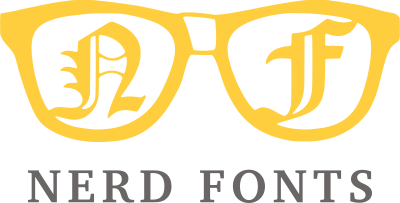
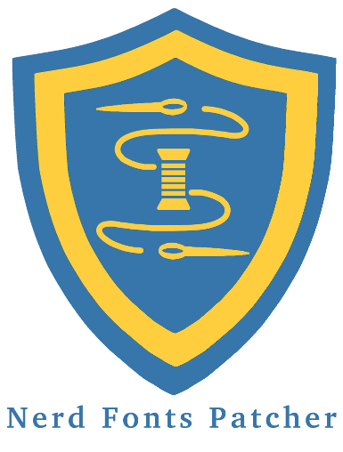

<h1 align="center">
  
</h1>
<h2 align="center">
  
</h2>

<div align="center">

[Releases][release]&nbsp;&nbsp;&nbsp;|&nbsp;&nbsp;&nbsp;[Fonts](#patched-fonts)&nbsp;&nbsp;&nbsp;|&nbsp;&nbsp;&nbsp;[Font Patcher](#font-patcher)&nbsp;&nbsp;&nbsp;|&nbsp;&nbsp;&nbsp;[Wiki Documentation][wiki]&nbsp;&nbsp;&nbsp;|&nbsp;&nbsp;&nbsp;[Stickers][stickers]&nbsp;&nbsp;&nbsp;|&nbsp;&nbsp;&nbsp;[VimDevIcons][vim-devicons]


[![GitHub release][img-version-badge]][repo] [![Gitter][img-gitter-badge]][gitter] [![Code of Conduct][coc-badge]][coc] [![PRs Welcome][prs-badge]][prs]  <a href="#patched-fonts" title=""></a> [![Twitter][twitter-badge]][twitter-intent]


</div>

**Nerd Fonts**는 개발자를 대상으로 많은 글리프(아이콘)를 가진 폰트를 패치하는 프로젝트입니다. 특히 [Font Awesome ➶][font-awesome], [Devicons ➶][vorillaz-devicons], [Octicons ➶][octicons], 또는 [다른 것들](#글리프-세트)과 같이 인기있는 '아이콘 폰트'에 있는 많은 부가적 글리프를 추가하기 위함입니다.

아래의 생키 플로우 다이어그램은 현재 포함된 글리프 세트를 보여줍니다:

<p align="center">
  
</p>
<sub><i>다이어그램은 <a href="http://sankeymatic.com/" title="SankeyMATIC (BETA): A Sankey diagram builder for everyone">@SankeyMATIC</a>으로 만들었습니다.</i></sub>


## 중요한 주의 사항
* `master` 브랜치 파일 경로는 안정성이 보장되지 **않습니다.** [저장소의 URI 레퍼런스를 체크해보세요.](#불안정한-파일-경로)
* 이 저장소를 클론하는 것은 [개발에 기여](#기여하기)하려는 것이 아닌 이상 추천하지 **않습니다.** ([저장소 크기 때문](#옵션-5-저장소-클론))

## 목차

[**TL;DR**](#tldr)

[**설치 옵션**](#폰트-설치)
  * [**1 - 수동**](#옵션-1-수동-설치)
  * [**2 - 릴리즈 아카이브 다운로드**](#옵션-2-릴리즈-아카이브-다운로드)
  * [**3 - 설치 스크립트**](#옵션-3-설치-스크립트)
  * [**4 - Homebrew Fonts (macOS (OS X))**](#옵션-4-homebrew-폰트)
  * [**5 - 저장소 클론**](#옵션-5-저장소-클론)
  * [**6 - Ad Hoc Curl 다운로드**](#옵션-6-ad-hoc-curl-다운로드)
  * [**7 - Arch Community Repository (Arch Linux)**](#옵션-7-비공식-arch-community-repository)
  * [**8 - 자신의 폰트 패치**](#옵션-8-자신의-폰트-패치)

[**기능**](#기능)
  * [**글리프/아이콘 세트**](#글리프-세트)
  * [**패치된 폰트들**](#패치된-폰트들)
  * [**조합**](#조합)
  * [**폰트 설치기**](#font-patcher)

[**개발자 / 기여자**](#font-patcher)
  * [**폰트 설치기**](#font-patcher)
  * [**폰트 설치기의 모든 폰트 설치하기!**](#gotta-patch-em-all)
  * [**패치할 다른 좋은 폰트들**](#패치할-다른-좋은-폰트들)
  * [**기여하기**](#기여하기)

[**프로젝트 동기**](#프로젝트-동기)

**추가적인 정보**
  * [**마스터의 불안정한 파일 경로**](#불안정한-파일-경로)
  * [**Changelog**](#changelog)
  * [**License**](#license)


## TL;DR
  Nerd Fonts는 인기있는 프로그래밍 폰트들에 많은 글리프를 추가합니다.
  아직 패치되지 않은 폰트를 원한다면 [폰트 설치기](#font-patcher)를 사용할 수 있습니다.
  더 높은 수준의 정보는 [위키](wiki)에 있습니다. Vim 플러그인을 찾는다면 [VimDevIcons ➶][vim-devicons]를 보세요.

### 다양한 폰트 다운로드 옵션

_만약..._

  * `옵션 1.` **빠르게** [`patched-fonts/` 디렉토리](#패치된-폰트들)에서 **개별 폰트**를 다운로드하고 싶은 경우.
  * `옵션 2.` 여러 스타일 (볼드, 이탤릭 등)의 **폰트 패밀리** 패키지를 다운로드하고 싶은 경우 [아카이브에서 다운로드](#옵션-2-릴리즈-아카이브-다운로드)를 확인하세요.
  * `옵션 3.` **자동으로** 설치하거나 **스크립트**를 사용하고 싶은 경우 [설치 스크립트](#옵션-3-설치-스크립트)를 확인하세요.
  * `옵션 4.` **macOS**에서 **Homebrew**를 사용하고 싶은 경우 [Homebrew 폰트](#옵션-4-homebrew-폰트)를 확인하세요.
  * `옵션 5.` **완전히 통제**하고 싶은 경우 [저장소 클론](#옵션-5-저장소-클론)을 확인하세요.
  * `옵션 6.` **`curl` 명령**을 사용하고 싶거나 **스크립트**를 사용하고 싶은 경우 [Ad Hoc Curl 다운로드](#옵션-6-ad-hoc-curl-다운로드)를 확인하세요.
  * `옵션 7.` **Arch Linux**에서 **Community 패키지**를 사용하고 싶은 경우 [비공식 Arch Community Repositories](#옵션-7-비공식-arch-community-repository)를 확인하세요.
  * `옵션 8.` 자신의 폰트를 패치하고 싶은 경우 [폰트 설치기](#옵션-8-자신의-폰트-패치)를 확인하세요.

## 기능
* [FontForge 파이썬 스크립트](#font-patcher)를 이용해 어떤 폰트든 패치할 수 있습니다.
  * **고정폭 (monospaced)** _또는_ **가변폭 (non-monospaced)** 글리프를 만드는 옵션을 포함합니다.
  * 더 자세한 정보는 [**폰트 설치기**](#font-patcher) 문단을 확인하세요.
* **`50`** 개의 [폰트 패밀리](#패치된-폰트들)
* **`1,571,470`** 개 이상의 폰트 조합/변형 [(자세한 정보)](#조합)
* **`9,000`** 개 이상의 글리프/아이콘 [(자세한 정보)](#조합)
  * 현재 글리프 세트: [Powerline with Extra Symbols][ryanoasis-powerline-extra-symbols], [Font Awesome][font-awesome], [Material Design Icons][font-material-design-icons], [Weather][font-weather], [Devicons][vorillaz-devicons], [Octicons][octicons], [Font Logos][font-logos] (구 Font Linux), [Pomicons][gabrielelana-pomicons]
* 각 폰트의 **고정폭 (monospaced)** _또는_ **가변폭 (non-monospaced)** 글리프 버전
  * 이는 Nerd Font 글리프 자체가 꼭 폰트 전체일 필요는 없다는 의미입니다.
* 개발자/기여자들이 모든 폰트를 다시 패치하기 위한 [bash 스크립트](#gotta-patch-em-all) 제공했습니다.


## 글리프 세트

:mag: :mag: 이제 [NerdFonts.com][Cheat Sheet]의 [Cheat Sheet][]에서 쉽게 글리프를 찾아볼 수 있습니다.

[위키: 글리프 세트와 코드포인트에 대한 자세한 정보][wiki-glyph-sets-codepoints]를 참고하세요.

### Shell에서의 아이콘 이름

[위키: Shell에서의 아이콘 이름][wiki-icon-names-in-shell]을 참고하세요.


## 패치된 폰트들

| 폰트명                                         | 폰트 이름 및 저장소          |\*RFN | EM 크기 | 상태            |
|:--------------------------------------------------|:----------------------------------|:-----|:--------|:------------------|
| [3270 Nerd Font][p-3270]                          | [3270][f-3270]                    | NO   | 1000    | ![w] ![m2] ![l]   |
| [Agave][p-agave]                                  | [Agave][f-agave]                  | NO   | 2048    | ![w] ![m2] ![l]   |
| [AnonymicePro Nerd Font][p-anonymous-pro]         | [Anonymous Pro][f-a-pro]          | NO   | 2048    | ![w] ![m2] ![l]   |
| [Arimo][p-arimo]                                  | [Arimo][f-arimo]                  | NO   | 2048    | ![w] ![m2] ![l]   |
| [Aurulent Sans Mono Nerd Font][p-aurulent]        |                                   | NO   | 1000    | ![w] ![m2] ![l]   |
| [BigBlueTerminal][p-bigblueterm]                  |                                   | NO   | 1200    | ![w] ![m2] ![l]   |
| [Bitstream Vera Sans Mono Nerd Font][p-bitstream] |                                   | NO   | 2048    | ![w] ![m2] ![l]   |
| [Blex*][p-blex]                                   | [IBM Plex Mono][f-ibm-plex]       | YES  | 1000    | ![w] ![m2] ![l]   |
| [Code New Roman Nerd Font][p-code-nr]             |                                   | NO   | 2048    | ![w] ![m2] ![l]   |
| [Cousine Nerd Font][p-cousine]                    | [Cousine][f-cousine]              | NO   | 1000    | ![w] ![m2] ![l]   |
| [DaddyTimeMono][p-daddytimemono]                  | [DaddyTimeMono][f-daddytimemono]  | NO   | 1024    | ![w] ![m2] ![l]   |
| [DepartureMono Nerd Font][p-departuremono]        | [Departure Mono][f-departuremono] | NO   | 550     | ![w] ![m2] ![l]   |
| [DejaVu Sans Mono Nerd Font][p-dejavu]            |                                   | NO   | 2048    | ![w] ![m2] ![l]   |
| [Droid Sans Mono Nerd Font][p-droid]              |                                   | NO   | 2048    | ![w] ![m2] ![l]   |
| [Fantasque Sans Nerd Font][p-fantasque]           | [Fantasque Sans][f-fant]          | NO   | 2048    | ![w] ![m2] ![l]   |
| [Fira Code Nerd Font][p-fira-code]                | [Fira Code][f-fira-code]          | NO   | 1000    | ![w] ![m2] ![l]   |
| [Fira Mono Nerd Font][p-fira-mono]                | [Fira][f-fira-mono]               | NO   | 1000    | ![w] ![m2] ![l]   |
| [Go Mono Nerd Font][p-go-mono]                    | [Go-Mono][f-go-mono]              | NO   | 1000    | ![w] ![m2] ![l]   |
| [Gohu Nerd Font][p-gohu]                          | [Gohu TTF][f-gohu2],[Gohu][f-gohu]| NO   | 1000    | ![w] ![m2] ![l]   |
| [Hack Nerd Font][p-hack]                          | [Hack][f-hack]                    | NO   | 2048    | ![w] ![m2] ![l]   |
| [Hasklug Nerd Font*][p-hasklig]                   | [Hasklig][f-hasklig]              | YES  | 1000    | ![w] ![m2] ![l]   |
| [Heavy Data Mono Nerd Font][p-heavy-data]         |                                   | NO   | 2048    | ![w] ![m2] ![l]   |
| [Hermut Nerd Font][p-hermit]                      |                                   | NO   | 1000    | ![w] ![m2] ![l]   |
| [iM-Writing*][p-im-writing]                       | [iA-Writer][f-ia-writer]          | YES  | 1000    | ![w] ![m2] ![l]   |
| [Inconsolata Nerd Font][p-inconsolata]            |                                   | NO   | 1000    | ![w] ![m2] ![l]   |
| [Inconsolata Go Nerd Font][p-inconsolata-go]      |                                   | NO   | 1000    | ![w] ![m2] ![l]   |
| [Inconsolata LGC Nerd Font][p-inconsolata-lgc]    |                                   | NO   | 1000    | ![w] ![m2] ![l]   |
| [Iosevka Nerd Font][p-iosevka]                    | [Iosevka][f-iosevka]              | NO   | 1000    | [#83][s-iosevka]  |
| [JetBrains Mono][p-jetbrains-mono]                | [JetBrains Mono][f-jetbrains-mono]| NO   | 1000    | ![w] ![m2] ![l]   |
| [Lekton Nerd Font][p-lekton]                      |                                   | NO   | 1000    | ![w] ![m2] ![l]   |
| [Literation Mono Nerd Font*][p-liberation]        | [Liberation][f-liberation]        | YES  | 2048    | ![w] ![m2] ![l]   |
| [Meslo Nerd Font][p-meslo]                        |                                   | NO   | 2048    | ![w] ![m2] ![l]   |
| [Monofur Nerd Font][p-monofur]                    |                                   | NO   | 2400    | ![w] ![m2] ![l]   |
| [Monoid Nerd Font][p-monoid]                      |                                   | NO   | 1536    | ![w] ![m2] ![l]   |
| [Mononoki Nerd Font][p-mononoki]                  | [Mononoki][f-mononoki]            | NO   | 1024    | ![w] ![m2] ![l]   |
| [M+ (MPlus) Nerd Font][p-mplus]                   |                                   | NO   | 1000    | ![w] ![m2] ![l]   |
| [Noto][p-noto]                                    |                                   | NO   | 1000    | ![w] ![m2] ![l]   |
| [OpenDyslexic][p-opendyslexic]                    |                                   | NO   | 1000    | ![w] ![m2] ![l]   |
| [Overpass][p-overpass]                            |                                   | NO   | 1000    | ![w] ![m2] ![l]   |
| [ProFont (Windows tweaked) Nerd Font][p-profont]  |                                   | NO   | 1200    | ![w] ![m2] ![l]   |
| [ProFont (x11) Nerd Font][p-profont]              |                                   | NO   | 1000    | ![w] ![m2] ![l]   |
| [ProggyClean Nerd Font][p-proggy-clean]           |                                   | NO   | 2048    | Imperfect         |
| [Roboto Mono][p-roboto]                           |                                   | NO   | 2048    | ![w] ![m2] ![l]   |
| [Sauce Code Nerd Font][p-source-code-pro]         | [Source][f-source]                | YES  | 1000    | ![w] ![m2] ![l]   |
| [Shure Tech Mono Nerd Font*][p-share-tech-mono]   | [Share Tech Mono][f-share]        | YES  | 1000    | ![w] ![m2] ![l]   |
| [Space Mono Nerd Font][p-space-mono]              | [Space Mono][f-space]             | NO   | 1000    | ![w] ![m2] ![l]   |
| [Terminess Nerd Font*][p-terminus]                | [Terminus Font][f-terminus]       | YES  | 1000    | ![w] ![m2] ![l]   |
| [Tinos][p-tinos]                                  |                                   | NO   | 2048    | ![w] ![m2] ![l]   |
| [Ubuntu Nerd Font][p-ubuntu]                      |                                   | NO   | 1000    | ![w] ![m2] ![l]   |
| [Ubuntu Mono Nerd Font][p-ubuntu-mono]            |                                   | NO   | 1000    | ![w] ![m2] ![l]   |
| [Victor Mono][p-victor]                           | [Victor Mono][f-victor]           | NO   | 1000    | ![w] ![m2] ![l]   |

<sub>_*RFN = 예약된 폰트 이름(Reserved Font Name)_</sub>

## 조합

- **`1,485,000`** 개 이상의 고유한 폰트 변형/조합 (Power Set):
  - **`50`** 개의 폰트 타입페이스
  - **`719`** 개의 폰트 패밀리
  - **`2,876`** 개의 '완전한' 변형/조합
  - **`'1,485,410'`** 개의 _가능한_ 변형/조합
  - **`1,488,286`** 개의 총 조합 (2,876 + 1,428,110)
- 각 폰트의 조합은 [변형](#변형)의 조합들입니다.

### 변형

- 플래그 지정 없음 (**Seti-UI + Custom**와 **[Devicons][vorillaz-devicons]** 만 기본으로 설정)
- **가변** 또는 **고정**폭 글리프
- [Font Awesome][font-awesome]
- [Font Awesome Extension][font-awesome-extension]
- [Material Design Icons][font-material-design-icons]
- [Weather][font-weather]
- [GitHub Octicons][octicons]
- [Font Logos][font-logos] (구 Font Linux)
- [Powerline Extra Symbols][ryanoasis-powerline-extra-symbols]
- [IEC Power Symbols][website-iecpower]
- [Pomicons][gabrielelana-pomicons]
- 윈도우 호환성


## 폰트 설치

### `옵션 1: 수동 설치`

> **빠르게** 특정 **개별 폰트**를 설치할 수 있는 최고의 옵션.

선택한 특정 [패치된 폰트](#패치된-폰트들)를 다운로드합니다.

### `옵션 2: 릴리즈 아카이브 다운로드`

> **아카이브** 또는 완전한 변형 (볼드, 이탤릭 등)의 **폰트 패밀리**를 위한 최고의 옵션.

패키지로 다운로드할 수 있는 폰트들은 [최신 릴리즈](https://github.com/ryanoasis/nerd-fonts/releases/latest)에 있습니다.

### `옵션 3: 설치 스크립트`

> **자동** 설치 또는 **스크립트**를 사용하는 최고의 옵션.

_주의_: Linux & macOS (OS X) 전용
_주의_: 현재 저장소를 **클론 해야 합니다**

#### 모든 폰트:

* 모든 패치된 폰트를 설치합니다. (_경고: 많은 폰트들이 큰 크기로 설치됩니다_)

```sh
./install.sh
```

#### 하나의 폰트:

* 하나의 폰트를 설치합니다.

```sh
./install.sh <FontName>
./install.sh Hack
./install.sh HeavyData
```

### `옵션 4: Homebrew 폰트`

> **macOS**에서 **Homebrew**를 사용하는 최고의 옵션.

macOS (OS X)의 [Homebrew Cask](https://github.com/Homebrew/homebrew-cask)를 통해 모든 폰트를 사용할 수 있습니다.

```sh
brew install font-hack-nerd-font
```

### `옵션 5: 저장소 클론`

> 폰트의 **모든** 또는 **대부분**을 **완전히 통제**하거나, 개발에 **기여**하기 위한 최고의 옵션.

제한된 폰트 세트에만 관심있는 경우 이 저장소를 클론하는 것은 필요하지도, 효율적이지도 **않습니다.** (주로 저장소 크기 때문)

하지만 저장소를 클론하고 싶다면 _얕은_ 클론을 하세요:

```sh
git clone --depth 1
```

### `옵션 6: Ad Hoc Curl 다운로드`

> **`curl` 명령** 또는 **스크립트**를 사용하는 옵션.

#### Linux

```sh
mkdir -p ~/.local/share/fonts
cd ~/.local/share/fonts && curl -fLo "Droid Sans Mono for Powerline Nerd Font Complete.otf" https://github.com/ryanoasis/nerd-fonts/raw/HEAD/patched-fonts/DroidSansMono/complete/Droid%20Sans%20Mono%20Nerd%20Font%20Complete.otf
```

_주의:_ 사용되지 않는 대체 경로: `~/.fonts`

#### macOS (OS X)

```sh
cd ~/Library/Fonts && curl -fLo "Droid Sans Mono for Powerline Nerd Font Complete.otf" https://github.com/ryanoasis/nerd-fonts/raw/HEAD/patched-fonts/DroidSansMono/complete/Droid%20Sans%20Mono%20Nerd%20Font%20Complete.otf
```

### `옵션 7: 비공식 Arch Community Repository`

Most fonts are available via [Arch Community packages](https://archlinux.org/packages/?sort=&repo=Community&q=-nerd).
Some special packages are [in AUR](https://aur.archlinux.org/packages?K=nerd-fonts-&outdated=off).

### `옵션 8: 자신의 폰트 패치`

> 자기 **자신의 폰트** 또는 패치된 폰트를 **커스터마이징**해 **패치**하기 위한 옵션.

제공된 파이썬 명령줄 스크립트를 사용하면 부가적인 글리프를 가진 자신의 폰트를 생성할 수 있습니다.

참고: [폰트 설치기](#font-patcher) 사용법

* [제공된 폰트](#패치된-폰트들) 중 하나를 사용하고 싶은 경우 이 옵션을 따르지 **마세요.**
* 시스템의 올바른 폰트 디렉토리에 생선된 폰트를 복사해야 합니다.

<h2 align="center" id="font-patcher">
	
</h2>

[VimDevIcons ➶][vim-devicons]에서 자신이 선택한 폰트를 패치하기:
* 요구 사항: Python 3, `python-fontforge` 패키지 (버전 `20141231` 또는 그 이상, [설치 안내](http://designwithfontforge.com/en-US/Installing_Fontforge.html)를 참고하세요.)
* OSX의 설치 방법: `brew install fontforge`
* 사용법:

```
./font-patcher PATH_TO_FONT
```

* 대안 사용법:  스크립트 플래그를 사용해 FontForge 바이너리와 함께 설치기를 실행하세요:

```
./fontforge -script font-patcher PATH_TO_FONT
```


```
Nerd Fonts Patcher v3.0.2 (4.4.0) (ff 20230101)
usage: font-patcher [-h] [-v] [-s] [-l] [-q] [-c] [--careful] [--removeligs] [--postprocess [POSTPROCESS]] [--configfile [CONFIGFILE]] [--custom [CUSTOM]]
                    [-ext [EXTENSION]] [-out [OUTPUTDIR]] [--glyphdir [GLYPHDIR]] [--makegroups [{-1,0,1,2,3,4,5,6}]] [--variable-width-glyphs]
                    [--has-no-italic] [--progressbars | --no-progressbars] [--debug [{0,1,2,3}]] [--dry] [--xavgcharwidth [XAVGWIDTH]] [--fontawesome]
                    [--fontawesomeextension] [--fontlogos] [--octicons] [--codicons] [--powersymbols] [--pomicons] [--powerline] [--powerlineextra]
                    [--material] [--weather]
                    font

Nerd Fonts Font Patcher: patches a given font with programming and development related glyphs

* Website: https://www.nerdfonts.com
* Version: 3.0.2
* Development Website: https://github.com/ryanoasis/nerd-fonts
* Changelog: https://github.com/ryanoasis/nerd-fonts/blob/-/changelog.md

positional arguments:
  font                  The path to the font to patch (e.g., Inconsolata.otf)

options:
  -h, --help            show this help message and exit
  -v, --version         show program's version number and exit
  -s, --mono, --use-single-width-glyphs
                        Whether to generate the glyphs as single-width not double-width (default is double-width)
  -l, --adjust-line-height
                        Whether to adjust line heights (attempt to center powerline separators more evenly)
  -q, --quiet, --shutup
                        Do not generate verbose output
  -c, --complete        Add all available Glyphs
  --careful             Do not overwrite existing glyphs if detected
  --removeligs, --removeligatures
                        Removes ligatures specificed in JSON configuration file
  --postprocess [POSTPROCESS]
                        Specify a Script for Post Processing
  --configfile [CONFIGFILE]
                        Specify a file path for JSON configuration file (see sample: src/config.sample.json)
  --custom [CUSTOM]     Specify a custom symbol font, all glyphs will be copied; absolute path suggested
  -ext [EXTENSION], --extension [EXTENSION]
                        Change font file type to create (e.g., ttf, otf)
  -out [OUTPUTDIR], --outputdir [OUTPUTDIR]
                        The directory to output the patched font file to
  --glyphdir [GLYPHDIR]
                        Path to glyphs to be used for patching
  --makegroups [{-1,0,1,2,3,4,5,6}]
                        Use alternative method to name patched fonts (recommended)
  --variable-width-glyphs
                        Do not adjust advance width (no "overhang")
  --has-no-italic       Font family does not have Italic (but Oblique)
  --progressbars        Show percentage completion progress bars per Glyph Set (default)
  --no-progressbars     Don't show percentage completion progress bars per Glyph Set
  --debug [{0,1,2,3}]   Verbose mode (optional: 1=just to file; 2*=just to terminal; 3=display and file)
  --dry                 Do neither patch nor store the font, to check naming
  --xavgcharwidth [XAVGWIDTH]
                        Adjust xAvgCharWidth (optional: concrete value)

Symbol Fonts:
  --fontawesome         Add Font Awesome Glyphs (http://fontawesome.io/)
  --fontawesomeextension
                        Add Font Awesome Extension Glyphs (https://andrelzgava.github.io/font-awesome-extension/)
  --fontlogos, --fontlinux
                        Add Font Logos Glyphs (https://github.com/Lukas-W/font-logos)
  --octicons            Add Octicons Glyphs (https://octicons.github.com)
  --codicons            Add Codicons Glyphs (https://github.com/microsoft/vscode-codicons)
  --powersymbols        Add IEC Power Symbols (https://unicodepowersymbol.com/)
  --pomicons            Add Pomicon Glyphs (https://github.com/gabrielelana/pomicons)
  --powerline           Add Powerline Glyphs
  --powerlineextra      Add Powerline Glyphs (https://github.com/ryanoasis/powerline-extra-symbols)
  --material, --materialdesignicons, --mdi
                        Add Material Design Icons (https://github.com/templarian/MaterialDesign)
  --weather, --weathericons
                        Add Weather Icons (https://github.com/erikflowers/weather-icons)
```

#### 예시

	./font-patcher Droid\ Sans\ Mono\ for\ Powerline.otf
	./font-patcher Droid\ Sans\ Mono\ for\ Powerline.otf -s -q
	./font-patcher Droid\ Sans\ Mono\ for\ Powerline.otf --use-single-width-glyphs --quiet
	./font-patcher Droid\ Sans\ Mono\ for\ Powerline.otf -w
	./font-patcher Droid\ Sans\ Mono\ for\ Powerline.otf --windows --quiet
	./font-patcher Droid\ Sans\ Mono\ for\ Powerline.otf --windows --pomicons --quiet
	./font-patcher Inconsolata.otf --fontawesome
	./font-patcher Inconsolata.otf --fontawesome --octicons --pomicons
	./font-patcher Inconsolata.otf


<a name="gotta-patch-em-all"></a>
## 폰트 설치기의 모든 폰트를 설치하기!

* 기여자나 개발자를 위한 방법

* 패치되지 않은 디렉토리의 **모든** 폰트를 다시 패치합니다:
```
./gotta-patch-em-all-font-patcher\!.sh
```

* 폰트명 패턴을 명시해 제한을 걸 수도 있습니다:
```
./gotta-patch-em-all-font-patcher\!.sh Hermit
```


## 기여하기

[contributing.md](contributing.md)를 참고하세요.


## 불안정한 파일 경로

:warning: 경고: 릴리즈에 따라 파일 경로가 변경될 수 있습니다. (특히 **메이저** 버전 범프)

각 배포에서 경로가 변경될 수 있으므로 ~~마스터~~ 브랜치가 아닌 **릴리즈** 브랜치를 참조하세요.

* 예시:
  * :x: 이렇게 하는 대신: <code>https\://github.com/ryanoasis/nerd-fonts/blob/<del>master</del>/patched-fonts/Hermit/Medium/complete/Hurmit%20Medium%20Nerd%20Font%20Complete.otf</code>
  * :white_check_mark: 이렇게 하세요: <code>https\://github.com/ryanoasis/nerd-fonts/blob/<b>0.9.0</b>/patched-fonts/Hermit/Medium/complete/Hurmit%20Medium%20Nerd%20Font%20Complete.otf</code>


## 패치할 좋은 폰트들

* 라이센스 때문에 공유할 수 없거나, 제공할 수 없는 추가적인 좋은 폰트 리스트:
 * [Input Mono][input-mono] (라이센스 제한)
   * 외부 호스팅으로 가능할 수 있습니다 :)
 * [PragmataPro][pragmatapro] (유료)
 * [Consolas][consolas] (소유권)
 * [Operator Mono][operator] (유료)
 * [Dank Mono][dank] (유료)


## 프로젝트 동기

[위키: 프로젝트 목적][wiki-project-purpose]


## Changelog

[changelog.md](changelog.md)를 참고하세요.

## License

[MIT](LICENSE) © Ryan L McIntyre

<!--
Repo References
-->

[vim-devicons]:https://github.com/ryanoasis/vim-devicons "VimDevIcons Vim Plugin (external link) ➶"
[vorillaz-devicons]:https://vorillaz.github.io/devicons/
[font-awesome]:https://github.com/FortAwesome/Font-Awesome
[font-awesome-extension]:https://github.com/AndreLZGava/font-awesome-extension
[font-material-design-icons]:https://github.com/Templarian/MaterialDesign
[font-weather]:https://github.com/erikflowers/weather-icons
[octicons]:https://github.com/primer/octicons
[font-logos]:https://github.com/Lukas-W/font-logos
[gabrielelana-pomicons]:https://github.com/gabrielelana/pomicons
[Seti-UI]:https://atom.io/themes/seti-ui
[ryanoasis-powerline-extra-symbols]:https://github.com/ryanoasis/powerline-extra-symbols
[wiki]:https://github.com/ryanoasis/nerd-fonts/wiki
[wiki-project-purpose]:https://github.com/ryanoasis/nerd-fonts/wiki/Project-Purpose
[wiki-glyph-sets-codepoints]:https://github.com/ryanoasis/nerd-fonts/wiki/Glyph-Sets-and-Code-Points
[wiki-icon-names-in-shell]:https://github.com/ryanoasis/nerd-fonts/wiki/Icon-Names-in-Shell
[repo]:https://github.com/ryanoasis/nerd-fonts
[gitter]:https://gitter.im/ryanoasis/nerd-fonts
[code-climate]:https://codeclimate.com/github/ryanoasis/nerd-fonts
[twitter-intent]:https://twitter.com/intent/tweet?url=https%3A%2F%2Fgithub.com%2Fryanoasis%2Fnerd-fonts&via=%40nerdfonts&text=Nerd%20Fonts%20-%20Iconic%20font%20aggregator%2C%20collection%2C%20and%20patcher&hashtags=iconfont%20font%20github


<!--
Website References
-->

[website-iecpower]:https://unicodepowersymbol.com/
[Cheat Sheet]:https://nerdfonts.com/cheat-sheet
[stickers]:https://www.redbubble.com/people/ryanoasis/works/30764810-nerd-fonts-iconic-font-aggregator

<!--
Link References
-->

[badge-version]:https://badge.fury.io/gh/ryanoasis%2Fnerd-fonts
[badge-gitter]:https://gitter.im/ryanoasis/nerd-fonts?utm_source=badge&utm_medium=badge&utm_campaign=pr-badge&utm_content=badge

[img-version-badge]:https://img.shields.io/github/release/ryanoasis/nerd-fonts.svg?style=for-the-badge
[img-gitter-badge]:https://img.shields.io/gitter/room/nwjs/nw.js.svg?style=for-the-badge
[img-code-climate-badge]:https://img.shields.io/codeclimate/issues/ryanoasis/nerd-fonts.svg?style=for-the-badge
[coc-badge]: https://img.shields.io/badge/code%20of-conduct-ff69b4.svg?style=for-the-badge
[prs-badge]: https://img.shields.io/badge/PRs-welcome-brightgreen.svg?style=for-the-badge&logo=data%3Aimage%2Fsvg%2Bxml%3Bbase64%2CPD94bWwgdmVyc2lvbj0iMS4wIiBlbmNvZGluZz0iVVRGLTgiPz48c3ZnIGlkPSJzdmcyIiB3aWR0aD0iNjQ1IiBoZWlnaHQ9IjU4NSIgdmVyc2lvbj0iMS4wIiB4bWxucz0iaHR0cDovL3d3dy53My5vcmcvMjAwMC9zdmciPiA8ZyBpZD0ibGF5ZXIxIj4gIDxwYXRoIGlkPSJwYXRoMjQxNyIgZD0ibTI5Ny4zIDU1MC44N2MtMTMuNzc1LTE1LjQzNi00OC4xNzEtNDUuNTMtNzYuNDM1LTY2Ljg3NC04My43NDQtNjMuMjQyLTk1LjE0Mi03Mi4zOTQtMTI5LjE0LTEwMy43LTYyLjY4NS01Ny43Mi04OS4zMDYtMTE1LjcxLTg5LjIxNC0xOTQuMzQgMC4wNDQ1MTItMzguMzg0IDIuNjYwOC01My4xNzIgMTMuNDEtNzUuNzk3IDE4LjIzNy0zOC4zODYgNDUuMS02Ni45MDkgNzkuNDQ1LTg0LjM1NSAyNC4zMjUtMTIuMzU2IDM2LjMyMy0xNy44NDUgNzYuOTQ0LTE4LjA3IDQyLjQ5My0wLjIzNDgzIDUxLjQzOSA0LjcxOTcgNzYuNDM1IDE4LjQ1MiAzMC40MjUgMTYuNzE0IDYxLjc0IDUyLjQzNiA2OC4yMTMgNzcuODExbDMuOTk4MSAxNS42NzIgOS44NTk2LTIxLjU4NWM1NS43MTYtMTIxLjk3IDIzMy42LTEyMC4xNSAyOTUuNSAzLjAzMTYgMTkuNjM4IDM5LjA3NiAyMS43OTQgMTIyLjUxIDQuMzgwMSAxNjkuNTEtMjIuNzE1IDYxLjMwOS02NS4zOCAxMDguMDUtMTY0LjAxIDE3OS42OC02NC42ODEgNDYuOTc0LTEzNy44OCAxMTguMDUtMTQyLjk4IDEyOC4wMy01LjkxNTUgMTEuNTg4LTAuMjgyMTYgMS44MTU5LTI2LjQwOC0yNy40NjF6IiBmaWxsPSIjZGQ1MDRmIi8%2BIDwvZz48L3N2Zz4%3D
[twitter-badge]:https://img.shields.io/twitter/url/http/shields.io.svg?style=for-the-badge&logo=twitter
[os-badge]:https://img.shields.io/badge/-OS-brightgreen.svg?style=for-the-badge&logoWidth=80&logo=data%3Aimage%2Fsvg%2Bxml%3Bbase64%2CPD94bWwgdmVyc2lvbj0iMS4wIiBlbmNvZGluZz0iVVRGLTgiPz48c3ZnIHdpZHRoPSIzOS43NDFtbSIgaGVpZ2h0PSIxMy4zNzdtbSIgdmVyc2lvbj0iMS4xIiB2aWV3Qm94PSIwIDAgMzkuNzQxMjggMTMuMzc3MTI3IiB4bWxucz0iaHR0cDovL3d3dy53My5vcmcvMjAwMC9zdmciIHhtbG5zOmNjPSJodHRwOi8vY3JlYXRpdmVjb21tb25zLm9yZy9ucyMiIHhtbG5zOmRjPSJodHRwOi8vcHVybC5vcmcvZGMvZWxlbWVudHMvMS4xLyIgeG1sbnM6cmRmPSJodHRwOi8vd3d3LnczLm9yZy8xOTk5LzAyLzIyLXJkZi1zeW50YXgtbnMjIj48bWV0YWRhdGE%2BPHJkZjpSREY%2BPGNjOldvcmsgcmRmOmFib3V0PSIiPjxkYzpmb3JtYXQ%2BaW1hZ2Uvc3ZnK3htbDwvZGM6Zm9ybWF0PjxkYzp0eXBlIHJkZjpyZXNvdXJjZT0iaHR0cDovL3B1cmwub3JnL2RjL2RjbWl0eXBlL1N0aWxsSW1hZ2UiLz48ZGM6dGl0bGUvPjwvY2M6V29yaz48L3JkZjpSREY%2BPC9tZXRhZGF0YT48ZyB0cmFuc2Zvcm09Im1hdHJpeCguMzMwODMgMCAwIC4zMzA4MyAyNi41MDggLTEuNzc0MikiPjxwb2x5Z29uIHBvaW50cz0iMTcuNCAzOC4zIDIxLjUgNDAuNiAyNy43IDQwLjYgMzMuNSAzNi4yIDM2LjEgMjkuMyAzMC4xIDIyIDI4LjQgMTcuOSAyMC4xIDE4LjIgMjAuMiAyMC41IDE4LjYgMjMuNSAxNi4xIDI4LjQgMTUuNiAzMi41IiBmaWxsPSIjZWNlZmYxIi8%2BPHBhdGggZD0ibTM0LjMgMjMuOWMtMS42LTIuMy0yLjktMy43LTMuNi02LjZzMC4yLTIuMS0wLjQtNC42Yy0wLjMtMS4zLTAuOC0yLjItMS4zLTIuOS0wLjYtMC43LTEuMy0xLjEtMS43LTEuMi0wLjktMC41LTMtMS4zLTUuNiAwLjEtMi43IDEuNC0yLjQgNC40LTEuOSAxMC41IDAgMC40LTAuMSAwLjktMC4zIDEuMy0wLjQgMC45LTEuMSAxLjctMS43IDIuNC0wLjcgMS0xLjQgMi0xLjkgMy4xLTEuMiAyLjMtMi4zIDUuMi0yIDYuMyAwLjUtMC4xIDYuOCA5LjUgNi44IDkuNyAwLjQtMC4xIDIuMS0wLjEgMy42LTAuMSAyLjEtMC4xIDMuMy0wLjIgNSAwLjIgMC0wLjMtMC4xLTAuNi0wLjEtMC45IDAtMC42IDAuMS0xLjEgMC4yLTEuOCAwLjEtMC41IDAuMi0xIDAuMy0xLjYtMSAwLjktMi44IDEuOS00LjUgMi4yLTEuNSAwLjMtNC0wLjItNS4yLTEuNyAwLjEgMCAwLjMgMCAwLjQtMC4xIDAuMy0wLjEgMC42LTAuMiAwLjctMC40IDAuMy0wLjUgMC4xLTEtMC4xLTEuM3MtMS43LTEuNC0yLjQtMi0xLjEtMC45LTEuNS0xLjNsLTAuOC0wLjhjLTAuMi0wLjItMC4zLTAuNC0wLjQtMC41LTAuMi0wLjUtMC4zLTEuMS0wLjItMS45IDAuMS0xLjEgMC41LTIgMS0zIDAuMi0wLjQgMC43LTEuMiAwLjctMS4ycy0xLjcgNC4yLTAuOCA1LjVjMCAwIDAuMS0xLjMgMC41LTIuNiAwLjMtMC45IDAuOC0yLjIgMS40LTIuOXMyLjEtMy4zIDIuMi00LjljMC0wLjcgMC4xLTEuNCAwLjEtMS45LTAuNC0wLjQgNi42LTEuNCA3LTAuMyAwLjEgMC40IDEuNSA0IDIuMyA1LjkgMC40IDAuOSAwLjkgMS43IDEuMiAyLjcgMC4zIDEuMSAwLjUgMi42IDAuNSA0LjEgMCAwLjMgMCAwLjgtMC4xIDEuMyAwLjIgMCA0LjEtNC4yLTAuNS03LjcgMCAwIDIuOCAxLjMgMi45IDMuOSAwLjEgMi4xLTAuOCAzLjgtMSA0LjEgMC4xIDAgMi4xIDAuOSAyLjIgMC45IDAuNCAwIDEuMi0wLjMgMS4yLTAuMyAwLjEtMC4zIDAuNC0xLjEgMC40LTEuNCAwLjctMi4zLTEtNi0yLjYtOC4zeiIgZmlsbD0iIzI2MzIzOCIvPjxnIGZpbGw9IiNlY2VmZjEiPjxlbGxpcHNlIGN4PSIyMS42IiBjeT0iMTUuMyIgcng9IjEuMyIgcnk9IjIiLz48ZWxsaXBzZSBjeD0iMjYuMSIgY3k9IjE1LjIiIHJ4PSIxLjciIHJ5PSIyLjMiLz48L2c%2BPGcgZmlsbD0iIzIxMjEyMSI%2BPGVsbGlwc2UgdHJhbnNmb3JtPSJtYXRyaXgoLS4xMjU0IC0uOTkyMSAuOTkyMSAtLjEyNTQgOC45NzU0IDM4Ljk5NykiIGN4PSIyMS43IiBjeT0iMTUuNSIgcng9IjEuMiIgcnk9Ii43Ii8%2BPGVsbGlwc2UgY3g9IjI2IiBjeT0iMTUuNiIgcng9IjEiIHJ5PSIxLjMiLz48L2c%2BPGcgZmlsbD0iI2ZmYzEwNyI%2BPHBhdGggZD0ibTM5LjMgMzcuNmMtMC40LTAuMi0xLjEtMC41LTEuNy0xLjQtMC4zLTAuNS0wLjItMS45LTAuNy0yLjUtMC4zLTAuNC0wLjctMC4yLTAuOC0wLjItMC45IDAuMi0zIDEuNi00LjQgMC0wLjItMC4yLTAuNS0wLjUtMS0wLjVzLTAuNyAwLjItMC45IDAuNi0wLjIgMC43LTAuMiAxLjdjMCAwLjggMCAxLjctMC4xIDIuNC0wLjIgMS43LTAuNSAyLjctMC41IDMuNyAwIDEuMSAwLjMgMS44IDAuNyAyLjEgMC4zIDAuMyAwLjggMC41IDEuOSAwLjVzMS44LTAuNCAyLjUtMS4xYzAuNS0wLjUgMC45LTAuNyAyLjMtMS43IDEuMS0wLjcgMi44LTEuNiAzLjEtMS45IDAuMi0wLjIgMC41LTAuMyAwLjUtMC45IDAtMC41LTAuNC0wLjctMC43LTAuOHoiLz48cGF0aCBkPSJtMTkuMiAzNy45Yy0xLTEuNi0xLjEtMS45LTEuOC0yLjktMC42LTEtMS45LTIuOS0yLjctMi45LTAuNiAwLTAuOSAwLjMtMS4zIDAuN3MtMC44IDEuMy0xLjUgMS44Yy0wLjYgMC41LTIuMyAwLjQtMi43IDFzMC40IDEuNSAwLjQgM2MwIDAuNi0wLjUgMS0wLjYgMS40LTAuMSAwLjUtMC4yIDAuOCAwIDEuMiAwLjQgMC42IDAuOSAwLjggNC4zIDEuNSAxLjggMC40IDMuNSAxLjQgNC42IDEuNXMzIDAgMy0yLjdjMC4xLTEuNi0wLjgtMi0xLjctMy42eiIvPjxwYXRoIGQ9Im0yMS4xIDE5LjhjLTAuNi0wLjQtMS4xLTAuOC0xLjEtMS40czAuNC0wLjggMS0xLjNjMC4xLTAuMSAxLjItMS4xIDIuMy0xLjFzMi40IDAuNyAyLjkgMC45YzAuOSAwLjIgMS44IDAuNCAxLjcgMS4xLTAuMSAxLTAuMiAxLjItMS4yIDEuNy0wLjcgMC4yLTIgMS4zLTIuOSAxLjMtMC40IDAtMSAwLTEuNC0wLjEtMC4zLTAuMS0wLjgtMC42LTEuMy0xLjF6Ii8%2BPC9nPjxnIGZpbGw9IiM2MzQ3MDMiPjxwYXRoIGQ9Im0yMC45IDE5YzAuMiAwLjIgMC41IDAuNCAwLjggMC41IDAuMiAwLjEgMC41IDAuMiAwLjUgMC4yaDAuOWMwLjUgMCAxLjItMC4yIDEuOS0wLjYgMC43LTAuMyAwLjgtMC41IDEuMy0wLjcgMC41LTAuMyAxLTAuNiAwLjgtMC43cy0wLjQgMC0xLjEgMC40Yy0wLjYgMC40LTEuMSAwLjYtMS43IDAuOS0wLjMgMC4xLTAuNyAwLjMtMSAwLjNoLTAuOWMtMC4zIDAtMC41LTAuMS0wLjgtMC4yLTAuMi0wLjEtMC4zLTAuMi0wLjQtMC4yLTAuMi0wLjEtMC42LTAuNS0wLjgtMC42IDAgMC0wLjIgMC0wLjEgMC4xbDAuNiAwLjZ6Ii8%2BPHBhdGggZD0ibTIzLjkgMTYuOGMwLjEgMC4yIDAuMyAwLjIgMC40IDAuM3MwLjIgMC4xIDAuMiAwLjFjMC4xLTAuMSAwLTAuMy0wLjEtMC4zIDAtMC4yLTAuNS0wLjItMC41LTAuMXoiLz48cGF0aCBkPSJtMjIuMyAxN2MwIDAuMSAwLjIgMC4yIDAuMiAwLjEgMC4xLTAuMSAwLjItMC4yIDAuMy0wLjIgMC4yLTAuMSAwLjEtMC4yLTAuMi0wLjItMC4yIDAuMS0wLjIgMC4yLTAuMyAwLjN6Ii8%2BPC9nPjxwYXRoIGQ9Im0zMiAzNC43djAuM2MwLjIgMC40IDAuNyAwLjUgMS4xIDAuNSAwLjYgMCAxLjItMC40IDEuNS0wLjggMC0wLjEgMC4xLTAuMiAwLjItMC4zIDAuMi0wLjMgMC4zLTAuNSAwLjQtMC42IDAgMC0wLjEtMC4xLTAuMS0wLjItMC4xLTAuMi0wLjQtMC40LTAuOC0wLjUtMC4zLTAuMS0wLjgtMC4yLTEtMC4yLTAuOS0wLjEtMS40IDAuMi0xLjcgMC41IDAgMCAwLjEgMCAwLjEgMC4xIDAuMiAwLjIgMC4zIDAuNCAwLjMgMC43IDAuMSAwLjIgMCAwLjMgMCAwLjV6IiBmaWxsPSIjNDU1YTY0Ii8%2BPC9nPjxnIHRyYW5zZm9ybT0ibWF0cml4KC4xMzk0NSAwIDAgLjEzOTQ1IDAgMS4xNjIzKSI%2BPHBhdGggZD0ibTAgMTIuNDAyIDM1LjY4Ny00Ljg2MDIgMC4wMTU2IDM0LjQyMy0zNS42NyAwLjIwMzEzeiIgZmlsbD0iI2Y4NjgyYyIvPjxwYXRoIGQ9Im0zOS45OTYgNi45MDU5IDQ3LjMxOC02LjkwNnY0MS41MjdsLTQ3LjMxOCAwLjM3NTY1eiIgZmlsbD0iIzkxYzMwMCIvPjxwYXRoIGQ9Im0zNS42NyA0NS45MzEgMC4wMjc3IDM0LjQ1My0zNS42Ny00LjkwNDEtMmUtMyAtMjkuNzh6IiBmaWxsPSIjMDBiNGYxIi8%2BPHBhdGggZD0ibTg3LjMyNiA0Ni4yNTUtMC4wMTExIDQxLjM0LTQ3LjMxOC02LjY3ODQtMC4wNjYzLTM0LjczOXoiIGZpbGw9IiNmZmMzMDAiLz48L2c%2BPHBhdGggZD0ibTI2LjEzNyAxMC4yODRjLTAuMTk5NTggMC40NjEwNi0wLjQzNTgxIDAuODg1NDctMC43MDk1MiAxLjI3NTctMC4zNzMwOCAwLjUzMTkzLTAuNjc4NTYgMC45MDAxMy0wLjkxMzk4IDEuMTA0Ni0wLjM2NDk0IDAuMzM1NjItMC43NTU5NSAwLjUwNzUtMS4xNzQ2IDAuNTE3MjctMC4zMDA1OSAwLTAuNjYzMDgtMC4wODU1My0xLjA4NS0wLjI1OTA0LTAuNDIzMzUtMC4xNzI2OS0wLjgxMjQtMC4yNTgyMy0xLjE2ODEtMC4yNTgyMy0wLjM3MzA4IDAtMC43NzMyMiAwLjA4NTU0LTEuMjAxMiAwLjI1ODIzLTAuNDI4NjQgMC4xNzM1MS0wLjc3Mzk1IDAuMjYzOTMtMS4wMzggMC4yNzI4OS0wLjQwMTUyIDAuMDE3MTItMC44MDE3My0wLjE1OTY2LTEuMjAxMi0wLjUzMTEyLTAuMjU0OTctMC4yMjIzOC0wLjU3Mzg4LTAuNjAzNjItMC45NTU5My0xLjE0MzctMC40MDk5LTAuNTc2NzQtMC43NDY5MS0xLjI0NTUtMS4wMTA5LTIuMDA4LTAuMjgyNzUtMC44MjM1Ni0wLjQyNDQ5LTEuNjIxMS0wLjQyNDQ5LTIuMzkzMSAwLTAuODg0NDEgMC4xOTExLTEuNjQ3MiAwLjU3Mzg4LTIuMjg2NCAwLjMwMDgzLTAuNTEzNDQgMC43MDEwNC0wLjkxODQ2IDEuMjAxOS0xLjIxNTggMC41MDA5LTAuMjk3MzMgMS4wNDIxLTAuNDQ4ODQgMS42MjUtMC40NTg1NCAwLjMxODkxIDAgMC43MzcxMyAwLjA5ODY1IDEuMjU2OCAwLjI5MjUyIDAuNTE4MjUgMC4xOTQ1MyAwLjg1MTAxIDAuMjkzMTggMC45OTY5IDAuMjkzMTggMC4xMDkwOCAwIDAuNDc4NzQtMC4xMTUzNSAxLjEwNTQtMC4zNDUzMSAwLjU5MjYyLTAuMjEzMjYgMS4wOTI4LTAuMzAxNTYgMS41MDI1LTAuMjY2NzggMS4xMTAzIDAuMDg5NiAxLjk0NDQgMC41MjcyOSAyLjQ5OTIgMS4zMTU4LTAuOTkyOTkgMC42MDE2Ni0xLjQ4NDIgMS40NDQ0LTEuNDc0NCAyLjUyNTQgOWUtMyAwLjg0MjA1IDAuMzE0NDMgMS41NDI4IDAuOTE0NzkgMi4wOTkxIDAuMjcyMDggMC4yNTgyMiAwLjU3NTkyIDAuNDU3OCAwLjkxMzk4IDAuNTk5NTQtMC4wNzMzMiAwLjIxMjYxLTAuMTUwNyAwLjQxNjI2LTAuMjMyOTggMC42MTE3NnptLTIuNTQ2NC0xMC4wMmMwIDAuNjYtMC4yNDExMiAxLjI3NjItMC43MjE3MyAxLjg0NjYtMC41OCAwLjY3ODA3LTEuMjgxNSAxLjA2OTktMi4wNDIzIDEuMDA4MS0wLjAwOTctMC4wNzkxOC0wLjAxNTMtMC4xNjI1MS0wLjAxNTMtMC4yNTAwOCAwLTAuNjMzNiAwLjI3NTgyLTEuMzExNyAwLjc2NTY0LTEuODY2MSAwLjI0NDU0LTAuMjgwNzEgMC41NTU1NS0wLjUxNDEyIDAuOTMyNzEtMC43MDAzMSAwLjM3NjM1LTAuMTgzNDEgMC43MzIzMy0wLjI4NDg1IDEuMDY3MS0wLjMwMjIxIDAuMDA5OCAwLjA4ODIzIDAuMDEzODUgMC4xNzY0NyAwLjAxMzg1IDAuMjY0eiIgc3Ryb2tlLXdpZHRoPSIuMDgxNDYiLz48L3N2Zz4%3D


[consolas]:https://www.microsoft.com/typography/fonts/family.aspx?FID=300
[input-mono]:http://input.djr.com/download/
[pragmatapro]:https://www.fsd.it/shop/fonts/pragmatapro/
[operator]:https://www.typography.com/fonts/operator/
[dank]:https://dank.sh/

[release]:https://github.com/ryanoasis/nerd-fonts/releases/latest "Latest Release (external link) ➶"
[coc]:https://github.com/ryanoasis/nerd-fonts/blob/-/code_of_conduct.md "Contributor Covenant Code of Conduct"
[prs]:http://makeapullrequest.com "Make a Pull Request (external link) ➶"

<!--
Font repos
-->

[f-arimo]:https://github.com/google/fonts/tree/master/apache/arimo
[f-hack]:https://github.com/chrissimpkins/Hack
[f-a-pro]:https://www.marksimonson.com/fonts/view/anonymous-pro
[f-3270]:https://github.com/rbanffy/3270font
[f-cousine]:https://fonts.google.com/specimen/Cousine
[f-source]:https://github.com/adobe-fonts/source-code-pro
[f-liberation]:https://pagure.io/liberation-fonts
[f-terminus]:http://terminus-font.sourceforge.net
[f-fira-mono]:https://github.com/mozilla/Fira
[f-fira-code]:https://github.com/tonsky/FiraCode
[f-monoid]:https://github.com/larsenwork/monoid
[f-iosevka]:https://github.com/be5invis/Iosevka
[f-jetbrains-mono]:https://github.com/JetBrains/JetBrainsMono
[f-fant]:https://github.com/belluzj/fantasque-sans
[f-share]:https://fonts.google.com/specimen/Share+Tech+Mono
[f-space]:https://fonts.google.com/specimen/Space+Mono
[f-go-mono]:https://go.googlesource.com/image/+/master/font/gofont/ttfs/
[f-gohu]:http://font.gohu.org/
[f-gohu2]:https://github.com/koemaeda/gohufont-ttf
[f-mononoki]:https://madmalik.github.io/mononoki/
[f-hasklig]:https://github.com/i-tu/Hasklig
[f-ibm-plex]:https://github.com/IBM/plex
[f-victor]:https://github.com/rubjo/victor-mono
[f-daddytimemono]:https://github.com/BourgeoisBear/DaddyTimeMono
[f-agave]:https://github.com/agarick/agave
[f-ia-writer]:https://github.com/iaolo/iA-Fonts
[f-departuremono]:https://github.com/rektdeckard/departure-mono

<!--
Patched Font internal links
-->

[p-3270]:patched-fonts/3270
[p-anonymous-pro]:patched-fonts/AnonymousPro
[p-aurulent]:patched-fonts/AurulentSansMono
[p-arimo]:patched-fonts/Arimo
[p-bigblueterm]:patched-fonts/BigBlueTerminal
[p-bitstream]:patched-fonts/BitstreamVeraSansMono
[p-blex]:patched-fonts/IBMPlexMono
[p-cousine]:patched-fonts/Cousine
[p-departuremono]:patched-fonts/DepartureMono
[p-dejavu]:patched-fonts/DejaVuSansMono
[p-droid]:patched-fonts/DroidSansMono
[p-fantasque]:patched-fonts/FantasqueSansMono
[p-fira-code]:patched-fonts/FiraCode
[p-fira-mono]:patched-fonts/FiraMono
[p-heavy-data]:patched-fonts/HeavyData
[p-hermit]:patched-fonts/Hermit
[p-inconsolata]:patched-fonts/Inconsolata
[p-inconsolata-go]:patched-fonts/InconsolataGo
[p-inconsolata-lgc]:patched-fonts/InconsolataLGC
[p-iosevka]:patched-fonts/Iosevka
[p-jetbrains-mono]:patched-fonts/JetBrainsMono
[p-hack]:patched-fonts/Hack
[p-lekton]:patched-fonts/Lekton
[p-liberation]:patched-fonts/LiberationMono
[p-meslo]:patched-fonts/Meslo
[p-monofur]:patched-fonts/Monofur
[p-monoid]:patched-fonts/Monoid
[p-mplus]:patched-fonts/MPlus
[p-noto]:patched-fonts/Noto
[p-opendyslexic]:patched-fonts/OpenDyslexic
[p-overpass]:patched-fonts/Overpass
[p-profont]:patched-fonts/ProFont
[p-proggy-clean]:patched-fonts/ProggyClean
[p-roboto]:patched-fonts/RobotoMono
[p-source-code-pro]:patched-fonts/SourceCodePro
[p-terminus]:patched-fonts/Terminus
[p-tinos]:patched-fonts/Tinos
[p-ubuntu]:patched-fonts/Ubuntu
[p-ubuntu-mono]:patched-fonts/UbuntuMono
[p-share-tech-mono]:patched-fonts/ShareTechMono
[p-space-mono]:patched-fonts/SpaceMono
[p-go-mono]:patched-fonts/Go-Mono
[p-gohu]:patched-fonts/Gohu
[p-mononoki]:patched-fonts/Mononoki
[p-code-nr]:patched-fonts/CodeNewRoman
[p-hasklig]:patched-fonts/Hasklig
[p-victor]:patched-fonts/VictorMono
[p-daddytimemono]:patched-fonts/DaddyTimeMono
[p-agave]:patched-fonts/Agave
[p-im-writing]:patched-fonts/iA-Writer


<!--
Quick Link Images
-->

[ql-1]:images/nerd-fonts-character-logo-md.png "Latest Release (external link) ➶"
[ql-2]:images/nerd-fonts-character-logo-md.png "↓ View Patched Fonts List ↓"
[ql-3]:images/nerd-fonts-patcher-logo-md.png "↓ Font Patcher Details ↓"
[ql-4]:https://raw.githubusercontent.com/wiki/ryanoasis/vim-devicons/screenshots/v1.0.0/branding-logo-sm.png "VimDevIcons Vim Plugin (external link) ➶"
[ql-5]:images/nerd-fonts-character-logo-md.png "Font Package Archive (Zip) Downloads (external link) ➶"

<!--
Patched Font Statuses
-->

[w-top]:https://github.com/ryanoasis/nerd-fonts/wiki/screenshots/v1.0.x/windows-pass-sm.png "↓ Windows Compatibility Status ↓"
[l-top]:https://github.com/ryanoasis/nerd-fonts/wiki/screenshots/v1.0.x/linux-pass-sm.png "↓ Linux Compatibility Status ↓"
[m-top]:https://github.com/ryanoasis/nerd-fonts/wiki/screenshots/v1.0.x/mac-pass-sm.png "↓ macOS (OSX) Compatibility Status ↓"

[w]:https://github.com/ryanoasis/nerd-fonts/wiki/screenshots/v1.0.x/windows-pass-sm.png "Windows status is working ☺"
[l]:https://github.com/ryanoasis/nerd-fonts/wiki/screenshots/v1.0.x/linux-pass-sm.png "Linux status is working ☺"
[m]:https://github.com/ryanoasis/nerd-fonts/wiki/screenshots/v1.0.x/mac-pass-sm.png "macOS (OSX) status is working ☺"

[w2]:https://github.com/ryanoasis/nerd-fonts/wiki/screenshots/v1.0.x/windows-unknown-sm.png "Windows status is Unknown/Un-tested"
[l2]:https://github.com/ryanoasis/nerd-fonts/wiki/screenshots/v1.0.x/linux-unknown-sm.png "Linux status is Unknown/Un-tested"
[m2]:https://github.com/ryanoasis/nerd-fonts/wiki/screenshots/v1.0.x/mac-unknown-sm.png "macOS (OSX) status is Unknown/Un-tested"

[s-iosevka]:https://github.com/ryanoasis/nerd-fonts/issues/83
