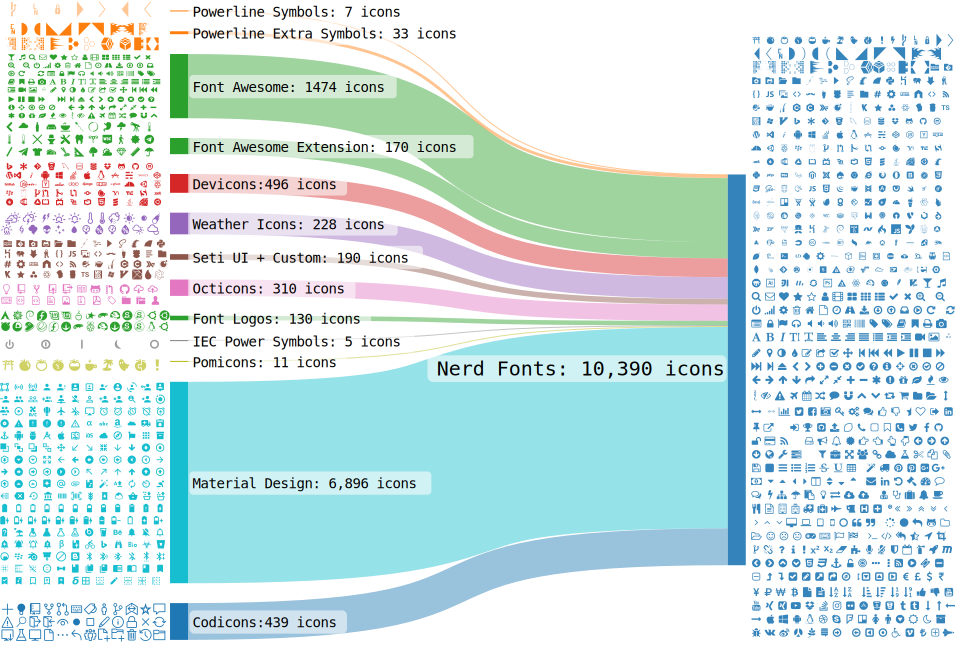

<h1 align="center">
  
</h1>
<h2 align="center">
  
</h2>

<div align="center">

[Releases][release]&nbsp;&nbsp;&nbsp;|&nbsp;&nbsp;&nbsp;[Fonts](#字體包)&nbsp;&nbsp;&nbsp;|&nbsp;&nbsp;&nbsp;[Font Patcher](#font-patcher)&nbsp;&nbsp;&nbsp;|&nbsp;&nbsp;&nbsp;[Wiki Documentation][wiki]&nbsp;&nbsp;&nbsp;|&nbsp;&nbsp;&nbsp;[Stickers][stickers]&nbsp;&nbsp;&nbsp;|&nbsp;&nbsp;&nbsp;[VimDevIcons][vim-devicons]

[![GitHub release][img-version-badge]][repo] [![Gitter][img-gitter-badge]][gitter] [![Code of Conduct][coc-badge]][coc] [![PRs Welcome][prs-badge]][prs] <a href="#patched-fonts" title=""></a> [![Twitter][twitter-badge]][twitter-intent]

</div>

**Nerd Fonts** 是一個使用大量字體圖示來解決程式設計師在開發過程中缺少合適字體的問題的專案。它可以從流行的字體圖示庫中將大量外部字體引入待開發的專案中，它支持的字體圖示庫包括 [Font Awesome ➶][font-awesome], [Devicons ➶][vorillaz-devicons], [Octicons ➶][octicons], and [others](#字形集).

下面的[桑基圖（Sankey Diagram）](https://en.wikipedia.org/wiki/Sankey_diagram)展示了 Nerd Fonts 中現有的字形組合：

<p align="center">
  
</p>
<sub><i>創建圖表的工具為： <a href="http://sankeymatic.com/" title="SankeyMATIC (BETA): A Sankey diagram builder for everyone">@SankeyMATIC</a></i></sub>

## 重要提示

- `master` 分支的文件路徑 **不穩定！** [驗證你的 repository URI references](#不穩定的文件路徑)
- 除非你想成為[開發貢獻者](#貢獻)，不然最好**不要**複製這個 repository。

## 目錄

[**TL;DR**](#tldr)

[**安裝選項**](#字體安裝)

- [**1 - 手動**](#選項1-手動下載並安裝)
- [**2 - 下載發佈存檔**](#選項2-下載發佈存檔)
- [**3 - 腳本安裝**](#選項3-腳本安裝)
- [**4 - Homebrew Fonts (macOS (OS X))**](#選項4-homebrew-字體)
- [**5 - 複製 Repo**](#選項5-複製-repo)
- [**6 - Ad Hoc Curl 下載**](#選項6-ad-hoc-curl-下載)
- [**7 - Arch Community Repository (Arch Linux)**](#選項7-非官方-arch-community-repository)
- [**8 - 打包你的個人字體**](#選項8-打包你的個人字體)

[**特徵**](#特徵)

- [**字形集**](#字形集)
- [**字體包**](#字體包)
- [**組合**](#組合)
- [**Font Patcher**](#font-patcher)

[**開發者 / 貢獻者**](#font-patcher)

- [**Font Patcher**](#font-patcher)
- [**Gotta Patch 'em All Font Patcher!**](#gotta-patch-em-all)
- [**Other Good Fonts to Patch**](#其他的好字體)
- [**Contributing**](#貢獻)

[**專案目的**](#專案目的)

**附錄**

- [**master 中不穩定的文件路徑**](#不穩定的文件路徑)
- [**更新日誌**](#更新日誌)
- [**證書**](#授權)

## TL;DR

Nerd Fonts 中包含流行的程式字體和字形。
如果你想要的字體沒有在現有的字體庫中，你可以使用 [font patcher](#font-patcher)來自訂字體。
更多信息請見 [wiki][wiki]。如果你正在尋找 Vim 外掛，請見 [VimDevIcons ➶][vim-devicons]。

### 多種字體下載選項

_如果你..._

- `選項 1.` 需要**快速**從[`patched-fonts/` directory](#字體包)下載一個 **獨立字體**
- `選項 2.` 需要去下載包含粗體、斜體等等一系列字體的 **字體家族**，請見 [下載檔案](#選項2-下載發佈存檔)
- `選項 3.` 需要**自動安裝**或使用**腳本**，請見 [安裝腳本](#選項3-腳本安裝)
- `選項 4.` 是**macOS**的使用者，並且想要使用**Homebrew**，請見 [Homebrew Fonts](#選項4-homebrew-字體)
- `選項 5.` 想要 **完全控制**，請見 [複製這個 repo](#選項5-複製-repo)
- `選項 6.` 想要使用 **`curl` command** 或者使用 **scripts**，請見 [Ad Hoc Curl 下載](#選項6-ad-hoc-curl-下載)
- `選項 7.` 是**Arch Linux**的使用者，並且想要使用**Community packages**，請見 [Arch Community Repositories](#選項7-非官方-arch-community-repository)
- `選項 8.` 想要打包你自訂的字體，請見 [字體包](#選項8-打包你的個人字體)

- [FontForge Python script](#font-patcher) 可以打包任何字體
  - 包括建立**Monospaced (fixed-pitch, fixed-width)** _或者_ **double-width (non-monospaced)** 字形
  - 更多詳情請見 [**Font Patcher**](#font-patcher) 段落
- **`51`** 已經 [打包了字體家族](#字體包)
- Over **`1,571,470`** 獨立的 組合/變型 字體 [(更多詳情)](#組合)
- Over **`9,000`** 字形/圖示 組合 [(更多詳情)](#組合)
  - 當前的字形集包括： [Powerline with Extra Symbols][ryanoasis-powerline-extra-symbols], [Font Awesome][font-awesome], [Material Design Icons][font-material-design-icons], [Weather][font-weather], [Devicons][vorillaz-devicons], [Octicons][octicons], [Font Logos][font-logos] (Formerly Font Linux), [Pomicons][gabrielelana-pomicons], [Codeicons][codicons]
- 每種字體的**Monospaced (fixed-pitch, fixed-width)** _和_ **double-width (non-monospaced)** 版本
  - 這指的是 Nerd Font 字形本身，並不一定需要將字體作為一個整體考慮
- 一個 開發者/貢獻者提供了 [bash script](#gotta-patch-em-all) 來為所有字體再打包

## 字形集

:mag: :mag: 你現在可以透過 [NerdFonts.com][cheat sheet] 中的 [Cheat Sheet][] 對字形進行搜索

請見 [Wiki: Glyph Sets and Codepoints for more details][wiki-glyph-sets-codepoints]

### Shell 中的 Icon 名稱

請見 [Wiki: Icon names in shell][wiki-icon-names-in-shell]

## 字體包

| Font Name                                         | Font Name and Repository          | ver   |\*RFN | Status            |
|:--------------------------------------------------|:----------------------------------|:------|:-----|:------------------|
| [3270 Nerd Font][p-3270]                          | [3270][f-3270]                    | 3.0.1 | NO   | ![w] ![m2] ![l]   |
| [Agave][p-agave]                                  | [Agave][f-agave]                  | 37    | NO   | ![w] ![m2] ![l]   |
| [AnonymicePro Nerd Font][p-anonymous-pro]         | [Anonymous Pro][f-a-pro]          | 1.002 | YES  | ![w] ![m2] ![l]   |
| [Arimo][p-arimo]                                  | [Arimo][f-arimo]                  | 1.33  | NO   | ![w] ![m2] ![l]   |
| [Aurulent Sans Mono Nerd Font][p-aurulent]        | Stephen G. Hartke                 |       | NO   | ![w] ![m2] ![l]   |
| [BigBlueTerminal][p-bigblueterm]                  | VileR                             |       | NO   | ![w] ![m2] ![l]   |
| [Bitstrom Wera Nerd Font][p-bitstream]            | Bitstream Inc                     | 1.1   | YES  | ![w] ![m2] ![l]   |
| [Blex Mono][p-blex]                               | [IBM Plex Mono][f-ibm-plex]       | 2.3   | YES  | ![w] ![m2] ![l]   |
| [Caskaydia Cove Nerd Font][p-cascadia]            | [Cascadia Code][f-cascadia]       |2111.01| YES  | ![w] ![m2] ![l]   |
| [Code New Roman Nerd Font][p-code-nr]             | Sam Radian                        | 2.0   | NO   | ![w] ![m2] ![l]   |
| [Comic Shanns Mono Nerd Font][p-comic]            | [Comic Shanns Mono][f-comic]      | 1.3   | NO   | ![w] ![m2] ![l]   |
| [Cousine Nerd Font][p-cousine]                    | [Cousine][f-cousine]              | 1.211 | NO   | ![w] ![m2] ![l]   |
| [DaddyTimeMono][p-daddytimemono]                  | [DaddyTimeMono][f-daddytimemono]  | 1.2.3 | NO   | ![w] ![m2] ![l]   |
| [DepartureMono Nerd Font][p-departuremono]        | [Departure Mono][f-departuremono] | 1.422 | NO   | ![w] ![m2] ![l]   |
| [DejaVu Sans Mono Nerd Font][p-dejavu]            | [DejaVu][f-dejavu]                | 2.37  | NO   | ![w] ![m2] ![l]   |
| [Droid Sans Mono Nerd Font][p-droid]              | Ascender Corp                     |1.00-113| NO   | ![w] ![m2] ![l]   |
| [Fantasque Sans Nerd Font][p-fantasque]           | [Fantasque Sans][f-fant]          | 1.8.0 | NO   | ![w] ![m2] ![l]   |
| [Fira Code Nerd Font][p-fira-code]                | [Fira Code][f-fira-code]          | 6.2   | NO   | ![w] ![m2] ![l]   |
| [Fira Mono Nerd Font][p-fira-mono]                | [Fira][f-fira-mono]               | 3.206 | NO   | ![w] ![m2] ![l]   |
| [Go Mono Nerd Font][p-go-mono]                    | [Go-Mono][f-go-mono]              | 2.010 | NO   | ![w] ![m2] ![l]   |
| [Gohu Nerd Font][p-gohu]                          | [Gohu TTF][f-gohu2],[Gohu][f-gohu]| 2.0   | NO   | ![w] ![m2] ![l]   |
| [Hack Nerd Font][p-hack]                          | [Hack][f-hack]                    | 3.003 | NO   | ![w] ![m2] ![l]   |
| [Hasklug Nerd Font][p-hasklig]                    | [Hasklig][f-hasklig]              | 1.2   | YES  | ![w] ![m2] ![l]   |
| [Heavy Data Mono Nerd Font][p-heavy-data]         | Vic Fieger                        | 1     | NO   | ![w] ![m2] ![l]   |
| [Hurmit Nerd Font][p-hermit]                      | [Hermit][f-hermit]                | 2.0   | YES  | ![w] ![m2] ![l]   |
| [iM-Writing][p-im-writing]                        | [iA-Writer][f-ia-writer]          | Dec 2018 | YES  | ![w] ![m2] ![l]   |
| [Inconsolata Nerd Font][p-inconsolata]            | [Inconsolata][f-inconsolata]      | 3.000 | NO   | ![w] ![m2] ![l]   |
| [Inconsolata Go Nerd Font][p-inconsolata-go]      | [InconsolataGo][f-inconsolatago]  | 1.013 | NO   | ![w] ![m2] ![l]   |
| [Inconsolata LGC Nerd Font][p-inconsolata-lgc]    | [Inconsolata LGC][f-inconsolatalgc] | 1.3 | NO   | ![w] ![m2] ![l]   |
| [Iosevka Nerd Font][p-iosevka]                    | [Iosevka][f-iosevka]              |22.1.0 | NO   | ![w] ![m2] ![l]   |
| [Iosevka Term Nerd Font][p-iosevka-term]          | [Iosevka Term][f-iosevka]         |22.1.0 | NO   | ![w] ![m2] ![l]   |
| [JetBrains Mono][p-jetbrains-mono]                | [JetBrains Mono][f-jetbrains-mono]| 2.304 | NO   | ![w] ![m2] ![l]   |
| [Lekton Nerd Font][p-lekton]                      | [Lekton][f-lekton]                | 34    | NO   | ![w] ![m2] ![l]   |
| [Literation Mono Nerd Font][p-liberation]         | [Liberation][f-liberation]        | 2.1.5 | YES  | ![w] ![m2] ![l]   |
| [Lilex Nerd Font][p-lilex]                        | [Lilex][f-lilex]                  | 2.300 | NO   | ![w2] ![m2] ![l]  |
| [Meslo Nerd Font][p-meslo]                        | [Meslo][f-meslo]                  | 1.21  | NO   | ![w] ![m2] ![l]   |
| [Monofur Nerd Font][p-monofur]                    | Tobias B Koehler                  | 1.0   | NO   | ![w] ![m2] ![l]   |
| [Monoid Nerd Font][p-monoid]                      | [Monoid][f-monoid]                | 0.61  | NO   | ![w] ![m2] ![l]   |
| [Mononoki Nerd Font][p-mononoki]                  | [Mononoki][f-mononoki]            | 1.6   | YES  | ![w] ![m2] ![l]   |
| [M+ (MPlus) Nerd Font][p-mplus]                   | [M+ Fonts][f-mplus]               |2023/03| NO   | ![w] ![m2] ![l]   |
| [Noto][p-noto]                                    | [Noto][f-noto]                    | div   | NO   | ![w] ![m2] ![l]   |
| [OpenDyslexic][p-opendyslexic]                    | [OpenDyslexic][f-opendyslexic]    | 2.001 | NO   | ![w] ![m2] ![l]   |
| [Overpass][p-overpass]                            | [Overpass][f-overpass]            | 3.0.5 | NO   | ![w] ![m2] ![l]   |
| [ProFont (Windows tweaked) Nerd Font][p-profont]  | [ProFont][f-profont]              | 2.3   | NO   | ![w] ![m2] ![l]   |
| [ProFont (x11) Nerd Font][p-profont]              | [ProFont][f-profont]              | 2.2   | NO   | ![w] ![m2] ![l]   |
| [ProggyClean Nerd Font][p-proggy-clean]           | Tristan Grimmer                   |2004/04/15| NO   | Imperfect         |
| [Roboto Mono][p-roboto]                           | [Roboto Mono][f-roboto]           | 3.0   | NO   | ![w] ![m2] ![l]   |
| [Sauce Code Nerd Font][p-source-code-pro]         | [Source][f-source]                | 2.038 | YES  | ![w] ![m2] ![l]   |
| [Shure Tech Mono Nerd Font][p-share-tech-mono]    | [Share Tech Mono][f-share]        | 1.003 | YES  | ![w] ![m2] ![l]   |
| [Space Mono Nerd Font][p-space-mono]              | [Space Mono][f-space]             | 1.001 | NO   | ![w] ![m2] ![l]   |
| [Terminess Nerd Font][p-terminus]                 | [Terminus TTF][f-terminus]        |4.49.2 | YES  | ![w] ![m2] ![l]   |
| [Tinos][p-tinos]                                  | [Tinos][f-tinos]                  | 1.23  | NO   | ![w] ![m2] ![l]   |
| [Ubuntu Nerd Font][p-ubuntu]                      | [Ubuntu Font][f-ubuntu]           | 0.83  | NO   | ![w] ![m2] ![l]   |
| [Ubuntu Mono Nerd Font][p-ubuntu-mono]            | [Ubuntu Font][f-ubuntu]           | 0.80  | NO   | ![w] ![m2] ![l]   |
| [Victor Mono][p-victor]                           | [Victor Mono][f-victor]           | 1.5.4 | NO   | ![w] ![m2] ![l]   |

<sub>_\*RFN = Reserved Font Name_</sub>

## 組合

- 超過 **`1,485,000個`** 獨立的 變化/組合(Power Set)字體包：
  - **`50個`** 字體合集
  - **`719個`** 字體家族
  - **`2,876個`** ‘完全’的 變化/組合字體
  - **`1,485,410個`** _有可能的_ 變化/組合字體
  - **`1,488,286個`** 總字體數 (2,876 + 1,485,410)
- 每種字體的組合都是任意 [Variations](#variations) 的組合

### Variations

- no flags given (defaults to only **Seti-UI + Custom** and **[Devicons][vorillaz-devicons]**)
- **double _(variable/proportional)_** or **single _(fixed/monospaced)_** width glyphs
- [Font Awesome][font-awesome]
- [Font Awesome Extension][font-awesome-extension]
- [Material Design Icons][font-material-design-icons]
- [Weather][font-weather]
- [GitHub Octicons][octicons]
- [Font Logos][font-logos] (Formerly Font Linux)
- [Powerline Extra Symbols][ryanoasis-powerline-extra-symbols]
- [IEC Power Symbols][website-iecpower]
- [Pomicons][gabrielelana-pomicons]
- [Codicons][codicons]
- Windows Compatibility

## 字體安裝

### `選項1: 手動下載並安裝`

> 安裝特定 **單獨字體** 的**最快**方法。

下載你選中的特定字體 [patched font](#字體包)

### `選項2: 下載發佈存檔`

> 適用於當你需要**archive**或者完整的**字體家族**(Bold, Italic, etc.)的情況。

你可以以壓縮檔的形式從 [latest r elease](https://github.com/ryanoasis/nerd-fonts/releases/latest)下載所需的字體

### `選項3: 腳本安裝`

> 適用於當你想要 **自動** 安裝或者使用 **scripts** 的情況。

_註_: **Requires cloning** the repo as of now

#### 所有字體：

- 安裝全部的字體包 (_警告：字體的數量眾多，需要下載的文件體積巨大_)

```sh
./install.sh
```

或是在 Powershell (僅限 Windows)

```pwsh
./install.ps1
```

#### 單獨字體:

- 安裝你所需的單獨字體

```sh
./install.sh <FontName>
./install.sh Hack
./install.sh HeavyData
```

或是在 Powershell (僅限 Windows):

```pwsh
./install.ps1 <FontName>
./install.ps1 Hack
./install.ps1 HeavyData
./install.ps1 FiraCode, Hack
./install.ps1 CascadiaCode -WindowsCompatibleOnly
./install.ps1 DejaVuSansMono -WhatIf
```

### `選項4: Homebrew 字體`

> 適用於 **macOS 系統**的**Homebrew**使用者。

所有字體都可以透過 [Homebrew 字體](https://github.com/Homebrew/homebrew-cask) 從 macOS (OS X)平台上找到

```sh
brew install font-hack-nerd-font
```

### `選項5: 複製 Repo`

> 適用於要使用 **完全控制**, **所有** 或者 **多數** 字體的情況，或者為 Nerd Fonts 的開發 **盡一份力**的情況。

基於效率考慮，如果你只想使用有限的幾種字體，我們**不推薦**複製這個 repository。

但是如果你想要複製這個 repo，請確認你*shallow*複製了它：

```sh
git clone --depth 1
```

如果你想要複製一個子目錄，使用 `git sparse-checkout`。以下指令至少需要 `Git v2.26`：

```sh
git clone --filter=blob:none --sparse git@github.com:ryanoasis/nerd-fonts
cd nerd-fonts
git sparse-checkout add patched-fonts/JetBrainsMono
```

### `選項6: Ad Hoc Curl 下載`

> 適用於當你想要使用 **`curl` command** 或者在 **scripts**中使用它的情況。

#### Linux

```sh
mkdir -p ~/.local/share/fonts
cd ~/.local/share/fonts && curl -fLo "Droid Sans Mono for Powerline Nerd Font Complete.otf" https://github.com/ryanoasis/nerd-fonts/raw/HEAD/patched-fonts/DroidSansMono/complete/Droid%20Sans%20Mono%20Nerd%20Font%20Complete.otf
```

_註:_ deprecated alternative paths: `~/.fonts`

#### macOS (OS X)

```sh
cd ~/Library/Fonts && curl -fLo "Droid Sans Mono for Powerline Nerd Font Complete.otf" https://github.com/ryanoasis/nerd-fonts/raw/HEAD/patched-fonts/DroidSansMono/complete/Droid%20Sans%20Mono%20Nerd%20Font%20Complete.otf
```

### `選項7: 非官方 Arch Community Repository`

Most fonts are available via [Arch Community packages](https://archlinux.org/packages/?sort=&repo=Community&q=-nerd).
Some special packages are [in AUR](https://aur.archlinux.org/packages?K=nerd-fonts-&outdated=off).

列表尚未完成，但你可以[在這邊找到完整的列表](https://aur.archlinux.org/packages?K=nerd-fonts-&outdated=off)。

### `選項8: 打包你的個人字體`

> 適用於 **patching** 你的 **個人字體** 或者完全 **自訂** 字體包。

在你的個人字體中使用 Python 命令行腳本去增加新的字形並生成字體包

請見: [Font Patcher](#font-patcher) 的使用方法

- 這個選項適用於當你 **不想** 使用 [fonts provided](#字體包)的情況
- 你需要複製已經生成好的字體到你系統中正確的字體資料夾中

<h2 align="center" id="font-patcher">
	
</h2>

可以透過 [VimDevIcons ➶][vim-devicons] 打包你選中的字體:

- 需要: Python 3, python-fontforge package (version 20141231 或者更新版本，請見 [安裝說明](http://designwithfontforge.com/en-US/Installing_Fontforge.html))
- OSX 上的替代安裝方法為: `brew install fontforge`

* Linux 上的替代安裝方法: 使用 [AppImage](https://github.com/fontforge/fontforge/releases)
* Docker 上的替代安裝方法: [Docker Hub](https://hub.docker.com/r/nerdfonts/patcher)

- 使用:

  ```
  ./font-patcher PATH_TO_FONT
  ```

- 替代方案: 使用 script flag 透過 FontForge binary 來執行打包:

  ```
  ./fontforge -script font-patcher PATH_TO_FONT
  ```

- 使用 AppImage:

  _註_: 下載 AppImage 後需執行 `chmod u+x` 指令. 所有路徑皆需使用**絕對路徑**，並且需要明確的輸出路徑! 如果所有內容都在同一個目錄下, 你可以使用 `$PWD`.

  ```
  ./FontForge.AppImage -script $PWD/font-patcher $PWD/BaseFont.ttf -out /tmp
  ```

- 使用 Docker:

  ```
  docker run -v /path/to/fonts:/in:Z -v /path/for/output:/out:Z nerdfonts/patcher [OPTIONS]
  ```

完整選項:

```
Nerd Fonts Patcher v3.0.2 (4.4.0) (ff 20230101)
usage: font-patcher [-h] [-v] [-s] [-l] [-q] [-c] [--careful] [--removeligs] [--postprocess [POSTPROCESS]] [--configfile [CONFIGFILE]] [--custom [CUSTOM]]
                    [-ext [EXTENSION]] [-out [OUTPUTDIR]] [--glyphdir [GLYPHDIR]] [--makegroups [{-1,0,1,2,3,4,5,6}]] [--variable-width-glyphs]
                    [--has-no-italic] [--progressbars | --no-progressbars] [--debug [{0,1,2,3}]] [--dry] [--xavgcharwidth [XAVGWIDTH]] [--fontawesome]
                    [--fontawesomeextension] [--fontlogos] [--octicons] [--codicons] [--powersymbols] [--pomicons] [--powerline] [--powerlineextra]
                    [--material] [--weather]
                    font

Nerd Fonts Font Patcher: patches a given font with programming and development related glyphs

* Website: https://www.nerdfonts.com
* Version: 3.0.2
* Development Website: https://github.com/ryanoasis/nerd-fonts
* Changelog: https://github.com/ryanoasis/nerd-fonts/blob/-/changelog.md

positional arguments:
  font                  The path to the font to patch (e.g., Inconsolata.otf)

options:
  -h, --help            show this help message and exit
  -v, --version         show program's version number and exit
  -s, --mono, --use-single-width-glyphs
                        Whether to generate the glyphs as single-width not double-width (default is double-width)
  -l, --adjust-line-height
                        Whether to adjust line heights (attempt to center powerline separators more evenly)
  -q, --quiet, --shutup
                        Do not generate verbose output
  -c, --complete        Add all available Glyphs
  --careful             Do not overwrite existing glyphs if detected
  --removeligs, --removeligatures
                        Removes ligatures specificed in JSON configuration file
  --postprocess [POSTPROCESS]
                        Specify a Script for Post Processing
  --configfile [CONFIGFILE]
                        Specify a file path for JSON configuration file (see sample: src/config.sample.json)
  --custom [CUSTOM]     Specify a custom symbol font, all glyphs will be copied; absolute path suggested
  -ext [EXTENSION], --extension [EXTENSION]
                        Change font file type to create (e.g., ttf, otf)
  -out [OUTPUTDIR], --outputdir [OUTPUTDIR]
                        The directory to output the patched font file to
  --glyphdir [GLYPHDIR]
                        Path to glyphs to be used for patching
  --makegroups [{-1,0,1,2,3,4,5,6}]
                        Use alternative method to name patched fonts (recommended)
  --variable-width-glyphs
                        Do not adjust advance width (no "overhang")
  --has-no-italic       Font family does not have Italic (but Oblique)
  --progressbars        Show percentage completion progress bars per Glyph Set (default)
  --no-progressbars     Don't show percentage completion progress bars per Glyph Set
  --debug [{0,1,2,3}]   Verbose mode (optional: 1=just to file; 2*=just to terminal; 3=display and file)
  --dry                 Do neither patch nor store the font, to check naming
  --xavgcharwidth [XAVGWIDTH]
                        Adjust xAvgCharWidth (optional: concrete value)

Symbol Fonts:
  --fontawesome         Add Font Awesome Glyphs (http://fontawesome.io/)
  --fontawesomeextension
                        Add Font Awesome Extension Glyphs (https://andrelzgava.github.io/font-awesome-extension/)
  --fontlogos, --fontlinux
                        Add Font Logos Glyphs (https://github.com/Lukas-W/font-logos)
  --octicons            Add Octicons Glyphs (https://octicons.github.com)
  --codicons            Add Codicons Glyphs (https://github.com/microsoft/vscode-codicons)
  --powersymbols        Add IEC Power Symbols (https://unicodepowersymbol.com/)
  --pomicons            Add Pomicon Glyphs (https://github.com/gabrielelana/pomicons)
  --powerline           Add Powerline Glyphs
  --powerlineextra      Add Powerline Glyphs (https://github.com/ryanoasis/powerline-extra-symbols)
  --material, --materialdesignicons, --mdi
                        Add Material Design Icons (https://github.com/templarian/MaterialDesign)
  --weather, --weathericons
                        Add Weather Icons (https://github.com/erikflowers/weather-icons)
```

#### 範例

```
./font-patcher Droid\ Sans\ Mono\ for\ Powerline.otf
./font-patcher Droid\ Sans\ Mono\ for\ Powerline.otf -s -q
./font-patcher Droid\ Sans\ Mono\ for\ Powerline.otf --use-single-width-glyphs --quiet
./font-patcher Droid\ Sans\ Mono\ for\ Powerline.otf -w
./font-patcher Droid\ Sans\ Mono\ for\ Powerline.otf --windows --quiet
./font-patcher Droid\ Sans\ Mono\ for\ Powerline.otf --windows --pomicons --quiet

./font-patcher Inconsolata.otf --fontawesome
./font-patcher Inconsolata.otf --fontawesome --octicons --pomicons
./font-patcher Inconsolata.otf

./FontForge.AppImage -script /tmp/nerdfonts/font-patcher /tmp/nerdfonts/CascadiaMonoPL-Semibold.ttf --fontawesome -out /tmp
./FontForge.AppImage -script $PWD/font-patcher $PWD/CascadiaMonoPL-Semibold.ttf --octicons -out $HOME

docker run --rm -v ~/myfont/patchme:/in:Z -v ~/myfont/patched:/out:Z nerdfonts/patcher
docker run --rm -v ~/Desktop/myfont/patchme:/in:Z -v ~/Desktop/myfont/patched:/out:Z nerdfonts/patcher --fontawesome
```

<a name="gotta-patch-em-all"></a>

## Gotta Patch 'em All Font Patcher!

- 針對貢獻者和開發者使用

- 在未打包的路徑中 re-patches **所有** 字體:

  ```
  ./gotta-patch-em-all-font-patcher\!.sh
  ```

- 可以選擇限制到特定字體名稱模式:

  ```
  ./gotta-patch-em-all-font-patcher\!.sh Hermit
  ```

## 貢獻

請見 [contributing.md](contributing.md)

## 不穩定的文件路徑

:warning: 警告: 基於後續的新版本發佈，文件路徑有可能被改變 (特別是 **major** version bumps)

注意 **release** 分支 _不是_ ~~master 分支~~因為路徑會因為新版本發佈而改變

- 舉例:
  - :white_check_mark: Use: <code>https\://github.com/ryanoasis/nerd-fonts/blob/<b>0.9.0</b>/patched-fonts/Hermit/Medium/complete/Hurmit%20Medium%20Nerd%20Font%20Complete.otf</code>
  - :x: Instead of: <code>https\://github.com/ryanoasis/nerd-fonts/blob/<del>master</del>/patched-fonts/Hermit/Medium/complete/Hurmit%20Medium%20Nerd%20Font%20Complete.otf</code>

## 其他的好字體

一個包含更多好字體的列表，可惜的是，因為授權問題我們不能提供或分享它們:

- [Input Mono][input-mono]
- [PragmataPro][pragmatapro]
- [Consolas][consolas]
- [Operator Mono][operator]
- [Dank Mono][dank]

## 專案目的

請見 [Wiki: Project Purpose][wiki-project-purpose]

## 更新日誌

請見 [changelog.md](changelog.md)

## 授權

請見 [LICENSE](LICENSE)

<!--
Repo References
-->

[vim-devicons]: https://github.com/ryanoasis/vim-devicons "VimDevIcons Vim Plugin (external link) ➶"
[vorillaz-devicons]: https://vorillaz.github.io/devicons/
[font-awesome]: https://github.com/FortAwesome/Font-Awesome
[font-awesome-extension]: https://github.com/AndreLZGava/font-awesome-extension
[font-material-design-icons]: https://github.com/Templarian/MaterialDesign
[font-weather]: https://github.com/erikflowers/weather-icons
[octicons]: https://github.com/primer/octicons
[font-logos]: https://github.com/Lukas-W/font-logos
[gabrielelana-pomicons]: https://github.com/gabrielelana/pomicons
[seti-ui]: https://atom.io/themes/seti-ui
[ryanoasis-powerline-extra-symbols]: https://github.com/ryanoasis/powerline-extra-symbols
[codicons]: https://github.com/microsoft/vscode-codicons
[wiki]: https://github.com/ryanoasis/nerd-fonts/wiki
[wiki-project-purpose]: https://github.com/ryanoasis/nerd-fonts/wiki/Project-Purpose
[wiki-glyph-sets-codepoints]: https://github.com/ryanoasis/nerd-fonts/wiki/Glyph-Sets-and-Code-Points
[wiki-icon-names-in-shell]: https://github.com/ryanoasis/nerd-fonts/wiki/Icon-Names-in-Shell
[repo]: https://github.com/ryanoasis/nerd-fonts
[gitter]: https://gitter.im/ryanoasis/nerd-fonts
[code-climate]: https://codeclimate.com/github/ryanoasis/nerd-fonts
[twitter-intent]: https://twitter.com/intent/tweet?url=https%3A%2F%2Fgithub.com%2Fryanoasis%2Fnerd-fonts&via=%40nerdfonts&text=Nerd%20Fonts%20-%20Iconic%20font%20aggregator%2C%20collection%2C%20and%20patcher&hashtags=iconfont%20font%20github

<!--
Website References
-->

[website-iecpower]: https://unicodepowersymbol.com/
[cheat sheet]: https://nerdfonts.com/cheat-sheet
[stickers]: https://www.redbubble.com/people/ryanoasis/works/30764810-nerd-fonts-iconic-font-aggregator

<!--
Link References
-->

[badge-version]: https://badge.fury.io/gh/ryanoasis%2Fnerd-fonts
[badge-gitter]: https://gitter.im/ryanoasis/nerd-fonts?utm_source=badge&utm_medium=badge&utm_campaign=pr-badge&utm_content=badge
[img-version-badge]: https://img.shields.io/github/release/ryanoasis/nerd-fonts.svg?style=for-the-badge
[img-gitter-badge]: https://img.shields.io/gitter/room/nwjs/nw.js.svg?style=for-the-badge
[img-code-climate-badge]: https://img.shields.io/codeclimate/issues/ryanoasis/nerd-fonts.svg?style=for-the-badge
[coc-badge]: https://img.shields.io/badge/code%20of-conduct-ff69b4.svg?style=for-the-badge
[prs-badge]: https://img.shields.io/badge/PRs-welcome-brightgreen.svg?style=for-the-badge&logo=data%3Aimage%2Fsvg%2Bxml%3Bbase64%2CPD94bWwgdmVyc2lvbj0iMS4wIiBlbmNvZGluZz0iVVRGLTgiPz48c3ZnIGlkPSJzdmcyIiB3aWR0aD0iNjQ1IiBoZWlnaHQ9IjU4NSIgdmVyc2lvbj0iMS4wIiB4bWxucz0iaHR0cDovL3d3dy53My5vcmcvMjAwMC9zdmciPiA8ZyBpZD0ibGF5ZXIxIj4gIDxwYXRoIGlkPSJwYXRoMjQxNyIgZD0ibTI5Ny4zIDU1MC44N2MtMTMuNzc1LTE1LjQzNi00OC4xNzEtNDUuNTMtNzYuNDM1LTY2Ljg3NC04My43NDQtNjMuMjQyLTk1LjE0Mi03Mi4zOTQtMTI5LjE0LTEwMy43LTYyLjY4NS01Ny43Mi04OS4zMDYtMTE1LjcxLTg5LjIxNC0xOTQuMzQgMC4wNDQ1MTItMzguMzg0IDIuNjYwOC01My4xNzIgMTMuNDEtNzUuNzk3IDE4LjIzNy0zOC4zODYgNDUuMS02Ni45MDkgNzkuNDQ1LTg0LjM1NSAyNC4zMjUtMTIuMzU2IDM2LjMyMy0xNy44NDUgNzYuOTQ0LTE4LjA3IDQyLjQ5My0wLjIzNDgzIDUxLjQzOSA0LjcxOTcgNzYuNDM1IDE4LjQ1MiAzMC40MjUgMTYuNzE0IDYxLjc0IDUyLjQzNiA2OC4yMTMgNzcuODExbDMuOTk4MSAxNS42NzIgOS44NTk2LTIxLjU4NWM1NS43MTYtMTIxLjk3IDIzMy42LTEyMC4xNSAyOTUuNSAzLjAzMTYgMTkuNjM4IDM5LjA3NiAyMS43OTQgMTIyLjUxIDQuMzgwMSAxNjkuNTEtMjIuNzE1IDYxLjMwOS02NS4zOCAxMDguMDUtMTY0LjAxIDE3OS42OC02NC42ODEgNDYuOTc0LTEzNy44OCAxMTguMDUtMTQyLjk4IDEyOC4wMy01LjkxNTUgMTEuNTg4LTAuMjgyMTYgMS44MTU5LTI2LjQwOC0yNy40NjF6IiBmaWxsPSIjZGQ1MDRmIi8%2BIDwvZz48L3N2Zz4%3D
[twitter-badge]: https://img.shields.io/twitter/url/http/shields.io.svg?style=for-the-badge&logo=twitter
[os-badge]: https://img.shields.io/badge/-OS-brightgreen.svg?style=for-the-badge&logoWidth=80&logo=data%3Aimage%2Fsvg%2Bxml%3Bbase64%2CPD94bWwgdmVyc2lvbj0iMS4wIiBlbmNvZGluZz0iVVRGLTgiPz48c3ZnIHdpZHRoPSIzOS43NDFtbSIgaGVpZ2h0PSIxMy4zNzdtbSIgdmVyc2lvbj0iMS4xIiB2aWV3Qm94PSIwIDAgMzkuNzQxMjggMTMuMzc3MTI3IiB4bWxucz0iaHR0cDovL3d3dy53My5vcmcvMjAwMC9zdmciIHhtbG5zOmNjPSJodHRwOi8vY3JlYXRpdmVjb21tb25zLm9yZy9ucyMiIHhtbG5zOmRjPSJodHRwOi8vcHVybC5vcmcvZGMvZWxlbWVudHMvMS4xLyIgeG1sbnM6cmRmPSJodHRwOi8vd3d3LnczLm9yZy8xOTk5LzAyLzIyLXJkZi1zeW50YXgtbnMjIj48bWV0YWRhdGE%2BPHJkZjpSREY%2BPGNjOldvcmsgcmRmOmFib3V0PSIiPjxkYzpmb3JtYXQ%2BaW1hZ2Uvc3ZnK3htbDwvZGM6Zm9ybWF0PjxkYzp0eXBlIHJkZjpyZXNvdXJjZT0iaHR0cDovL3B1cmwub3JnL2RjL2RjbWl0eXBlL1N0aWxsSW1hZ2UiLz48ZGM6dGl0bGUvPjwvY2M6V29yaz48L3JkZjpSREY%2BPC9tZXRhZGF0YT48ZyB0cmFuc2Zvcm09Im1hdHJpeCguMzMwODMgMCAwIC4zMzA4MyAyNi41MDggLTEuNzc0MikiPjxwb2x5Z29uIHBvaW50cz0iMTcuNCAzOC4zIDIxLjUgNDAuNiAyNy43IDQwLjYgMzMuNSAzNi4yIDM2LjEgMjkuMyAzMC4xIDIyIDI4LjQgMTcuOSAyMC4xIDE4LjIgMjAuMiAyMC41IDE4LjYgMjMuNSAxNi4xIDI4LjQgMTUuNiAzMi41IiBmaWxsPSIjZWNlZmYxIi8%2BPHBhdGggZD0ibTM0LjMgMjMuOWMtMS42LTIuMy0yLjktMy43LTMuNi02LjZzMC4yLTIuMS0wLjQtNC42Yy0wLjMtMS4zLTAuOC0yLjItMS4zLTIuOS0wLjYtMC43LTEuMy0xLjEtMS43LTEuMi0wLjktMC41LTMtMS4zLTUuNiAwLjEtMi43IDEuNC0yLjQgNC40LTEuOSAxMC41IDAgMC40LTAuMSAwLjktMC4zIDEuMy0wLjQgMC45LTEuMSAxLjctMS43IDIuNC0wLjcgMS0xLjQgMi0xLjkgMy4xLTEuMiAyLjMtMi4zIDUuMi0yIDYuMyAwLjUtMC4xIDYuOCA5LjUgNi44IDkuNyAwLjQtMC4xIDIuMS0wLjEgMy42LTAuMSAyLjEtMC4xIDMuMy0wLjIgNSAwLjIgMC0wLjMtMC4xLTAuNi0wLjEtMC45IDAtMC42IDAuMS0xLjEgMC4yLTEuOCAwLjEtMC41IDAuMi0xIDAuMy0xLjYtMSAwLjktMi44IDEuOS00LjUgMi4yLTEuNSAwLjMtNC0wLjItNS4yLTEuNyAwLjEgMCAwLjMgMCAwLjQtMC4xIDAuMy0wLjEgMC42LTAuMiAwLjctMC40IDAuMy0wLjUgMC4xLTEtMC4xLTEuM3MtMS43LTEuNC0yLjQtMi0xLjEtMC45LTEuNS0xLjNsLTAuOC0wLjhjLTAuMi0wLjItMC4zLTAuNC0wLjQtMC41LTAuMi0wLjUtMC4zLTEuMS0wLjItMS45IDAuMS0xLjEgMC41LTIgMS0zIDAuMi0wLjQgMC43LTEuMiAwLjctMS4ycy0xLjcgNC4yLTAuOCA1LjVjMCAwIDAuMS0xLjMgMC41LTIuNiAwLjMtMC45IDAuOC0yLjIgMS40LTIuOXMyLjEtMy4zIDIuMi00LjljMC0wLjcgMC4xLTEuNCAwLjEtMS45LTAuNC0wLjQgNi42LTEuNCA3LTAuMyAwLjEgMC40IDEuNSA0IDIuMyA1LjkgMC40IDAuOSAwLjkgMS43IDEuMiAyLjcgMC4zIDEuMSAwLjUgMi42IDAuNSA0LjEgMCAwLjMgMCAwLjgtMC4xIDEuMyAwLjIgMCA0LjEtNC4yLTAuNS03LjcgMCAwIDIuOCAxLjMgMi45IDMuOSAwLjEgMi4xLTAuOCAzLjgtMSA0LjEgMC4xIDAgMi4xIDAuOSAyLjIgMC45IDAuNCAwIDEuMi0wLjMgMS4yLTAuMyAwLjEtMC4zIDAuNC0xLjEgMC40LTEuNCAwLjctMi4zLTEtNi0yLjYtOC4zeiIgZmlsbD0iIzI2MzIzOCIvPjxnIGZpbGw9IiNlY2VmZjEiPjxlbGxpcHNlIGN4PSIyMS42IiBjeT0iMTUuMyIgcng9IjEuMyIgcnk9IjIiLz48ZWxsaXBzZSBjeD0iMjYuMSIgY3k9IjE1LjIiIHJ4PSIxLjciIHJ5PSIyLjMiLz48L2c%2BPGcgZmlsbD0iIzIxMjEyMSI%2BPGVsbGlwc2UgdHJhbnNmb3JtPSJtYXRyaXgoLS4xMjU0IC0uOTkyMSAuOTkyMSAtLjEyNTQgOC45NzU0IDM4Ljk5NykiIGN4PSIyMS43IiBjeT0iMTUuNSIgcng9IjEuMiIgcnk9Ii43Ii8%2BPGVsbGlwc2UgY3g9IjI2IiBjeT0iMTUuNiIgcng9IjEiIHJ5PSIxLjMiLz48L2c%2BPGcgZmlsbD0iI2ZmYzEwNyI%2BPHBhdGggZD0ibTM5LjMgMzcuNmMtMC40LTAuMi0xLjEtMC41LTEuNy0xLjQtMC4zLTAuNS0wLjItMS45LTAuNy0yLjUtMC4zLTAuNC0wLjctMC4yLTAuOC0wLjItMC45IDAuMi0zIDEuNi00LjQgMC0wLjItMC4yLTAuNS0wLjUtMS0wLjVzLTAuNyAwLjItMC45IDAuNi0wLjIgMC43LTAuMiAxLjdjMCAwLjggMCAxLjctMC4xIDIuNC0wLjIgMS43LTAuNSAyLjctMC41IDMuNyAwIDEuMSAwLjMgMS44IDAuNyAyLjEgMC4zIDAuMyAwLjggMC41IDEuOSAwLjVzMS44LTAuNCAyLjUtMS4xYzAuNS0wLjUgMC45LTAuNyAyLjMtMS43IDEuMS0wLjcgMi44LTEuNiAzLjEtMS45IDAuMi0wLjIgMC41LTAuMyAwLjUtMC45IDAtMC41LTAuNC0wLjctMC43LTAuOHoiLz48cGF0aCBkPSJtMTkuMiAzNy45Yy0xLTEuNi0xLjEtMS45LTEuOC0yLjktMC42LTEtMS45LTIuOS0yLjctMi45LTAuNiAwLTAuOSAwLjMtMS4zIDAuN3MtMC44IDEuMy0xLjUgMS44Yy0wLjYgMC41LTIuMyAwLjQtMi43IDFzMC40IDEuNSAwLjQgM2MwIDAuNi0wLjUgMS0wLjYgMS40LTAuMSAwLjUtMC4yIDAuOCAwIDEuMiAwLjQgMC42IDAuOSAwLjggNC4zIDEuNSAxLjggMC40IDMuNSAxLjQgNC42IDEuNXMzIDAgMy0yLjdjMC4xLTEuNi0wLjgtMi0xLjctMy42eiIvPjxwYXRoIGQ9Im0yMS4xIDE5LjhjLTAuNi0wLjQtMS4xLTAuOC0xLjEtMS40czAuNC0wLjggMS0xLjNjMC4xLTAuMSAxLjItMS4xIDIuMy0xLjFzMi40IDAuNyAyLjkgMC45YzAuOSAwLjIgMS44IDAuNCAxLjcgMS4xLTAuMSAxLTAuMiAxLjItMS4yIDEuNy0wLjcgMC4yLTIgMS4zLTIuOSAxLjMtMC40IDAtMSAwLTEuNC0wLjEtMC4zLTAuMS0wLjgtMC42LTEuMy0xLjF6Ii8%2BPC9nPjxnIGZpbGw9IiM2MzQ3MDMiPjxwYXRoIGQ9Im0yMC45IDE5YzAuMiAwLjIgMC41IDAuNCAwLjggMC41IDAuMiAwLjEgMC41IDAuMiAwLjUgMC4yaDAuOWMwLjUgMCAxLjItMC4yIDEuOS0wLjYgMC43LTAuMyAwLjgtMC41IDEuMy0wLjcgMC41LTAuMyAxLTAuNiAwLjgtMC43cy0wLjQgMC0xLjEgMC40Yy0wLjYgMC40LTEuMSAwLjYtMS43IDAuOS0wLjMgMC4xLTAuNyAwLjMtMSAwLjNoLTAuOWMtMC4zIDAtMC41LTAuMS0wLjgtMC4yLTAuMi0wLjEtMC4zLTAuMi0wLjQtMC4yLTAuMi0wLjEtMC42LTAuNS0wLjgtMC42IDAgMC0wLjIgMC0wLjEgMC4xbDAuNiAwLjZ6Ii8%2BPHBhdGggZD0ibTIzLjkgMTYuOGMwLjEgMC4yIDAuMyAwLjIgMC40IDAuM3MwLjIgMC4xIDAuMiAwLjFjMC4xLTAuMSAwLTAuMy0wLjEtMC4zIDAtMC4yLTAuNS0wLjItMC41LTAuMXoiLz48cGF0aCBkPSJtMjIuMyAxN2MwIDAuMSAwLjIgMC4yIDAuMiAwLjEgMC4xLTAuMSAwLjItMC4yIDAuMy0wLjIgMC4yLTAuMSAwLjEtMC4yLTAuMi0wLjItMC4yIDAuMS0wLjIgMC4yLTAuMyAwLjN6Ii8%2BPC9nPjxwYXRoIGQ9Im0zMiAzNC43djAuM2MwLjIgMC40IDAuNyAwLjUgMS4xIDAuNSAwLjYgMCAxLjItMC40IDEuNS0wLjggMC0wLjEgMC4xLTAuMiAwLjItMC4zIDAuMi0wLjMgMC4zLTAuNSAwLjQtMC42IDAgMC0wLjEtMC4xLTAuMS0wLjItMC4xLTAuMi0wLjQtMC40LTAuOC0wLjUtMC4zLTAuMS0wLjgtMC4yLTEtMC4yLTAuOS0wLjEtMS40IDAuMi0xLjcgMC41IDAgMCAwLjEgMCAwLjEgMC4xIDAuMiAwLjIgMC4zIDAuNCAwLjMgMC43IDAuMSAwLjIgMCAwLjMgMCAwLjV6IiBmaWxsPSIjNDU1YTY0Ii8%2BPC9nPjxnIHRyYW5zZm9ybT0ibWF0cml4KC4xMzk0NSAwIDAgLjEzOTQ1IDAgMS4xNjIzKSI%2BPHBhdGggZD0ibTAgMTIuNDAyIDM1LjY4Ny00Ljg2MDIgMC4wMTU2IDM0LjQyMy0zNS42NyAwLjIwMzEzeiIgZmlsbD0iI2Y4NjgyYyIvPjxwYXRoIGQ9Im0zOS45OTYgNi45MDU5IDQ3LjMxOC02LjkwNnY0MS41MjdsLTQ3LjMxOCAwLjM3NTY1eiIgZmlsbD0iIzkxYzMwMCIvPjxwYXRoIGQ9Im0zNS42NyA0NS45MzEgMC4wMjc3IDM0LjQ1My0zNS42Ny00LjkwNDEtMmUtMyAtMjkuNzh6IiBmaWxsPSIjMDBiNGYxIi8%2BPHBhdGggZD0ibTg3LjMyNiA0Ni4yNTUtMC4wMTExIDQxLjM0LTQ3LjMxOC02LjY3ODQtMC4wNjYzLTM0LjczOXoiIGZpbGw9IiNmZmMzMDAiLz48L2c%2BPHBhdGggZD0ibTI2LjEzNyAxMC4yODRjLTAuMTk5NTggMC40NjEwNi0wLjQzNTgxIDAuODg1NDctMC43MDk1MiAxLjI3NTctMC4zNzMwOCAwLjUzMTkzLTAuNjc4NTYgMC45MDAxMy0wLjkxMzk4IDEuMTA0Ni0wLjM2NDk0IDAuMzM1NjItMC43NTU5NSAwLjUwNzUtMS4xNzQ2IDAuNTE3MjctMC4zMDA1OSAwLTAuNjYzMDgtMC4wODU1My0xLjA4NS0wLjI1OTA0LTAuNDIzMzUtMC4xNzI2OS0wLjgxMjQtMC4yNTgyMy0xLjE2ODEtMC4yNTgyMy0wLjM3MzA4IDAtMC43NzMyMiAwLjA4NTU0LTEuMjAxMiAwLjI1ODIzLTAuNDI4NjQgMC4xNzM1MS0wLjc3Mzk1IDAuMjYzOTMtMS4wMzggMC4yNzI4OS0wLjQwMTUyIDAuMDE3MTItMC44MDE3My0wLjE1OTY2LTEuMjAxMi0wLjUzMTEyLTAuMjU0OTctMC4yMjIzOC0wLjU3Mzg4LTAuNjAzNjItMC45NTU5My0xLjE0MzctMC40MDk5LTAuNTc2NzQtMC43NDY5MS0xLjI0NTUtMS4wMTA5LTIuMDA4LTAuMjgyNzUtMC44MjM1Ni0wLjQyNDQ5LTEuNjIxMS0wLjQyNDQ5LTIuMzkzMSAwLTAuODg0NDEgMC4xOTExLTEuNjQ3MiAwLjU3Mzg4LTIuMjg2NCAwLjMwMDgzLTAuNTEzNDQgMC43MDEwNC0wLjkxODQ2IDEuMjAxOS0xLjIxNTggMC41MDA5LTAuMjk3MzMgMS4wNDIxLTAuNDQ4ODQgMS42MjUtMC40NTg1NCAwLjMxODkxIDAgMC43MzcxMyAwLjA5ODY1IDEuMjU2OCAwLjI5MjUyIDAuNTE4MjUgMC4xOTQ1MyAwLjg1MTAxIDAuMjkzMTggMC45OTY5IDAuMjkzMTggMC4xMDkwOCAwIDAuNDc4NzQtMC4xMTUzNSAxLjEwNTQtMC4zNDUzMSAwLjU5MjYyLTAuMjEzMjYgMS4wOTI4LTAuMzAxNTYgMS41MDI1LTAuMjY2NzggMS4xMTAzIDAuMDg5NiAxLjk0NDQgMC41MjcyOSAyLjQ5OTIgMS4zMTU4LTAuOTkyOTkgMC42MDE2Ni0xLjQ4NDIgMS40NDQ0LTEuNDc0NCAyLjUyNTQgOWUtMyAwLjg0MjA1IDAuMzE0NDMgMS41NDI4IDAuOTE0NzkgMi4wOTkxIDAuMjcyMDggMC4yNTgyMiAwLjU3NTkyIDAuNDU3OCAwLjkxMzk4IDAuNTk5NTQtMC4wNzMzMiAwLjIxMjYxLTAuMTUwNyAwLjQxNjI2LTAuMjMyOTggMC42MTE3NnptLTIuNTQ2NC0xMC4wMmMwIDAuNjYtMC4yNDExMiAxLjI3NjItMC43MjE3MyAxLjg0NjYtMC41OCAwLjY3ODA3LTEuMjgxNSAxLjA2OTktMi4wNDIzIDEuMDA4MS0wLjAwOTctMC4wNzkxOC0wLjAxNTMtMC4xNjI1MS0wLjAxNTMtMC4yNTAwOCAwLTAuNjMzNiAwLjI3NTgyLTEuMzExNyAwLjc2NTY0LTEuODY2MSAwLjI0NDU0LTAuMjgwNzEgMC41NTU1NS0wLjUxNDEyIDAuOTMyNzEtMC43MDAzMSAwLjM3NjM1LTAuMTgzNDEgMC43MzIzMy0wLjI4NDg1IDEuMDY3MS0wLjMwMjIxIDAuMDA5OCAwLjA4ODIzIDAuMDEzODUgMC4xNzY0NyAwLjAxMzg1IDAuMjY0eiIgc3Ryb2tlLXdpZHRoPSIuMDgxNDYiLz48L3N2Zz4%3D
[consolas]: https://docs.microsoft.com/en-us/typography/font-list/consolas
[input-mono]: http://input.djr.com/download/
[pragmatapro]: https://www.fsd.it/shop/fonts/pragmatapro/
[operator]: https://www.typography.com/fonts/operator/
[dank]: https://dank.sh/
[release]: https://github.com/ryanoasis/nerd-fonts/releases/latest "Latest Release (external link) ➶"
[coc]: https://github.com/ryanoasis/nerd-fonts/blob/-/code_of_conduct.md "Contributor Covenant Code of Conduct"
[license]: https://github.com/ryanoasis/nerd-fonts/blob/-/LICENSE
[prs]: http://makeapullrequest.com "Make a Pull Request (external link) ➶"

<!--
Font repos
-->

[f-arimo]: https://github.com/google/fonts/tree/master/apache/arimo
[f-hack]: https://github.com/chrissimpkins/Hack
[f-a-pro]: https://www.marksimonson.com/fonts/view/anonymous-pro
[f-3270]: https://github.com/rbanffy/3270font
[f-cascadia]: https://github.com/microsoft/cascadia-code
[f-cousine]: https://fonts.google.com/specimen/Cousine
[f-source]: https://github.com/adobe-fonts/source-code-pro
[f-liberation]: https://pagure.io/liberation-fonts
[f-lilex]: https://github.com/mishamyrt/Lilex
[f-terminus]: http://terminus-font.sourceforge.net
[f-fira-mono]: https://github.com/mozilla/Fira
[f-fira-code]: https://github.com/tonsky/FiraCode
[f-monoid]: https://github.com/larsenwork/monoid
[f-iosevka]: https://github.com/be5invis/Iosevka
[f-jetbrains-mono]: https://github.com/JetBrains/JetBrainsMono
[f-fant]: https://github.com/belluzj/fantasque-sans
[f-share]: https://fonts.google.com/specimen/Share+Tech+Mono
[f-space]: https://fonts.google.com/specimen/Space+Mono
[f-go-mono]: https://go.googlesource.com/image/+/master/font/gofont/ttfs/
[f-gohu]: http://font.gohu.org/
[f-gohu2]: https://github.com/koemaeda/gohufont-ttf
[f-mononoki]: https://madmalik.github.io/mononoki/
[f-hasklig]: https://github.com/i-tu/Hasklig
[f-ibm-plex]: https://github.com/IBM/plex
[f-victor]: https://github.com/rubjo/victor-mono
[f-daddytimemono]: https://github.com/BourgeoisBear/DaddyTimeMono
[f-agave]: https://github.com/agarick/agave
[f-ia-writer]: https://github.com/iaolo/iA-Fonts
[f-departuremono]:https://github.com/rektdeckard/departure-mono

<!--
Patched Font internal links
-->

[p-3270]: patched-fonts/3270
[p-anonymous-pro]: patched-fonts/AnonymousPro
[p-aurulent]: patched-fonts/AurulentSansMono
[p-arimo]: patched-fonts/Arimo
[p-bigblueterm]: patched-fonts/BigBlueTerminal
[p-bitstream]: patched-fonts/BitstreamVeraSansMono
[p-blex]: patched-fonts/IBMPlexMono
[p-cascadia]: patched-fonts/CascadiaCode
[p-cousine]: patched-fonts/Cousine
[p-departuremono]:patched-fonts/DepartureMono
[p-dejavu]: patched-fonts/DejaVuSansMono
[p-droid]: patched-fonts/DroidSansMono
[p-fantasque]: patched-fonts/FantasqueSansMono
[p-fira-code]: patched-fonts/FiraCode
[p-fira-mono]: patched-fonts/FiraMono
[p-heavy-data]: patched-fonts/HeavyData
[p-hermit]: patched-fonts/Hermit
[p-inconsolata]: patched-fonts/Inconsolata
[p-inconsolata-go]: patched-fonts/InconsolataGo
[p-inconsolata-lgc]: patched-fonts/InconsolataLGC
[p-iosevka]: patched-fonts/Iosevka
[p-jetbrains-mono]: patched-fonts/JetBrainsMono
[p-hack]: patched-fonts/Hack
[p-lekton]: patched-fonts/Lekton
[p-liberation]: patched-fonts/LiberationMono
[p-lilex]: patched-fonts/Lilex
[p-meslo]: patched-fonts/Meslo
[p-monofur]: patched-fonts/Monofur
[p-monoid]: patched-fonts/Monoid
[p-mplus]: patched-fonts/MPlus
[p-noto]: patched-fonts/Noto
[p-opendyslexic]: patched-fonts/OpenDyslexic
[p-overpass]: patched-fonts/Overpass
[p-profont]: patched-fonts/ProFont
[p-proggy-clean]: patched-fonts/ProggyClean
[p-roboto]: patched-fonts/RobotoMono
[p-source-code-pro]: patched-fonts/SourceCodePro
[p-terminus]: patched-fonts/Terminus
[p-tinos]: patched-fonts/Tinos
[p-ubuntu]: patched-fonts/Ubuntu
[p-ubuntu-mono]: patched-fonts/UbuntuMono
[p-share-tech-mono]: patched-fonts/ShareTechMono
[p-space-mono]: patched-fonts/SpaceMono
[p-go-mono]: patched-fonts/Go-Mono
[p-gohu]: patched-fonts/Gohu
[p-mononoki]: patched-fonts/Mononoki
[p-code-nr]: patched-fonts/CodeNewRoman
[p-hasklig]: patched-fonts/Hasklig
[p-victor]: patched-fonts/VictorMono
[p-daddytimemono]: patched-fonts/DaddyTimeMono
[p-agave]: patched-fonts/Agave
[p-im-writing]: patched-fonts/iA-Writer

<!--
Quick Link Images
-->

[ql-1]: images/nerd-fonts-character-logo-md.png "Latest Release (external link) ➶"
[ql-2]: images/nerd-fonts-character-logo-md.png "↓ View Patched Fonts List ↓"
[ql-3]: images/nerd-fonts-patcher-logo-md.png "↓ Font Patcher Details ↓"
[ql-4]: https://raw.githubusercontent.com/wiki/ryanoasis/vim-devicons/screenshots/v1.0.0/branding-logo-sm.png "VimDevIcons Vim Plugin (external link) ➶"
[ql-5]: images/nerd-fonts-character-logo-md.png "Font Package Archive (Zip) Downloads (external link) ➶"

<!--
Patched Font Statuses
-->

[w-top]: https://github.com/ryanoasis/nerd-fonts/wiki/screenshots/v1.0.x/windows-pass-sm.png "↓ Windows Compatibility Status ↓"
[l-top]: https://github.com/ryanoasis/nerd-fonts/wiki/screenshots/v1.0.x/linux-pass-sm.png "↓ Linux Compatibility Status ↓"
[m-top]: https://github.com/ryanoasis/nerd-fonts/wiki/screenshots/v1.0.x/mac-pass-sm.png "↓ macOS (OSX) Compatibility Status ↓"
[w]: https://github.com/ryanoasis/nerd-fonts/wiki/screenshots/v1.0.x/windows-pass-sm.png "Windows status is working ☺"
[l]: https://github.com/ryanoasis/nerd-fonts/wiki/screenshots/v1.0.x/linux-pass-sm.png "Linux status is working ☺"
[m]: https://github.com/ryanoasis/nerd-fonts/wiki/screenshots/v1.0.x/mac-pass-sm.png "macOS (OSX) status is working ☺"
[w2]: https://github.com/ryanoasis/nerd-fonts/wiki/screenshots/v1.0.x/windows-unknown-sm.png "Windows status is Unknown/Un-tested"
[l2]: https://github.com/ryanoasis/nerd-fonts/wiki/screenshots/v1.0.x/linux-unknown-sm.png "Linux status is Unknown/Un-tested"
[m2]: https://github.com/ryanoasis/nerd-fonts/wiki/screenshots/v1.0.x/mac-unknown-sm.png "macOS (OSX) status is Unknown/Un-tested"
[s-iosevka]: https://github.com/ryanoasis/nerd-fonts/issues/83
