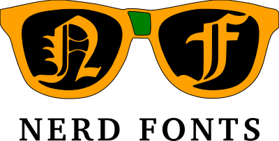

<h1 align="center">
  
</h1>
<h2 align="center">
  
</h2>

<div align="center">

[Релізи][release] &nbsp;&nbsp;|&nbsp;&nbsp; [Шрифти](#patched-fonts) &nbsp;&nbsp;&nbsp; | &nbsp;&nbsp;&nbsp; [Патчер Шрифтів](#font-patcher) &nbsp;&nbsp;&nbsp;|&nbsp;&nbsp;&nbsp; [Wiki Документація][wiki] &nbsp;&nbsp;| &nbsp;&nbsp;[ Стікери][stickers]&nbsp;&nbsp;&nbsp; |&nbsp;&nbsp;&nbsp; [VimDevIcons][vim-devicons]

[![GitHub Реліз][img-version-badge]][repo] [![Gitter][img-gitter-badge]][gitter] [![Code of Conduct][coc-badge]][coc] [![PRs Welcome][prs-badge]][prs]  <a href="#patched-fonts" title=""></a> [![Twitter][twitter-badge]][twitter-intent]

</div>

**Nerd Fonts** це проект, який виправляє шрифти для розробників за допомогою великої кількісті гліфів (інакше кажучи іконок). Спеціально для додавання великої кількості додаткових гліфів від популярних 'іконних шрифтів' таких як [Font Awesome ➶][font-awesome], [Devicons ➶][vorillaz-devicons], [Octicons ➶][octicons], та [інших](#glyph-sets).

Наступна Sankey flow діаграма показує включені поточні набори гліфів:

<p align="center">
  
</p>
<sub><i>Діаграма, створена за допомогою <a href="http://sankeymatic.com/" title="SankeyMATIC (BETA): Конструктор діаграм Sankey для всіх">@SankeyMATIC</a></i></sub>

## Важливі повідомлення

-   шляхи до файлів в гілці `master` **не** вважаються стабільними. [Verify your repository URI references](#unstable-file-paths)
-   клонування цього репозиторію **не** рекомендується ([через розміри репозиторію](#option-5-clone-the-repo)) якщо тільки ви не плануєте [розвивати проект](#contributing)

## Зміст

[**Надто довго. Не читав**](#tldr)

[**Налаштування по установці**](#font-installation)

-   [**1 - Посібник**](#option-1-download-and-install-manually)
-   [**2 - Архів завантажень релізів**](#option-2-release-archive-download)
-   [**3 - Установчі скрипти**](#option-3-install-script)
-   [**4 - Нативні шрифти (macOS (OS X))**](#option-4-homebrew-fonts)
-   [**5 - Клонування репозиторію**](#option-5-clone-the-repo)
-   [**6 - Конкретний випадок завантаження за допомогою Curl**](#option-6-ad-hoc-curl-download)
-   [**7 - Репозиторій користувачів Arch (Community) (Arch Linux)**](#варіант-7-неофіційні-репозиторії-користувачів-arch-community`)
-   [**8 - Налаштуйте свій власний шрифт**](#option-8-patch-your-own-font)

[**Особливості**](#features)

-   [**Набори гліфів/іконок**](#glyph-sets)
-   [**Виправлені шрифти**](#patched-fonts)
-   [**Комбінації**](#combinations)
-   [**Патчер шрифтів**](#font-patcher)

[**Розробник/Контриб'ютор**](#font-patcher)

-   [**Патчер шрифтів**](#font-patcher)
-   [**Збираємося патчить їх всіх, Патчер Усіх Шрифтів!**](#gotta-patch-em-all)
-   [**Інші хороші шрифти для патча**](#other-good-fonts-to-patch)
-   [**Розвиток проекту**](#contributing)

[**Мотивація проекту**](#project-motivation)

**Додаткова інформація**

-   [**Нестабільні шляхи до файлів в гілці master**](#unstable-file-paths)
-   [**Журнал змін**](#changelog)
-   [**Ліцензія**](#license)

## Надто довго. Не читав

  Nerd Fonts використовує популярні програмні шрифти і додає купу Значків.
  Існує також [патчер шрифтів](#font-patcher), якщо бажаний шрифт ще не виправлений.
  Для отримання більш детальної інформації дивись [wiki][wiki]. Якщо ви шукаєте плагін Vim, дивись [VimDevIcons ➶][vim-devicons].

### Різні параметри завантаження шрифтів

_Якщо ви..._

-   `Варіант 1.` бажаю **швидко** завантажити **індивідуальний шрифт** з [`patched-fonts/` каталогу](#patched-fonts)
-   `Варіант 2.` бажаю завантажити пакет варіацій **сімейства шрифтів** (жирний, курсив, тощо), дивись [завантажити архів](#option-2-release-archive-download)
-   `Варіант 3.` бажаю **автоматизувати** встановлення або використання в **скриптах**, дивись [Встановити скрипти](#option-3-install-script)
-   `Варіант 4.` Я на **macOS** та бажаю використовувати **нативні шрифти**, дивись [Нативні Шрифти](#option-4-homebrew-fonts)
-   `Варіант 5.` бажаю **повний контроль**, дивись [клонування репозиторії](#option-5-clone-the-repo)
-   `Варіант 6.` бажаю використовувати **`curl` команду** або використовувати в **скриптах** дивись [Конкретний випадок завантаження за допомогою Curl](#option-6-ad-hoc-curl-download)
-   `Варіант 7.` Я на **Arch Linux** та бажаю використовувати **Community packages**, дивись [Неофіційні репозиторії користувачів Arch](#варіант-7-неофіційні-репозиторії-користувачів-arch-community`)
-   `Варіант 8.` Бажаю пропатчити власний шрифт, дивись [Патчер шрифтів](#option-8-patch-your-own-font)

## Особливості

-   [FontForge Python script](#font-patcher) щоб патчити будь-який шрифт
    -   Включає можливість створення **Monospaced (фіксованої ширини)** _чи_ **подвійної ширини (non-monospaced)** glyphs
    -   Докладніше дивись розділ [**Патчер шрифтів**](#font-patcher)
-   **`50`** вже [виправлені сімейства шрифтів ](#patched-fonts)
-   Понад **`1,571,470`** унікальних комбінацій / варіацій пропатченних шрифтів [(детальніше)](#combinations)
-   Понад **`9,000`** гліфів / іконок у поєднанні [(детальніше)](#combinations)
    -   Поточні набори гліфів включають: [Powerline with Extra Symbols][ryanoasis-powerline-extra-symbols], [Font Awesome][font-awesome], [Material Design Icons][font-material-design-icons], [Weather][font-weather], [Devicons][vorillaz-devicons], [Octicons][octicons], [Font Logos][font-logos] (Раніше Font Linux), [Pomicons][gabrielelana-pomicons]
-   **Monospaced (фіксованої ширини)** _чи_ **подвійної ширини (non-monospaced)** версія кожного шрифту
    -   Це стосується Nerd Font гліфів, але не обов'язково Шрифту в цілому
-   Розробник/Контриб'ютор постачає [bash скріпт](#gotta-patch-em-all) щоб повторно пропатчити всі шрифти

## Набори гліфів

:mag: :mag: Тепер ви можете легко шукати гліфи на [NerdFonts.com][cheat sheet] за допомогою [Cheat Sheet][]

Дивись [Wiki: Набори гліфів та Коди детальніше][wiki-glyph-sets-codepoints]

### Імена іконок в shell

Дивись [Wiki: Імена іконок в shell][wiki-icon-names-in-shell]

## Пропатченні шрифти

| Назва шрифту                                         | Назва шрифту та репозіторія           | \*RFN | EM Розмір | Статус           |
| :------------------------------------------------ | :--------------------------------- | :---- | :------ | :--------------- |
| [3270 Nerd Font][p-3270]                          | [3270][f-3270]                     | NO    | 1000    | ![w] ![m2] ![l]  |
| [Agave][p-agave]                                  | [Agave][f-agave]                   | NO    | 2048    | ![w] ![m2] ![l]  |
| [AnonymicePro Nerd Font][p-anonymous-pro]         | [Anonymous Pro][f-a-pro]           | NO    | 2048    | ![w] ![m2] ![l]  |
| [Arimo][p-arimo]                                  | [Arimo][f-arimo]                   | NO    | 2048    | ![w] ![m2] ![l]  |
| [Aurulent Sans Mono Nerd Font][p-aurulent]        |                                    | NO    | 1000    | ![w] ![m2] ![l]  |
| [BigBlueTerminal][p-bigblueterm]                  |                                    | NO    | 1200    | ![w] ![m2] ![l]  |
| [Bitstream Vera Sans Mono Nerd Font][p-bitstream] |                                    | NO    | 2048    | ![w] ![m2] ![l]  |
| [Blex\*][p-blex]                                  | [IBM Plex Mono][f-ibm-plex]        | YES   | 1000    | ![w] ![m2] ![l]  |
| [Code New Roman Nerd Font][p-code-nr]             |                                    | NO    | 2048    | ![w] ![m2] ![l]  |
| [Cousine Nerd Font][p-cousine]                    | [Cousine][f-cousine]               | NO    | 1000    | ![w] ![m2] ![l]  |
| [DaddyTimeMono][p-daddytimemono]                  | [DaddyTimeMono][f-daddytimemono]   | NO    | 1024    | ![w] ![m2] ![l]  |
| [DepartureMono Nerd Font][p-departuremono]        | [Departure Mono][f-departuremono]  | NO    | 550     | ![w] ![m2] ![l]  |
| [DejaVu Sans Mono Nerd Font][p-dejavu]            |                                    | NO    | 2048    | ![w] ![m2] ![l]  |
| [Droid Sans Mono Nerd Font][p-droid]              |                                    | NO    | 2048    | ![w] ![m2] ![l]  |
| [Fantasque Sans Nerd Font][p-fantasque]           | [Fantasque Sans][f-fant]           | NO    | 2048    | ![w] ![m2] ![l]  |
| [Fira Code Nerd Font][p-fira-code]                | [Fira Code][f-fira-code]           | NO    | 1000    | ![w] ![m2] ![l]  |
| [Fira Mono Nerd Font][p-fira-mono]                | [Fira][f-fira-mono]                | NO    | 1000    | ![w] ![m2] ![l]  |
| [Go Mono Nerd Font][p-go-mono]                    | [Go-Mono][f-go-mono]               | NO    | 1000    | ![w] ![m2] ![l]  |
| [Gohu Nerd Font][p-gohu]                          | [Gohu TTF][f-gohu2],[Gohu][f-gohu] | NO    | 1000    | ![w] ![m2] ![l]  |
| [Hack Nerd Font][p-hack]                          | [Hack][f-hack]                     | NO    | 2048    | ![w] ![m2] ![l]  |
| [Hasklug Nerd Font\*][p-hasklig]                  | [Hasklig][f-hasklig]               | YES   | 1000    | ![w] ![m2] ![l]  |
| [Heavy Data Mono Nerd Font][p-heavy-data]         |                                    | NO    | 2048    | ![w] ![m2] ![l]  |
| [Hermut Nerd Font][p-hermit]                      |                                    | NO    | 1000    | ![w] ![m2] ![l]  |
| [iM-Writing\*][p-im-writing]                      | [iA-Writer][f-ia-writer]           | YES   | 1000    | ![w] ![m2] ![l]  |
| [Inconsolata Nerd Font][p-inconsolata]            |                                    | NO    | 1000    | ![w] ![m2] ![l]  |
| [Inconsolata Go Nerd Font][p-inconsolata-go]      |                                    | NO    | 1000    | ![w] ![m2] ![l]  |
| [Inconsolata LGC Nerd Font][p-inconsolata-lgc]    |                                    | NO    | 1000    | ![w] ![m2] ![l]  |
| [Iosevka Nerd Font][p-iosevka]                    | [Iosevka][f-iosevka]               | NO    | 1000    | [#83][s-iosevka] |
| [JetBrains Mono][p-jetbrains-mono]                | [JetBrains Mono][f-jetbrains-mono] | NO    | 1000    | ![w] ![m2] ![l]  |
| [Lekton Nerd Font][p-lekton]                      |                                    | NO    | 1000    | ![w] ![m2] ![l]  |
| [Literation Mono Nerd Font\*][p-liberation]       | [Liberation][f-liberation]         | YES   | 2048    | ![w] ![m2] ![l]  |
| [Meslo Nerd Font][p-meslo]                        |                                    | NO    | 2048    | ![w] ![m2] ![l]  |
| [Monofur Nerd Font][p-monofur]                    |                                    | NO    | 2400    | ![w] ![m2] ![l]  |
| [Monoid Nerd Font][p-monoid]                      |                                    | NO    | 1536    | ![w] ![m2] ![l]  |
| [Mononoki Nerd Font][p-mononoki]                  | [Mononoki][f-mononoki]             | NO    | 1024    | ![w] ![m2] ![l]  |
| [M+ (MPlus) Nerd Font][p-mplus]                   |                                    | NO    | 1000    | ![w] ![m2] ![l]  |
| [Noto][p-noto]                                    |                                    | NO    | 1000    | ![w] ![m2] ![l]  |
| [OpenDyslexic][p-opendyslexic]                    |                                    | NO    | 1000    | ![w] ![m2] ![l]  |
| [Overpass][p-overpass]                            |                                    | NO    | 1000    | ![w] ![m2] ![l]  |
| [ProFont (Windows tweaked) Nerd Font][p-profont]  |                                    | NO    | 1200    | ![w] ![m2] ![l]  |
| [ProFont (x11) Nerd Font][p-profont]              |                                    | NO    | 1000    | ![w] ![m2] ![l]  |
| [ProggyClean Nerd Font][p-proggy-clean]           |                                    | NO    | 2048    | Imperfect        |
| [Roboto Mono][p-roboto]                           |                                    | NO    | 2048    | ![w] ![m2] ![l]  |
| [Sauce Code Nerd Font][p-source-code-pro]         | [Source][f-source]                 | YES   | 1000    | ![w] ![m2] ![l]  |
| [Shure Tech Mono Nerd Font\*][p-share-tech-mono]  | [Share Tech Mono][f-share]         | YES   | 1000    | ![w] ![m2] ![l]  |
| [Space Mono Nerd Font][p-space-mono]              | [Space Mono][f-space]              | NO    | 1000    | ![w] ![m2] ![l]  |
| [Terminess Nerd Font\*][p-terminus]               | [Terminus Font][f-terminus]        | YES   | 1000    | ![w] ![m2] ![l]  |
| [Tinos][p-tinos]                                  |                                    | NO    | 2048    | ![w] ![m2] ![l]  |
| [Ubuntu Nerd Font][p-ubuntu]                      |                                    | NO    | 1000    | ![w] ![m2] ![l]  |
| [Ubuntu Mono Nerd Font][p-ubuntu-mono]            |                                    | NO    | 1000    | ![w] ![m2] ![l]  |
| [Victor Mono][p-victor]                           | [Victor Mono][f-victor]            | NO    | 1000    | ![w] ![m2] ![l]  |

<sub>_\*RFN = Зарезервоване ім'я шрифту_</sub>

## Комбінації

-   Понад **`1,485,000`** унікальні варіанти / комбінації (Power Set) пропатченних шрифтів:
    -   **`50`** пропатченних типів шрифтів
    -   **`719`** пропатченних сімейств шрифтів
    -   **`2,876`** 'завершених' варіацій / комбінацій
    -   **`1,485,410`** _можливих_ варіацій / комбінацій
    -   **`1,488,286`** загальна кількість обчислених комбінацій (2,876 + 1,485,410)
-   Комбінації для кожного шрифту - це будь-яка комбінація [варіації](#variations)

### Варіації

-   Не дано додаткових параметрів (базові параметри **Seti-UI + Custom** and **[Devicons][vorillaz-devicons]**)
-   **double _(variable/proportional)_** or **single _(fixed/monospaced)_** width glyphs
-   [Font Awesome][font-awesome]
-   [Font Awesome Extension][font-awesome-extension]
-   [Material Design Icons][font-material-design-icons]
-   [Weather][font-weather]
-   [GitHub Octicons][octicons]
-   [Font Logos][font-logos] (Раніше Font Linux)
-   [Powerline Extra Symbols][ryanoasis-powerline-extra-symbols]
-   [IEC Power Symbols][website-iecpower]
-   [Pomicons][gabrielelana-pomicons]
-   Сумісність з Windows

## Встановлення шрифту

### `Варіант 1: Завантажити та встановити самостійно`

> Найкращий варіант для **швидкого** завантаження **індивідуального шрифта**.

Завантажте конкретний [пропатченний шрифт](#patched-fonts) на ваш вибір

### `Варіант 2: Завантажити реліз архіву`

> Найкращий варіант, якщо ви хочете **archive** або повне **сімейство шрифтів** в варіації (жирний, курсивний тощо)

Шрифти доступні для завантаження як пакети в [останньому релізі](https://github.com/ryanoasis/nerd-fonts/releases/latest)

### `Варіант 3: Встановити скрипти`

> Найкращий варіант, якщо ви хочете **автоматизувати** встановлення або для використання в **скриптах**.

_Примітка_: Лише для Linux та macOS (OS X)
_Примітка_: **необхідне клонування** репозиторію станом на даний час

#### Усі шрифти:

- Встановлює всі пропатченні шрифти (_Увага: Це багато шрифтів, що додають до великого розміру_)

```sh
./install.sh
```

#### Одиничний шрифт:

-   Встановлює єдиний шрифт на ваш вибір

```sh
./install.sh <FontName>
./install.sh Hack
./install.sh HeavyData
```

### `Варіант 4:  Нативні шрифти `

> Найкращий варіант, якщо ви використовуєте  **macOS** і хочете використовувати **нативні шрифти**.

Усі шрифти доступні через [нативні Cask](https://github.com/Homebrew/homebrew-cask) on macOS (OS X)

```sh
brew install font-hack-nerd-font
```

### `Варіант 5: Клонування репозиторію`

> Найкращий варіант для **повного контролю**, **всіх** чи **майже всіх** шрифтів, чи **контриб'юції** до розробки.

Клонування цього репозиторію **не** не потрібне (в основному за рахунок розміру репозиторію) якщо вас просто цікавить обмежений набір шрифтів.

Однак якщо ви хочете клонувати увесь проект, не забудьте зробити _неглибоке_ клонування:

```sh
git clone --depth 1
```

### `Варіант 6: Конкретний випадок завантаження за допомогою Curl`

> Варіант якщо ви хочете використовувати **`curl` команду** або для використання в **скриптах**.

#### Linux

```sh
mkdir -p ~/.local/share/fonts
cd ~/.local/share/fonts && curl -fLo "Droid Sans Mono for Powerline Nerd Font Complete.otf" https://github.com/ryanoasis/nerd-fonts/raw/HEAD/patched-fonts/DroidSansMono/complete/Droid%20Sans%20Mono%20Nerd%20Font%20Complete.otf
```

_Примітка:_ застарілі альтернативні шляхи: `~/.fonts`

#### macOS (OS X)

```sh
cd ~/Library/Fonts && curl -fLo "Droid Sans Mono for Powerline Nerd Font Complete.otf" https://github.com/ryanoasis/nerd-fonts/raw/HEAD/patched-fonts/DroidSansMono/complete/Droid%20Sans%20Mono%20Nerd%20Font%20Complete.otf
```

### `Варіант 7: Неофіційні репозиторії користувачів Arch (Community)`

Most fonts are available via [Arch Community packages](https://archlinux.org/packages/?sort=&repo=Community&q=-nerd).
Some special packages are [in AUR](https://aur.archlinux.org/packages?K=nerd-fonts-&outdated=off).

### `Варіант 8: Налаштуйте свій власний шрифт`

> Варіант для **пропатчити** твій **особистий шрифт** чи повністю **налаштувати** пропатченний шрифт.

Використовуйте наданий сценарій командної строки Python, щоб створити виправлений шрифт із власного, щоб отримати нові доповненні гліфи

Дивіться: [Патчер шрифтів](#font-patcher) для використання

-   оберіть цю опцію, якщо ви **не** бажаєте використовувати один із [наданих шрифтів](#patched-fonts)
-   вам все одно доведеться скопіювати згенерований шрифт у правильну директорію шрифтів у вашій системі

<h2 align="center" id="font-patcher">
	
</h2>

Виправлення шрифту за власним вибором для використання з [VimDevIcons ➶][vim-devicons]:

-   вимагає: Python 3, `python-fontforge` пакет (версіі `20141231` чи пізніше, дивись [інструкції по встановленню](http://designwithfontforge.com/en-US/Installing_Fontforge.html))
-   альтернативний метод інсталювання на OSX: `brew install fontforge`
-   Використання:

```
    ./font-patcher ШЛЯХ_ДО_ШРИФТА
```
-   Альтернативне використання: Виконайте патч із FontForge binary використовуючи параметри:

```
    ./fontforge -script font-patcher ШЛЯХ_ДО_ШРИФТА

Nerd Fonts Patcher v3.0.2 (4.4.0) (ff 20230101)
usage: font-patcher [-h] [-v] [-s] [-l] [-q] [-c] [--careful] [--removeligs] [--postprocess [POSTPROCESS]] [--configfile [CONFIGFILE]] [--custom [CUSTOM]]
                    [-ext [EXTENSION]] [-out [OUTPUTDIR]] [--glyphdir [GLYPHDIR]] [--makegroups [{-1,0,1,2,3,4,5,6}]] [--variable-width-glyphs]
                    [--has-no-italic] [--progressbars | --no-progressbars] [--debug [{0,1,2,3}]] [--dry] [--xavgcharwidth [XAVGWIDTH]] [--fontawesome]
                    [--fontawesomeextension] [--fontlogos] [--octicons] [--codicons] [--powersymbols] [--pomicons] [--powerline] [--powerlineextra]
                    [--material] [--weather]
                    font

Nerd Fonts Font Patcher: patches a given font with programming and development related glyphs

* Website: https://www.nerdfonts.com
* Version: 3.0.2
* Development Website: https://github.com/ryanoasis/nerd-fonts
* Changelog: https://github.com/ryanoasis/nerd-fonts/blob/-/changelog.md

positional arguments:
  font                  The path to the font to patch (e.g., Inconsolata.otf)

options:
  -h, --help            show this help message and exit
  -v, --version         show program's version number and exit
  -s, --mono, --use-single-width-glyphs
                        Whether to generate the glyphs as single-width not double-width (default is double-width)
  -l, --adjust-line-height
                        Whether to adjust line heights (attempt to center powerline separators more evenly)
  -q, --quiet, --shutup
                        Do not generate verbose output
  -c, --complete        Add all available Glyphs
  --careful             Do not overwrite existing glyphs if detected
  --removeligs, --removeligatures
                        Removes ligatures specificed in JSON configuration file
  --postprocess [POSTPROCESS]
                        Specify a Script for Post Processing
  --configfile [CONFIGFILE]
                        Specify a file path for JSON configuration file (see sample: src/config.sample.json)
  --custom [CUSTOM]     Specify a custom symbol font, all glyphs will be copied; absolute path suggested
  -ext [EXTENSION], --extension [EXTENSION]
                        Change font file type to create (e.g., ttf, otf)
  -out [OUTPUTDIR], --outputdir [OUTPUTDIR]
                        The directory to output the patched font file to
  --glyphdir [GLYPHDIR]
                        Path to glyphs to be used for patching
  --makegroups [{-1,0,1,2,3,4,5,6}]
                        Use alternative method to name patched fonts (recommended)
  --variable-width-glyphs
                        Do not adjust advance width (no "overhang")
  --has-no-italic       Font family does not have Italic (but Oblique)
  --progressbars        Show percentage completion progress bars per Glyph Set (default)
  --no-progressbars     Don't show percentage completion progress bars per Glyph Set
  --debug [{0,1,2,3}]   Verbose mode (optional: 1=just to file; 2*=just to terminal; 3=display and file)
  --dry                 Do neither patch nor store the font, to check naming
  --xavgcharwidth [XAVGWIDTH]
                        Adjust xAvgCharWidth (optional: concrete value)

Symbol Fonts:
  --fontawesome         Add Font Awesome Glyphs (http://fontawesome.io/)
  --fontawesomeextension
                        Add Font Awesome Extension Glyphs (https://andrelzgava.github.io/font-awesome-extension/)
  --fontlogos, --fontlinux
                        Add Font Logos Glyphs (https://github.com/Lukas-W/font-logos)
  --octicons            Add Octicons Glyphs (https://octicons.github.com)
  --codicons            Add Codicons Glyphs (https://github.com/microsoft/vscode-codicons)
  --powersymbols        Add IEC Power Symbols (https://unicodepowersymbol.com/)
  --pomicons            Add Pomicon Glyphs (https://github.com/gabrielelana/pomicons)
  --powerline           Add Powerline Glyphs
  --powerlineextra      Add Powerline Glyphs (https://github.com/ryanoasis/powerline-extra-symbols)
  --material, --materialdesignicons, --mdi
                        Add Material Design Icons (https://github.com/templarian/MaterialDesign)
  --weather, --weathericons
                        Add Weather Icons (https://github.com/erikflowers/weather-icons)
```
#### Приклади

    ./font-patcher Droid\ Sans\ Mono\ for\ Powerline.otf
    ./font-patcher Droid\ Sans\ Mono\ for\ Powerline.otf -s -q
    ./font-patcher Droid\ Sans\ Mono\ for\ Powerline.otf --use-single-width-glyphs --quiet
    ./font-patcher Droid\ Sans\ Mono\ for\ Powerline.otf -w
    ./font-patcher Droid\ Sans\ Mono\ for\ Powerline.otf --windows --quiet
    ./font-patcher Droid\ Sans\ Mono\ for\ Powerline.otf --windows --pomicons --quiet
    ./font-patcher Inconsolata.otf --fontawesome
    ./font-patcher Inconsolata.otf --fontawesome --octicons --pomicons
    ./font-patcher Inconsolata.otf

<a name="gotta-patch-em-all"></a>

## Збираємося патчитити "їх усіх", Патчер Усіх Шрифтів!

-   для використанням контриб'ютором або розробником

-   повторні патчі **всіх** шрифтів в не патченому каталозі:


    ./gotta-patch-em-all-font-patcher\!.sh

-   може додатково обмежуватися певним шаблоном імені шрифту:


    ./gotta-patch-em-all-font-patcher\!.sh Hermit

## Контриб'юція

Дивись [contributing.md](contributing.md)

## Нестабільні шляхи до файлів

:увага: Попередження: шляхи до файлів можуть змінюватися залежно від випусків (особливо **основних** змін версій)

Посилання на гілку **випуску** та _не_ на гілку ~~ master ~~, оскільки шляхи можуть змінюватися для кожного випуску

-   Наприклад:
    -   :white_check_mark: Використовуйте: <code>https\\://github.com/ryanoasis/nerd-fonts/blob/<b>0.9.0</b>/patched-fonts/Hermit/Medium/complete/Hurmit%20Medium%20Nerd%20Font%20Complete.otf</code>
    -   :x: Замість: <code>https\\://github.com/ryanoasis/nerd-fonts/blob/<del>master</del>/patched-fonts/Hermit/Medium/complete/Hurmit%20Medium%20Nerd%20Font%20Complete.otf</code>

## Інші добрі шрифти для патча

-   список додаткових хороших шрифтів для виправлення, які неможливо надати або поділити через ліцензію:
-   [Input Mono][input-mono] (обмеження ліцензії)
    -   Можливо, із зовнішнім хостингом :)
-   [PragmataPro][pragmatapro] (не вільний)
-   [Consolas][consolas] (пропріетарний)
-   [Operator Mono][operator] (не вільний)
-   [Dank Mono][dank] (не вільний)

## Мотивація проекту

Дивись [Wiki: Мета проекту][wiki-project-purpose]

## Журнал змін

Дивись [changelog.md](changelog.md)

## Ліцензія

[MIT](LICENSE) © Ryan L McIntyre

<!--
Довідкова література
-->

[vim-devicons]: https://github.com/ryanoasis/vim-devicons "VimDevIcons Vim Plugin (external link) ➶"

[vorillaz-devicons]: https://vorillaz.github.io/devicons/

[font-awesome]: https://github.com/FortAwesome/Font-Awesome

[font-awesome-extension]: https://github.com/AndreLZGava/font-awesome-extension

[font-material-design-icons]: https://github.com/Templarian/MaterialDesign

[font-weather]: https://github.com/erikflowers/weather-icons

[octicons]: https://github.com/primer/octicons

[font-logos]: https://github.com/Lukas-W/font-logos

[gabrielelana-pomicons]: https://github.com/gabrielelana/pomicons

[seti-ui]: https://atom.io/themes/seti-ui

[ryanoasis-powerline-extra-symbols]: https://github.com/ryanoasis/powerline-extra-symbols

[wiki]: https://github.com/ryanoasis/nerd-fonts/wiki

[wiki-project-purpose]: https://github.com/ryanoasis/nerd-fonts/wiki/Project-Purpose

[wiki-glyph-sets-codepoints]: https://github.com/ryanoasis/nerd-fonts/wiki/Glyph-Sets-and-Code-Points

[wiki-icon-names-in-shell]: https://github.com/ryanoasis/nerd-fonts/wiki/Icon-Names-in-Shell

[repo]: https://github.com/ryanoasis/nerd-fonts

[gitter]: https://gitter.im/ryanoasis/nerd-fonts

[code-climate]: https://codeclimate.com/github/ryanoasis/nerd-fonts

[twitter-intent]: https://twitter.com/intent/tweet?url=https%3A%2F%2Fgithub.com%2Fryanoasis%2Fnerd-fonts&via=%40nerdfonts&text=Nerd%20Fonts%20-%20Iconic%20font%20aggregator%2C%20collection%2C%20and%20patcher&hashtags=iconfont%20font%20github

<!--
Посилання на веб-сайт
-->

[website-iecpower]: https://unicodepowersymbol.com/

[Cheat Sheet]: https://nerdfonts.com/cheat-sheet

[stickers]: https://www.redbubble.com/people/ryanoasis/works/30764810-nerd-fonts-iconic-font-aggregator

<!--
Посилання на посилання
-->

[badge-version]: https://badge.fury.io/gh/ryanoasis%2Fnerd-fonts

[badge-gitter]: https://gitter.im/ryanoasis/nerd-fonts?utm_source=badge&utm_medium=badge&utm_campaign=pr-badge&utm_content=badge

[img-version-badge]: https://img.shields.io/github/release/ryanoasis/nerd-fonts.svg?style=for-the-badge

[img-gitter-badge]: https://img.shields.io/gitter/room/nwjs/nw.js.svg?style=for-the-badge

[img-code-climate-badge]: https://img.shields.io/codeclimate/issues/ryanoasis/nerd-fonts.svg?style=for-the-badge

[coc-badge]: https://img.shields.io/badge/code%20of-conduct-ff69b4.svg?style=for-the-badge

[prs-badge]: https://img.shields.io/badge/PRs-welcome-brightgreen.svg?style=for-the-badge&logo=data%3Aimage%2Fsvg%2Bxml%3Bbase64%2CPD94bWwgdmVyc2lvbj0iMS4wIiBlbmNvZGluZz0iVVRGLTgiPz48c3ZnIGlkPSJzdmcyIiB3aWR0aD0iNjQ1IiBoZWlnaHQ9IjU4NSIgdmVyc2lvbj0iMS4wIiB4bWxucz0iaHR0cDovL3d3dy53My5vcmcvMjAwMC9zdmciPiA8ZyBpZD0ibGF5ZXIxIj4gIDxwYXRoIGlkPSJwYXRoMjQxNyIgZD0ibTI5Ny4zIDU1MC44N2MtMTMuNzc1LTE1LjQzNi00OC4xNzEtNDUuNTMtNzYuNDM1LTY2Ljg3NC04My43NDQtNjMuMjQyLTk1LjE0Mi03Mi4zOTQtMTI5LjE0LTEwMy43LTYyLjY4NS01Ny43Mi04OS4zMDYtMTE1LjcxLTg5LjIxNC0xOTQuMzQgMC4wNDQ1MTItMzguMzg0IDIuNjYwOC01My4xNzIgMTMuNDEtNzUuNzk3IDE4LjIzNy0zOC4zODYgNDUuMS02Ni45MDkgNzkuNDQ1LTg0LjM1NSAyNC4zMjUtMTIuMzU2IDM2LjMyMy0xNy44NDUgNzYuOTQ0LTE4LjA3IDQyLjQ5My0wLjIzNDgzIDUxLjQzOSA0LjcxOTcgNzYuNDM1IDE4LjQ1MiAzMC40MjUgMTYuNzE0IDYxLjc0IDUyLjQzNiA2OC4yMTMgNzcuODExbDMuOTk4MSAxNS42NzIgOS44NTk2LTIxLjU4NWM1NS43MTYtMTIxLjk3IDIzMy42LTEyMC4xNSAyOTUuNSAzLjAzMTYgMTkuNjM4IDM5LjA3NiAyMS43OTQgMTIyLjUxIDQuMzgwMSAxNjkuNTEtMjIuNzE1IDYxLjMwOS02NS4zOCAxMDguMDUtMTY0LjAxIDE3OS42OC02NC42ODEgNDYuOTc0LTEzNy44OCAxMTguMDUtMTQyLjk4IDEyOC4wMy01LjkxNTUgMTEuNTg4LTAuMjgyMTYgMS44MTU5LTI2LjQwOC0yNy40NjF6IiBmaWxsPSIjZGQ1MDRmIi8%2BIDwvZz48L3N2Zz4%3D

[twitter-badge]: https://img.shields.io/twitter/url/http/shields.io.svg?style=for-the-badge&logo=twitter

[os-badge]: https://img.shields.io/badge/-OS-brightgreen.svg?style=for-the-badge&logoWidth=80&logo=data%3Aimage%2Fsvg%2Bxml%3Bbase64%2CPD94bWwgdmVyc2lvbj0iMS4wIiBlbmNvZGluZz0iVVRGLTgiPz48c3ZnIHdpZHRoPSIzOS43NDFtbSIgaGVpZ2h0PSIxMy4zNzdtbSIgdmVyc2lvbj0iMS4xIiB2aWV3Qm94PSIwIDAgMzkuNzQxMjggMTMuMzc3MTI3IiB4bWxucz0iaHR0cDovL3d3dy53My5vcmcvMjAwMC9zdmciIHhtbG5zOmNjPSJodHRwOi8vY3JlYXRpdmVjb21tb25zLm9yZy9ucyMiIHhtbG5zOmRjPSJodHRwOi8vcHVybC5vcmcvZGMvZWxlbWVudHMvMS4xLyIgeG1sbnM6cmRmPSJodHRwOi8vd3d3LnczLm9yZy8xOTk5LzAyLzIyLXJkZi1zeW50YXgtbnMjIj48bWV0YWRhdGE%2BPHJkZjpSREY%2BPGNjOldvcmsgcmRmOmFib3V0PSIiPjxkYzpmb3JtYXQ%2BaW1hZ2Uvc3ZnK3htbDwvZGM6Zm9ybWF0PjxkYzp0eXBlIHJkZjpyZXNvdXJjZT0iaHR0cDovL3B1cmwub3JnL2RjL2RjbWl0eXBlL1N0aWxsSW1hZ2UiLz48ZGM6dGl0bGUvPjwvY2M6V29yaz48L3JkZjpSREY%2BPC9tZXRhZGF0YT48ZyB0cmFuc2Zvcm09Im1hdHJpeCguMzMwODMgMCAwIC4zMzA4MyAyNi41MDggLTEuNzc0MikiPjxwb2x5Z29uIHBvaW50cz0iMTcuNCAzOC4zIDIxLjUgNDAuNiAyNy43IDQwLjYgMzMuNSAzNi4yIDM2LjEgMjkuMyAzMC4xIDIyIDI4LjQgMTcuOSAyMC4xIDE4LjIgMjAuMiAyMC41IDE4LjYgMjMuNSAxNi4xIDI4LjQgMTUuNiAzMi41IiBmaWxsPSIjZWNlZmYxIi8%2BPHBhdGggZD0ibTM0LjMgMjMuOWMtMS42LTIuMy0yLjktMy43LTMuNi02LjZzMC4yLTIuMS0wLjQtNC42Yy0wLjMtMS4zLTAuOC0yLjItMS4zLTIuOS0wLjYtMC43LTEuMy0xLjEtMS43LTEuMi0wLjktMC41LTMtMS4zLTUuNiAwLjEtMi43IDEuNC0yLjQgNC40LTEuOSAxMC41IDAgMC40LTAuMSAwLjktMC4zIDEuMy0wLjQgMC45LTEuMSAxLjctMS43IDIuNC0wLjcgMS0xLjQgMi0xLjkgMy4xLTEuMiAyLjMtMi4zIDUuMi0yIDYuMyAwLjUtMC4xIDYuOCA5LjUgNi44IDkuNyAwLjQtMC4xIDIuMS0wLjEgMy42LTAuMSAyLjEtMC4xIDMuMy0wLjIgNSAwLjIgMC0wLjMtMC4xLTAuNi0wLjEtMC45IDAtMC42IDAuMS0xLjEgMC4yLTEuOCAwLjEtMC41IDAuMi0xIDAuMy0xLjYtMSAwLjktMi44IDEuOS00LjUgMi4yLTEuNSAwLjMtNC0wLjItNS4yLTEuNyAwLjEgMCAwLjMgMCAwLjQtMC4xIDAuMy0wLjEgMC42LTAuMiAwLjctMC40IDAuMy0wLjUgMC4xLTEtMC4xLTEuM3MtMS43LTEuNC0yLjQtMi0xLjEtMC45LTEuNS0xLjNsLTAuOC0wLjhjLTAuMi0wLjItMC4zLTAuNC0wLjQtMC41LTAuMi0wLjUtMC4zLTEuMS0wLjItMS45IDAuMS0xLjEgMC41LTIgMS0zIDAuMi0wLjQgMC43LTEuMiAwLjctMS4ycy0xLjcgNC4yLTAuOCA1LjVjMCAwIDAuMS0xLjMgMC41LTIuNiAwLjMtMC45IDAuOC0yLjIgMS40LTIuOXMyLjEtMy4zIDIuMi00LjljMC0wLjcgMC4xLTEuNCAwLjEtMS45LTAuNC0wLjQgNi42LTEuNCA3LTAuMyAwLjEgMC40IDEuNSA0IDIuMyA1LjkgMC40IDAuOSAwLjkgMS43IDEuMiAyLjcgMC4zIDEuMSAwLjUgMi42IDAuNSA0LjEgMCAwLjMgMCAwLjgtMC4xIDEuMyAwLjIgMCA0LjEtNC4yLTAuNS03LjcgMCAwIDIuOCAxLjMgMi45IDMuOSAwLjEgMi4xLTAuOCAzLjgtMSA0LjEgMC4xIDAgMi4xIDAuOSAyLjIgMC45IDAuNCAwIDEuMi0wLjMgMS4yLTAuMyAwLjEtMC4zIDAuNC0xLjEgMC40LTEuNCAwLjctMi4zLTEtNi0yLjYtOC4zeiIgZmlsbD0iIzI2MzIzOCIvPjxnIGZpbGw9IiNlY2VmZjEiPjxlbGxpcHNlIGN4PSIyMS42IiBjeT0iMTUuMyIgcng9IjEuMyIgcnk9IjIiLz48ZWxsaXBzZSBjeD0iMjYuMSIgY3k9IjE1LjIiIHJ4PSIxLjciIHJ5PSIyLjMiLz48L2c%2BPGcgZmlsbD0iIzIxMjEyMSI%2BPGVsbGlwc2UgdHJhbnNmb3JtPSJtYXRyaXgoLS4xMjU0IC0uOTkyMSAuOTkyMSAtLjEyNTQgOC45NzU0IDM4Ljk5NykiIGN4PSIyMS43IiBjeT0iMTUuNSIgcng9IjEuMiIgcnk9Ii43Ii8%2BPGVsbGlwc2UgY3g9IjI2IiBjeT0iMTUuNiIgcng9IjEiIHJ5PSIxLjMiLz48L2c%2BPGcgZmlsbD0iI2ZmYzEwNyI%2BPHBhdGggZD0ibTM5LjMgMzcuNmMtMC40LTAuMi0xLjEtMC41LTEuNy0xLjQtMC4zLTAuNS0wLjItMS45LTAuNy0yLjUtMC4zLTAuNC0wLjctMC4yLTAuOC0wLjItMC45IDAuMi0zIDEuNi00LjQgMC0wLjItMC4yLTAuNS0wLjUtMS0wLjVzLTAuNyAwLjItMC45IDAuNi0wLjIgMC43LTAuMiAxLjdjMCAwLjggMCAxLjctMC4xIDIuNC0wLjIgMS43LTAuNSAyLjctMC41IDMuNyAwIDEuMSAwLjMgMS44IDAuNyAyLjEgMC4zIDAuMyAwLjggMC41IDEuOSAwLjVzMS44LTAuNCAyLjUtMS4xYzAuNS0wLjUgMC45LTAuNyAyLjMtMS43IDEuMS0wLjcgMi44LTEuNiAzLjEtMS45IDAuMi0wLjIgMC41LTAuMyAwLjUtMC45IDAtMC41LTAuNC0wLjctMC43LTAuOHoiLz48cGF0aCBkPSJtMTkuMiAzNy45Yy0xLTEuNi0xLjEtMS45LTEuOC0yLjktMC42LTEtMS45LTIuOS0yLjctMi45LTAuNiAwLTAuOSAwLjMtMS4zIDAuN3MtMC44IDEuMy0xLjUgMS44Yy0wLjYgMC41LTIuMyAwLjQtMi43IDFzMC40IDEuNSAwLjQgM2MwIDAuNi0wLjUgMS0wLjYgMS40LTAuMSAwLjUtMC4yIDAuOCAwIDEuMiAwLjQgMC42IDAuOSAwLjggNC4zIDEuNSAxLjggMC40IDMuNSAxLjQgNC42IDEuNXMzIDAgMy0yLjdjMC4xLTEuNi0wLjgtMi0xLjctMy42eiIvPjxwYXRoIGQ9Im0yMS4xIDE5LjhjLTAuNi0wLjQtMS4xLTAuOC0xLjEtMS40czAuNC0wLjggMS0xLjNjMC4xLTAuMSAxLjItMS4xIDIuMy0xLjFzMi40IDAuNyAyLjkgMC45YzAuOSAwLjIgMS44IDAuNCAxLjcgMS4xLTAuMSAxLTAuMiAxLjItMS4yIDEuNy0wLjcgMC4yLTIgMS4zLTIuOSAxLjMtMC40IDAtMSAwLTEuNC0wLjEtMC4zLTAuMS0wLjgtMC42LTEuMy0xLjF6Ii8%2BPC9nPjxnIGZpbGw9IiM2MzQ3MDMiPjxwYXRoIGQ9Im0yMC45IDE5YzAuMiAwLjIgMC41IDAuNCAwLjggMC41IDAuMiAwLjEgMC41IDAuMiAwLjUgMC4yaDAuOWMwLjUgMCAxLjItMC4yIDEuOS0wLjYgMC43LTAuMyAwLjgtMC41IDEuMy0wLjcgMC41LTAuMyAxLTAuNiAwLjgtMC43cy0wLjQgMC0xLjEgMC40Yy0wLjYgMC40LTEuMSAwLjYtMS43IDAuOS0wLjMgMC4xLTAuNyAwLjMtMSAwLjNoLTAuOWMtMC4zIDAtMC41LTAuMS0wLjgtMC4yLTAuMi0wLjEtMC4zLTAuMi0wLjQtMC4yLTAuMi0wLjEtMC42LTAuNS0wLjgtMC42IDAgMC0wLjIgMC0wLjEgMC4xbDAuNiAwLjZ6Ii8%2BPHBhdGggZD0ibTIzLjkgMTYuOGMwLjEgMC4yIDAuMyAwLjIgMC40IDAuM3MwLjIgMC4xIDAuMiAwLjFjMC4xLTAuMSAwLTAuMy0wLjEtMC4zIDAtMC4yLTAuNS0wLjItMC41LTAuMXoiLz48cGF0aCBkPSJtMjIuMyAxN2MwIDAuMSAwLjIgMC4yIDAuMiAwLjEgMC4xLTAuMSAwLjItMC4yIDAuMy0wLjIgMC4yLTAuMSAwLjEtMC4yLTAuMi0wLjItMC4yIDAuMS0wLjIgMC4yLTAuMyAwLjN6Ii8%2BPC9nPjxwYXRoIGQ9Im0zMiAzNC43djAuM2MwLjIgMC40IDAuNyAwLjUgMS4xIDAuNSAwLjYgMCAxLjItMC40IDEuNS0wLjggMC0wLjEgMC4xLTAuMiAwLjItMC4zIDAuMi0wLjMgMC4zLTAuNSAwLjQtMC42IDAgMC0wLjEtMC4xLTAuMS0wLjItMC4xLTAuMi0wLjQtMC40LTAuOC0wLjUtMC4zLTAuMS0wLjgtMC4yLTEtMC4yLTAuOS0wLjEtMS40IDAuMi0xLjcgMC41IDAgMCAwLjEgMCAwLjEgMC4xIDAuMiAwLjIgMC4zIDAuNCAwLjMgMC43IDAuMSAwLjIgMCAwLjMgMCAwLjV6IiBmaWxsPSIjNDU1YTY0Ii8%2BPC9nPjxnIHRyYW5zZm9ybT0ibWF0cml4KC4xMzk0NSAwIDAgLjEzOTQ1IDAgMS4xNjIzKSI%2BPHBhdGggZD0ibTAgMTIuNDAyIDM1LjY4Ny00Ljg2MDIgMC4wMTU2IDM0LjQyMy0zNS42NyAwLjIwMzEzeiIgZmlsbD0iI2Y4NjgyYyIvPjxwYXRoIGQ9Im0zOS45OTYgNi45MDU5IDQ3LjMxOC02LjkwNnY0MS41MjdsLTQ3LjMxOCAwLjM3NTY1eiIgZmlsbD0iIzkxYzMwMCIvPjxwYXRoIGQ9Im0zNS42NyA0NS45MzEgMC4wMjc3IDM0LjQ1My0zNS42Ny00LjkwNDEtMmUtMyAtMjkuNzh6IiBmaWxsPSIjMDBiNGYxIi8%2BPHBhdGggZD0ibTg3LjMyNiA0Ni4yNTUtMC4wMTExIDQxLjM0LTQ3LjMxOC02LjY3ODQtMC4wNjYzLTM0LjczOXoiIGZpbGw9IiNmZmMzMDAiLz48L2c%2BPHBhdGggZD0ibTI2LjEzNyAxMC4yODRjLTAuMTk5NTggMC40NjEwNi0wLjQzNTgxIDAuODg1NDctMC43MDk1MiAxLjI3NTctMC4zNzMwOCAwLjUzMTkzLTAuNjc4NTYgMC45MDAxMy0wLjkxMzk4IDEuMTA0Ni0wLjM2NDk0IDAuMzM1NjItMC43NTU5NSAwLjUwNzUtMS4xNzQ2IDAuNTE3MjctMC4zMDA1OSAwLTAuNjYzMDgtMC4wODU1My0xLjA4NS0wLjI1OTA0LTAuNDIzMzUtMC4xNzI2OS0wLjgxMjQtMC4yNTgyMy0xLjE2ODEtMC4yNTgyMy0wLjM3MzA4IDAtMC43NzMyMiAwLjA4NTU0LTEuMjAxMiAwLjI1ODIzLTAuNDI4NjQgMC4xNzM1MS0wLjc3Mzk1IDAuMjYzOTMtMS4wMzggMC4yNzI4OS0wLjQwMTUyIDAuMDE3MTItMC44MDE3My0wLjE1OTY2LTEuMjAxMi0wLjUzMTEyLTAuMjU0OTctMC4yMjIzOC0wLjU3Mzg4LTAuNjAzNjItMC45NTU5My0xLjE0MzctMC40MDk5LTAuNTc2NzQtMC43NDY5MS0xLjI0NTUtMS4wMTA5LTIuMDA4LTAuMjgyNzUtMC44MjM1Ni0wLjQyNDQ5LTEuNjIxMS0wLjQyNDQ5LTIuMzkzMSAwLTAuODg0NDEgMC4xOTExLTEuNjQ3MiAwLjU3Mzg4LTIuMjg2NCAwLjMwMDgzLTAuNTEzNDQgMC43MDEwNC0wLjkxODQ2IDEuMjAxOS0xLjIxNTggMC41MDA5LTAuMjk3MzMgMS4wNDIxLTAuNDQ4ODQgMS42MjUtMC40NTg1NCAwLjMxODkxIDAgMC43MzcxMyAwLjA5ODY1IDEuMjU2OCAwLjI5MjUyIDAuNTE4MjUgMC4xOTQ1MyAwLjg1MTAxIDAuMjkzMTggMC45OTY5IDAuMjkzMTggMC4xMDkwOCAwIDAuNDc4NzQtMC4xMTUzNSAxLjEwNTQtMC4zNDUzMSAwLjU5MjYyLTAuMjEzMjYgMS4wOTI4LTAuMzAxNTYgMS41MDI1LTAuMjY2NzggMS4xMTAzIDAuMDg5NiAxLjk0NDQgMC41MjcyOSAyLjQ5OTIgMS4zMTU4LTAuOTkyOTkgMC42MDE2Ni0xLjQ4NDIgMS40NDQ0LTEuNDc0NCAyLjUyNTQgOWUtMyAwLjg0MjA1IDAuMzE0NDMgMS41NDI4IDAuOTE0NzkgMi4wOTkxIDAuMjcyMDggMC4yNTgyMiAwLjU3NTkyIDAuNDU3OCAwLjkxMzk4IDAuNTk5NTQtMC4wNzMzMiAwLjIxMjYxLTAuMTUwNyAwLjQxNjI2LTAuMjMyOTggMC42MTE3NnptLTIuNTQ2NC0xMC4wMmMwIDAuNjYtMC4yNDExMiAxLjI3NjItMC43MjE3MyAxLjg0NjYtMC41OCAwLjY3ODA3LTEuMjgxNSAxLjA2OTktMi4wNDIzIDEuMDA4MS0wLjAwOTctMC4wNzkxOC0wLjAxNTMtMC4xNjI1MS0wLjAxNTMtMC4yNTAwOCAwLTAuNjMzNiAwLjI3NTgyLTEuMzExNyAwLjc2NTY0LTEuODY2MSAwLjI0NDU0LTAuMjgwNzEgMC41NTU1NS0wLjUxNDEyIDAuOTMyNzEtMC43MDAzMSAwLjM3NjM1LTAuMTgzNDEgMC43MzIzMy0wLjI4NDg1IDEuMDY3MS0wLjMwMjIxIDAuMDA5OCAwLjA4ODIzIDAuMDEzODUgMC4xNzY0NyAwLjAxMzg1IDAuMjY0eiIgc3Ryb2tlLXdpZHRoPSIuMDgxNDYiLz48L3N2Zz4%3D

[consolas]: https://www.microsoft.com/typography/fonts/family.aspx?FID=300

[input-mono]: http://input.djr.com/download/

[pragmatapro]: https://www.fsd.it/shop/fonts/pragmatapro/

[operator]: https://www.typography.com/fonts/operator/

[dank]: https://dank.sh/

[release]: https://github.com/ryanoasis/nerd-fonts/releases/latest "Latest Release (external link) ➶"

[coc]: https://github.com/ryanoasis/nerd-fonts/blob/-/code_of_conduct.md "Contributor Covenant Code of Conduct"

[prs]: http://makeapullrequest.com "Make a Pull Request (external link) ➶"

<!--
Репозіторії шрифтів
-->

[f-arimo]: https://github.com/google/fonts/tree/master/apache/arimo

[f-hack]: https://github.com/chrissimpkins/Hack

[f-a-pro]: https://www.marksimonson.com/fonts/view/anonymous-pro

[f-3270]: https://github.com/rbanffy/3270font

[f-cousine]: https://fonts.google.com/specimen/Cousine

[f-source]: https://github.com/adobe-fonts/source-code-pro

[f-liberation]: https://pagure.io/liberation-fonts

[f-terminus]: http://terminus-font.sourceforge.net

[f-fira-mono]: https://github.com/mozilla/Fira

[f-fira-code]: https://github.com/tonsky/FiraCode

[f-monoid]: https://github.com/larsenwork/monoid

[f-iosevka]: https://github.com/be5invis/Iosevka

[f-jetbrains-mono]:https://github.com/JetBrains/JetBrainsMono

[f-fant]: https://github.com/belluzj/fantasque-sans

[f-share]: https://fonts.google.com/specimen/Share+Tech+Mono

[f-space]: https://fonts.google.com/specimen/Space+Mono

[f-go-mono]: https://go.googlesource.com/image/+/master/font/gofont/ttfs/

[f-gohu]: http://font.gohu.org/

[f-gohu2]: https://github.com/koemaeda/gohufont-ttf

[f-mononoki]: https://madmalik.github.io/mononoki/

[f-hasklig]: https://github.com/i-tu/Hasklig

[f-ibm-plex]: https://github.com/IBM/plex

[f-victor]: https://github.com/rubjo/victor-mono

[f-daddytimemono]: https://github.com/BourgeoisBear/DaddyTimeMono

[f-agave]: https://github.com/agarick/agave

[f-ia-writer]: https://github.com/iaolo/iA-Fonts

[f-departuremono]:https://github.com/rektdeckard/departure-mono

<!--
Внутрішні посилання на пропатченні шрифти 
-->

[p-3270]: patched-fonts/3270

[p-anonymous-pro]: patched-fonts/AnonymousPro

[p-aurulent]: patched-fonts/AurulentSansMono

[p-arimo]: patched-fonts/Arimo

[p-bigblueterm]: patched-fonts/BigBlueTerminal

[p-bitstream]: patched-fonts/BitstreamVeraSansMono

[p-blex]: patched-fonts/IBMPlexMono

[p-cousine]: patched-fonts/Cousine

[p-departuremono]:patched-fonts/DepartureMono

[p-dejavu]: patched-fonts/DejaVuSansMono

[p-droid]: patched-fonts/DroidSansMono

[p-fantasque]: patched-fonts/FantasqueSansMono

[p-fira-code]: patched-fonts/FiraCode

[p-fira-mono]: patched-fonts/FiraMono

[p-heavy-data]: patched-fonts/HeavyData

[p-hermit]: patched-fonts/Hermit

[p-inconsolata]: patched-fonts/Inconsolata

[p-inconsolata-go]: patched-fonts/InconsolataGo

[p-inconsolata-lgc]: patched-fonts/InconsolataLGC

[p-iosevka]: patched-fonts/Iosevka

[p-jetbrains-mono]:patched-fonts/JetBrainsMono

[p-hack]: patched-fonts/Hack

[p-lekton]: patched-fonts/Lekton

[p-liberation]: patched-fonts/LiberationMono

[p-meslo]: patched-fonts/Meslo

[p-monofur]: patched-fonts/Monofur

[p-monoid]: patched-fonts/Monoid

[p-mplus]: patched-fonts/MPlus

[p-noto]: patched-fonts/Noto

[p-opendyslexic]: patched-fonts/OpenDyslexic

[p-overpass]: patched-fonts/Overpass

[p-profont]: patched-fonts/ProFont

[p-proggy-clean]: patched-fonts/ProggyClean

[p-roboto]: patched-fonts/RobotoMono

[p-source-code-pro]: patched-fonts/SourceCodePro

[p-terminus]: patched-fonts/Terminus

[p-tinos]: patched-fonts/Tinos

[p-ubuntu]: patched-fonts/Ubuntu

[p-ubuntu-mono]: patched-fonts/UbuntuMono

[p-share-tech-mono]: patched-fonts/ShareTechMono

[p-space-mono]: patched-fonts/SpaceMono

[p-go-mono]: patched-fonts/Go-Mono

[p-gohu]: patched-fonts/Gohu

[p-mononoki]: patched-fonts/Mononoki

[p-code-nr]: patched-fonts/CodeNewRoman

[p-hasklig]: patched-fonts/Hasklig

[p-victor]: patched-fonts/VictorMono

[p-daddytimemono]: patched-fonts/DaddyTimeMono

[p-agave]: patched-fonts/Agave

[p-im-writing]: patched-fonts/iA-Writer

<!--
Швидке посилання на зображення
-->

[ql-1]: images/nerd-fonts-character-logo-md.png "Latest Release (external link) ➶"

[ql-2]: images/nerd-fonts-character-logo-md.png "↓ View Patched Fonts List ↓"

[ql-3]: images/nerd-fonts-patcher-logo-md.png "↓ Font Patcher Details ↓"

[ql-4]: https://raw.githubusercontent.com/wiki/ryanoasis/vim-devicons/screenshots/v1.0.0/branding-logo-sm.png "VimDevIcons Vim Plugin (external link) ➶"

[ql-5]: images/nerd-fonts-character-logo-md.png "Font Package Archive (Zip) Downloads (external link) ➶"

<!--
Статуси  пропатченних шрифтів
-->

[w-top]: https://github.com/ryanoasis/nerd-fonts/wiki/screenshots/v1.0.x/windows-pass-sm.png "↓ Windows Compatibility Status ↓"

[l-top]: https://github.com/ryanoasis/nerd-fonts/wiki/screenshots/v1.0.x/linux-pass-sm.png "↓ Linux Compatibility Status ↓"

[m-top]: https://github.com/ryanoasis/nerd-fonts/wiki/screenshots/v1.0.x/mac-pass-sm.png "↓ macOS (OSX) Compatibility Status ↓"

[w]: https://github.com/ryanoasis/nerd-fonts/wiki/screenshots/v1.0.x/windows-pass-sm.png "Windows status is working ☺"

[l]: https://github.com/ryanoasis/nerd-fonts/wiki/screenshots/v1.0.x/linux-pass-sm.png "Linux status is working ☺"

[m]: https://github.com/ryanoasis/nerd-fonts/wiki/screenshots/v1.0.x/mac-pass-sm.png "macOS (OSX) status is working ☺"

[w2]: https://github.com/ryanoasis/nerd-fonts/wiki/screenshots/v1.0.x/windows-unknown-sm.png "Windows status is Unknown/Un-tested"

[l2]: https://github.com/ryanoasis/nerd-fonts/wiki/screenshots/v1.0.x/linux-unknown-sm.png "Linux status is Unknown/Un-tested"

[m2]: https://github.com/ryanoasis/nerd-fonts/wiki/screenshots/v1.0.x/mac-unknown-sm.png "macOS (OSX) status is Unknown/Un-tested"

[s-iosevka]: https://github.com/ryanoasis/nerd-fonts/issues/83
