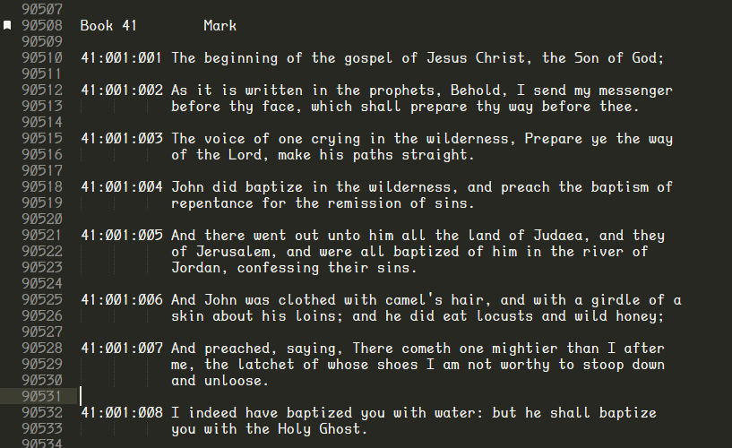
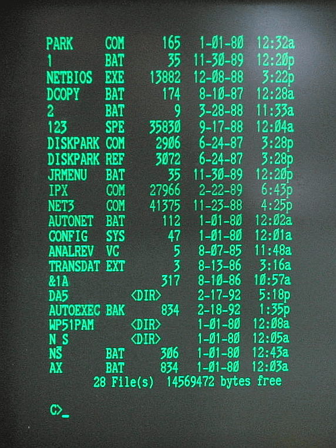

# DaddyTimeMono
A monospaced font for programmers and other terminal groupies.

**TTF** file is in `./build` directory.

## Currently Featured

- Unaccented Alphabet
- Numerals
- Punctuation
- Box-Drawing Characters
- CJK Fullwidth Unaccented Alphabet
- CJK Fullwidth Numerals
- CJK Fullwidth Punctuation
- CP437/ANSI Line Drawing & Box-Fill Characters

## TODO Features

- CP437/ANSI Box-Fill Character Width
- Accented Latin Characters
- Powerline Symbols
- Possibly Cyrillic

## Credits
Digits inspired by the [Corona PPC-400](https://en.wikipedia.org/wiki/Corona_Data_Systems#Corona_PPC-400) BIOS font.

All other characters by Jason Stewart.

### Special thanks to:

- George Williams and the entire [FontForge](http://fontforge.github.io/en-US/) team for making a useful creative tool freely available.
- The [ttfautohint](https://www.freetype.org/ttfautohint/) team and their fantastic tool for making this font usable at lower resolutions.
- Ricardo Bánffy of [3270 font](https://github.com/rbanffy/3270font) fame for sharing an image of the Cordata PPC-400 BIOS font.
- Whoever designed the PPC-400 font back in the day that has provided such sweet, sweet inspiration.

## Notes

- If you're using PuTTY, you will need to check "*allow selection of variable-pitch fonts*" for DaddyTimeMono to appear in the fonts dialog.  The CJK fullwidth characters are twice the width of all other characters, and prevent PuTTY from recognizing it as a monospaced font.
